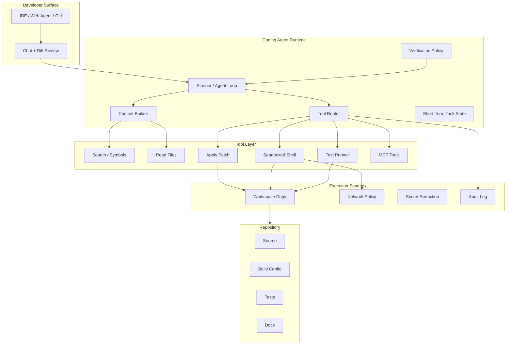
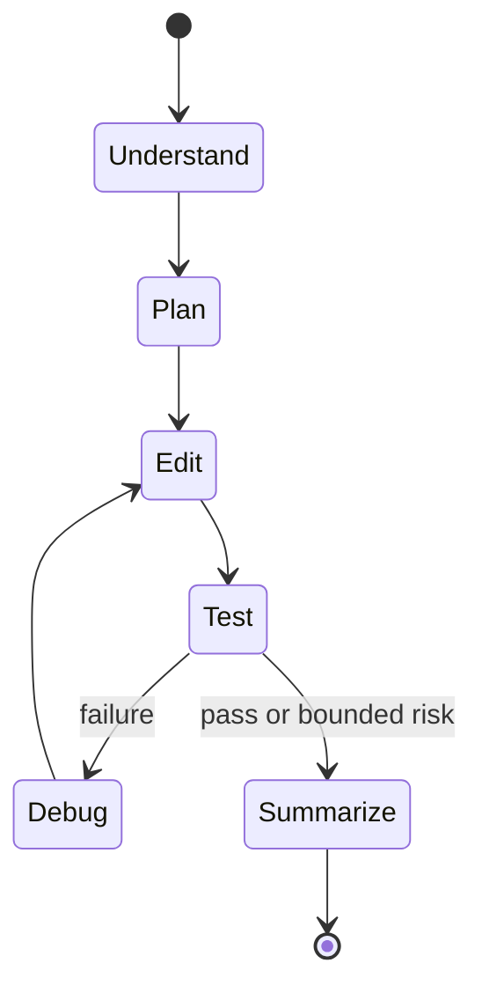
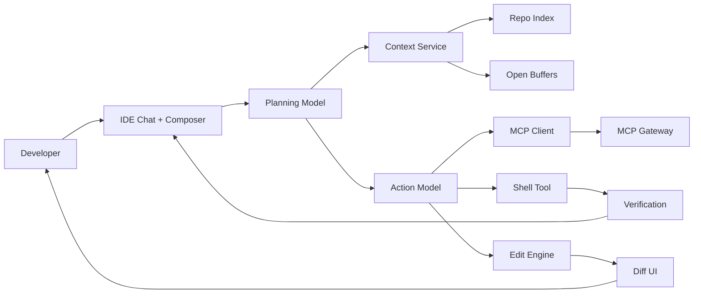

# 12-05 — AI Coding Agents (Codex, Claude Code, Cursor)

| Meta | Value |
|------|-------|
| **Estimated Time** | 6–7 hours (read 2.5h · lab 3h · product/security review 1h) |
| **Difficulty** | Advanced (agent loops, repository context, developer tooling, sandbox security) |
| **Prerequisites** | [03-01 Agent Anatomy & Loop](../03-Agentic-Fundamentals/03-01-Agent-Anatomy-and-Loop.md) · [03-02 Tools, Memory & Control Flow](../03-Agentic-Fundamentals/03-02-Tools-Memory-Control-Flow.md) · [07-01 MCP](../07-Protocols-MCP-A2A/07-01-MCP-Model-Context-Protocol.md) |
| **Module** | 12 — Advanced Topics |
| **Related** | [03-04 LangGraph Production Agents](../03-Agentic-Fundamentals/03-04-LangGraph-Production-Agents.md) · [07-04 MCP Production Patterns](../07-Protocols-MCP-A2A/07-04-MCP-Production-Patterns.md) · [08-01 Evaluation Lifecycle](../08-Evaluation-LLMOps/08-01-Evaluation-Lifecycle.md) · [10-02 Docker/K8s CI/CD](../10-Production-Infrastructure/10-02-Docker-Kubernetes-CICD.md) · [11-02 Prompt Injection Defense](../11-Security-Safety/11-02-Prompt-Injection-Defense.md) |

---

## Learning Objectives

By the end of this chapter you will be able to:

1. Explain how modern AI coding agents gather **repo context**, plan changes, edit files, run tools, and verify outcomes.
2. Compare **OpenAI Codex**, **Anthropic Claude Code**, and **Cursor agents** at product and architecture altitude.
3. Design a coding assistant with safe shell, search, edit, test, and sandbox capabilities.
4. Identify security risks: command execution, dependency confusion, secret exposure, prompt injection in repos, and unsafe PR automation.
5. Build a minimal coding agent loop over a toy repository.
6. Evaluate coding agents with task success, diff quality, test pass rate, review burden, and security controls.

Official references:

- Cursor docs: [https://docs.cursor.com/](https://docs.cursor.com/)
- Anthropic Claude Code docs: [https://docs.anthropic.com/en/docs/claude-code/overview](https://docs.anthropic.com/en/docs/claude-code/overview)
- OpenAI Codex docs: [https://platform.openai.com/docs/codex](https://platform.openai.com/docs/codex)

---

## Why This Topic Matters

AI coding agents are one of the clearest examples of agentic software becoming a daily production tool.

They operate in messy, high-context environments:

- large repositories,
- incomplete tests,
- flaky local setup,
- hidden build assumptions,
- partial user instructions,
- security-sensitive files,
- and human review workflows.

The agent must do more than autocomplete. It must:

1. inspect the repository,
2. form a plan,
3. edit code,
4. run commands,
5. interpret failures,
6. revise,
7. summarize risks,
8. and hand a coherent diff to a human.

This is the agent loop from [03-01](../03-Agentic-Fundamentals/03-01-Agent-Anatomy-and-Loop.md), grounded in developer tools.

Staff/Principal question:

> How do we make agents productive in a real repo without giving them an unbounded production terminal?

---

## Business Impact

| Business outcome | Coding agent lever |
|------------------|--------------------|
| **Higher engineering throughput** | Agents handle focused implementation, tests, migrations, and repetitive refactors |
| **Faster onboarding** | Repo-aware assistants explain architecture and conventions |
| **Lower review cost** | Agents provide summaries, test evidence, and smaller scoped diffs |
| **Better maintenance** | Agents can update docs, tests, and examples along with code |
| **Platform leverage** | Internal tools exposed through MCP become available in IDEs |
| **Risk concentration** | Shell/edit permissions can damage repos or leak secrets if ungated |

Product leaders should treat coding agents as workflow products, not just model wrappers.

---

## Architecture Overview



**Mental model:** A coding agent is a repo-aware planner with constrained tools and a verification loop.

---

## Core Concepts

### 1) Repository Context

#### Definition

Repository context is the structured evidence the agent uses to understand what to change.

Sources include:

| Context source | Examples |
|----------------|----------|
| Files | Open buffers, target modules, configs |
| Search results | `rg`, symbol search, imports |
| Build metadata | package manager, test framework, lockfiles |
| Git state | branch, diff, user changes |
| Docs | README, architecture notes, ADRs |
| Runtime evidence | failing tests, stack traces, linter errors |

#### Context is not "load the whole repo"

Large context windows help, but high-quality coding agents still need retrieval and prioritization.

Good context selection asks:

- Which files define the behavior?
- Which tests encode the contract?
- What local conventions already exist?
- Which user changes must not be overwritten?
- What commands prove the change?

#### Staff-level signal

The agent should cite evidence from the repo before editing, especially for architectural changes.

---

### 2) Tool Use

Coding agents need a small but powerful toolset:

| Tool | Purpose | Risk |
|------|---------|------|
| Search | Find symbols and patterns | Low |
| Read | Inspect files | Data exposure |
| Edit | Apply changes | Code corruption |
| Shell | Run tests/builds/scripts | Arbitrary execution |
| Git | Inspect diffs/status | Accidental commits or branch changes |
| Browser / docs | Fetch external docs | Prompt injection / egress |
| MCP | Access internal tools | Depends on server scopes |

The tool contract matters as much as the model. A strong model with unsafe shell is still unsafe.

Cross-link: [03-02 Tools, Memory & Control Flow](../03-Agentic-Fundamentals/03-02-Tools-Memory-Control-Flow.md)

---

### 3) Agent Loop

The common loop:



#### Loop budget

Agents need explicit bounds:

```text
max_tool_calls = 80
max_shell_commands = 12
max_edit_files = 15
max_wall_clock_minutes = 20
max_test_retries = 3
```

Without a budget, a coding agent can spin on flaky tests, dependency installs, or ambiguous failures.

---

### 4) Sandboxes

#### Why sandboxing is mandatory

Coding agents execute commands from repositories. Repositories may contain:

- malicious scripts,
- compromised dependencies,
- prompts embedded in docs,
- secrets in local env,
- build steps that reach external networks,
- or destructive cleanup commands.

Sandbox controls:

| Control | Purpose |
|---------|---------|
| Workspace copy | Preserve user files and allow reset |
| File allowlist | Limit edits to repo |
| Network policy | Block exfiltration and surprise downloads |
| Secret redaction | Prevent model and logs from seeing credentials |
| Command denylist | Block dangerous commands |
| Resource limits | Prevent fork bombs and runaway builds |
| Audit log | Reconstruct actions |

Cross-link: [11-02 Prompt Injection Defense](../11-Security-Safety/11-02-Prompt-Injection-Defense.md)

---

### 5) MCP in IDEs

MCP lets coding agents access capabilities beyond the built-in IDE tools:

- issue trackers,
- design docs,
- internal search,
- deployment status,
- feature flags,
- dependency metadata,
- security scanners.

MCP changes coding agents from "repo-only" assistants into enterprise workflow agents.

#### IDE MCP rule

Treat MCP tools as production capabilities. Use the governance patterns from [07-04](../07-Protocols-MCP-A2A/07-04-MCP-Production-Patterns.md):

- allowlist tools,
- scope credentials,
- log calls,
- version schemas,
- and sandbox side effects.

---

### 6) Comparing Codex, Claude Code, and Cursor

The exact products evolve, but the architectural comparison remains useful.

| Dimension | OpenAI Codex | Anthropic Claude Code | Cursor Agents |
|-----------|--------------|-----------------------|---------------|
| Primary surface | Cloud / coding agent workflows, API and product integrations | Terminal-first coding agent | IDE-first and cloud agent workflows |
| Strength | Autonomous task execution, model/tool integration | CLI workflow, repo exploration, command execution | Deep editor integration, codebase context, diffs, MCP, cloud delegation |
| Context style | Repo/task context plus tool traces | Local repo context through CLI tools | Open files, repo search, editor state, agent tools |
| Human review | Diff / task result review | Terminal transcript and edits | Inline IDE review, chat, diffs, cloud agent output |
| Sandbox model | Product-dependent cloud/runtime sandbox | Local terminal permissions unless configured | Local IDE permissions or managed cloud sandbox |
| Enterprise concern | Data boundaries and automation policy | Local shell and credential exposure | IDE permissions, MCP server governance, cloud workspace controls |

#### Product framing

Do not reduce the comparison to benchmark scores. The winning tool depends on:

- where developers already work,
- how much autonomy is allowed,
- whether tasks need local environment access,
- how reviews happen,
- and what the security model permits.

---

### 7) Building a Coding Assistant

A coding assistant needs four planes:

| Plane | Responsibility |
|-------|----------------|
| User experience | Chat, plan approval, diff review, progress updates |
| Context plane | Repo indexing, search, open files, test failures |
| Action plane | Edit, shell, test, MCP, git inspection |
| Control plane | Sandbox, budgets, audit, policy, evals |

#### Design-Cursor style architecture



#### Key product choices

| Choice | Product implication |
|--------|---------------------|
| Inline autocomplete vs agent | Low friction vs higher autonomy |
| Plan approval | Slower but safer for large changes |
| Auto-run tests | Higher confidence but noisy in weak repos |
| Cloud agent | Offloads long work but raises data boundary questions |
| Local agent | Uses exact dev env but exposes local credentials |
| MCP integrations | More workflow power but needs governance |

---

## When to Use AI Coding Agents

Use coding agents for:

- scoped bug fixes,
- test additions,
- mechanical refactors,
- migration assistance,
- documentation updates,
- explaining unfamiliar code,
- generating first drafts of implementation,
- reproducing failures,
- and dependency/API upgrade exploration.

Good task shape:

```text
Change X behavior in module Y.
Preserve existing user edits.
Add or update tests.
Run command Z if available.
Summarize files changed and residual risk.
```

---

## When NOT to Use AI Coding Agents

Avoid or restrict coding agents when:

- the task requires production secrets,
- the repo has untrusted build scripts and no sandbox,
- requirements are politically ambiguous,
- architectural direction has not been decided,
- the change affects safety-critical or regulated behavior without human review,
- tests are absent and behavior cannot be verified,
- or the agent would need broad infrastructure permissions.

Do not use a coding agent to bypass design review. Use it after the direction is clear enough to implement or explore safely.

---

## Implementation / Lab — Minimal Coding Agent Loop

This lab builds a tiny coding agent over a toy repo. It does not call an LLM; you can wire one in later. The goal is to understand the loop and boundaries.

### Toy repo

Create a directory:

```bash
mkdir toy_repo
cd toy_repo
```

Add `calculator.py`:

```python
def add(a: int, b: int) -> int:
    return a + b


def divide(a: int, b: int) -> float:
    return a / b
```

Add `test_calculator.py`:

```python
import pytest

from calculator import add, divide


def test_add():
    assert add(2, 3) == 5


def test_divide():
    assert divide(8, 2) == 4


def test_divide_by_zero_message():
    with pytest.raises(ValueError, match="division by zero"):
        divide(1, 0)
```

Install test dependency:

```bash
pip install pytest
```

### Agent sketch

Add `mini_agent.py` one directory above `toy_repo`:

```python
from __future__ import annotations

import dataclasses
import subprocess
from pathlib import Path


@dataclasses.dataclass
class AgentState:
    repo: Path
    task: str
    plan: list[str]
    transcript: list[str] = dataclasses.field(default_factory=list)
    max_iterations: int = 3


def run(cmd: list[str], cwd: Path) -> subprocess.CompletedProcess[str]:
    return subprocess.run(
        cmd,
        cwd=cwd,
        text=True,
        stdout=subprocess.PIPE,
        stderr=subprocess.STDOUT,
        timeout=20,
        check=False,
    )


def read_file(path: Path) -> str:
    return path.read_text(encoding="utf-8")


def write_file(path: Path, content: str) -> None:
    path.write_text(content, encoding="utf-8")


def plan(task: str) -> list[str]:
    return [
        "Inspect calculator.py and tests.",
        "Update divide to raise ValueError for zero denominator.",
        "Run pytest and revise if needed.",
    ]


def edit(repo: Path) -> None:
    target = repo / "calculator.py"
    current = read_file(target)
    old = "def divide(a: int, b: int) -> float:\n    return a / b\n"
    new = (
        "def divide(a: int, b: int) -> float:\n"
        "    if b == 0:\n"
        "        raise ValueError(\"division by zero\")\n"
        "    return a / b\n"
    )
    if old not in current:
        raise RuntimeError("expected divide implementation not found")
    write_file(target, current.replace(old, new))


def verify(repo: Path) -> tuple[bool, str]:
    result = run(["python", "-m", "pytest", "-q"], cwd=repo)
    return result.returncode == 0, result.stdout


def agent_loop(repo: Path, task: str) -> AgentState:
    state = AgentState(repo=repo, task=task, plan=plan(task))
    state.transcript.append("PLAN:\n" + "\n".join(f"- {step}" for step in state.plan))

    for iteration in range(1, state.max_iterations + 1):
        state.transcript.append(f"ITERATION {iteration}: editing")
        edit(repo)
        passed, output = verify(repo)
        state.transcript.append("TEST OUTPUT:\n" + output)
        if passed:
            state.transcript.append("RESULT: tests passed")
            return state
        state.transcript.append("RESULT: tests failed; would debug next")

    state.transcript.append("RESULT: iteration budget exhausted")
    return state


if __name__ == "__main__":
    repo_path = Path("toy_repo").resolve()
    final_state = agent_loop(
        repo_path,
        "Make divide raise ValueError('division by zero') when b is zero.",
    )
    print("\n\n".join(final_state.transcript))
```

Run:

```bash
python mini_agent.py
```

Expected result:

- The agent writes a small patch.
- `pytest` passes.
- The transcript includes plan, edit, test output, and final result.

### Extend the lab

1. Add a command allowlist so only `python -m pytest -q` is permitted.
2. Add a diff preview before writing.
3. Add a max changed lines budget.
4. Replace the hardcoded `edit()` with an LLM-generated patch.
5. Add a policy that blocks editing files outside `toy_repo`.

---

## Product and Security Implications

### Product implications

| Product decision | Consequence |
|------------------|-------------|
| Agent can edit automatically | Faster flow, higher trust burden |
| Agent must ask before edits | Safer but interrupt-heavy |
| Agent can run shell | Better verification, more security exposure |
| Agent works in cloud | Long tasks can continue, data boundary becomes central |
| Agent has MCP | Rich enterprise workflows, more governance surface |

### Security implications

| Threat | Example | Control |
|--------|---------|---------|
| Prompt injection in repo | `README` tells agent to leak secrets | Treat repo text as untrusted |
| Destructive commands | `rm -rf`, credential deletion | Command policy and sandbox |
| Secret exposure | Agent reads `.env` | Secret redaction and file denylist |
| Supply chain | Agent installs malicious package | Lockfiles, registries, network controls |
| Unsafe automation | Agent commits or pushes unintended diff | Human review and git policy |
| Data exfiltration | Build script posts files externally | Network egress policy |

---

## Evaluation

Coding agent evals should measure task outcomes and review burden.

| Metric | Definition |
|--------|------------|
| Task success | Human-accepted solution solves issue |
| Test pass rate | Relevant tests pass after agent changes |
| Diff precision | Changed lines necessary for task |
| Review time | Minutes for human to accept or reject |
| Regression rate | Later bugs attributable to agent change |
| Tool efficiency | Tool calls per accepted task |
| Security violations | Blocked commands, secret touches, policy denials |

#### Eval set design

Include:

- small bug fixes,
- test updates,
- multi-file refactors,
- ambiguous requirements,
- failing environment cases,
- malicious repo instructions,
- and tasks requiring abstention.

---

## Failure Modes

| Failure | Symptom | Mitigation |
|---------|---------|------------|
| Context miss | Agent edits wrong file | Search/read evidence before plan |
| Over-broad diff | Many unrelated changes | Changed-file budget and diff review |
| Test tunnel vision | Passes one test but breaks contract | Run targeted and broader suites |
| Shell injection | Agent executes repo-suggested command | Command allowlist and sandbox |
| Secret leak | Agent prints env or keys | Secret redaction and denylisted files |
| Dependency drift | Agent updates lockfile unnecessarily | Package manager policy |
| User change overwrite | Agent replaces uncommitted work | Git status checks and patch merge |
| Infinite debug loop | Repeats failing command | Iteration and time budgets |
| Unreviewed side effects | Commit/push/deploy without approval | Human gates and disabled write operations |
| Hallucinated API | Code imports nonexistent library | Build/test verification |

---

## Interview Questions

### Senior Engineer

1. Describe the loop of a coding agent from task intake to final summary.
2. What context does an agent need before editing a file?
3. Why is shell access riskier than file search?

### Staff Engineer

1. Design a secure coding agent for a monorepo with 200 engineers.
2. How would you evaluate Cursor, Claude Code, and Codex for your organization?
3. What sandbox controls are mandatory before allowing shell execution?

### Principal Engineer

1. Build an enterprise coding-agent platform that supports local IDE and cloud agents.
2. Decide whether agents may commit, push, or open PRs automatically.
3. How do you handle prompt injection embedded in source repositories?

### Engineering Manager

1. Which engineering workflows should receive coding agents first?
2. How do you communicate productivity gains without implying headcount replacement?
3. What training do developers need to review agent-generated code?

---

## Revision Notes

- Coding agents are **tool-using repo agents**, not just autocomplete.
- The core loop is **plan -> edit -> test -> revise -> summarize**.
- Context selection is the difference between useful autonomy and random edits.
- Shell access requires sandboxing, command policy, budgets, and audit.
- MCP expands IDE capability and requires production governance.
- Evaluate agents by accepted task outcomes, review burden, test evidence, and security posture.

---

## Summary

AI coding agents combine repository context, tool use, planning, editing, and verification. Codex, Claude Code, and Cursor differ in surface area and operating model, but all share the same core concerns: context quality, safe tools, bounded loops, sandboxing, human review, and evidence-driven evaluation. The Staff/Principal move is to design the workflow and control plane, not merely choose a model.

---

## Further Reading

- Cursor documentation: [https://docs.cursor.com/](https://docs.cursor.com/)
- Cursor MCP documentation: [https://docs.cursor.com/context/model-context-protocol](https://docs.cursor.com/context/model-context-protocol)
- Anthropic Claude Code overview: [https://docs.anthropic.com/en/docs/claude-code/overview](https://docs.anthropic.com/en/docs/claude-code/overview)
- Anthropic Claude Code security: [https://docs.anthropic.com/en/docs/claude-code/security](https://docs.anthropic.com/en/docs/claude-code/security)
- OpenAI Codex docs: [https://platform.openai.com/docs/codex](https://platform.openai.com/docs/codex)
- OpenAI Agents guide: [https://platform.openai.com/docs/guides/agents](https://platform.openai.com/docs/guides/agents)
- Model Context Protocol: [https://modelcontextprotocol.io/](https://modelcontextprotocol.io/)
- MCP specification: [https://spec.modelcontextprotocol.io/](https://spec.modelcontextprotocol.io/)
- OWASP Top 10 for LLM Applications: [https://owasp.org/www-project-top-10-for-large-language-model-applications/](https://owasp.org/www-project-top-10-for-large-language-model-applications/)
