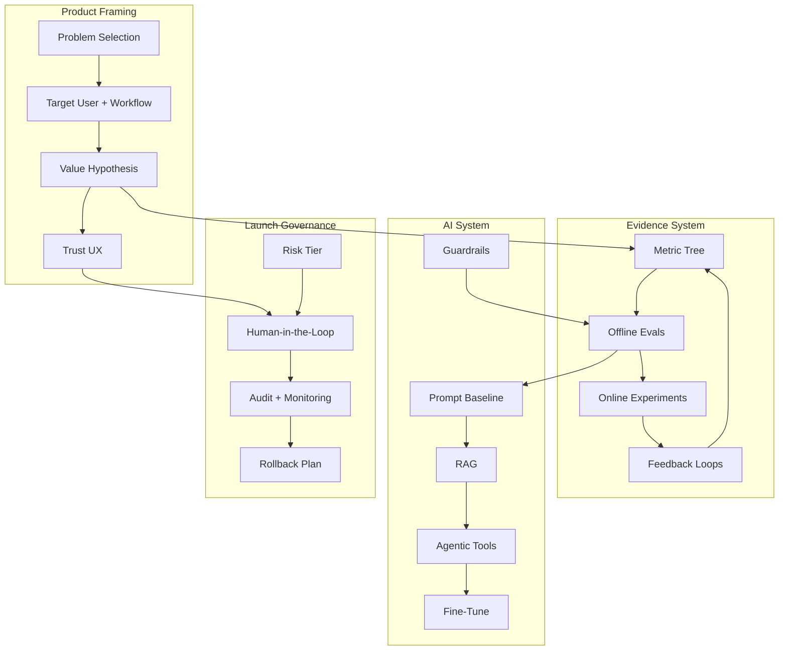
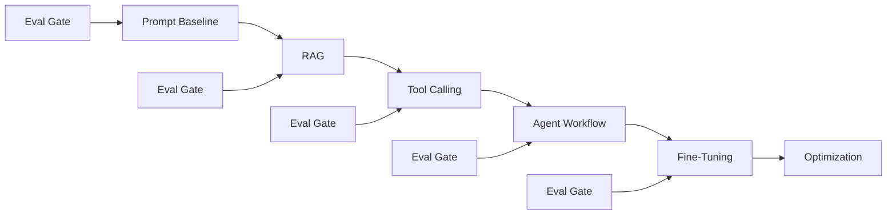
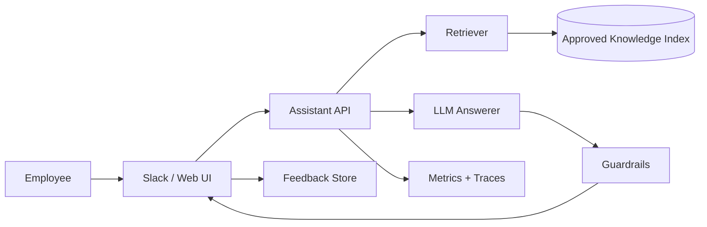
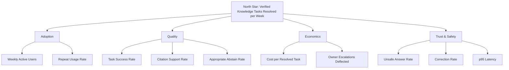

# 12-06 — AI Product Thinking

| Meta | Value |
|------|-------|
| **Estimated Time** | 5–6 hours (read 2h · one-pager lab 2h · launch review 1h) |
| **Difficulty** | Advanced (product judgment, metrics, eval design, roadmap sequencing) |
| **Prerequisites** | [00-01 AI Engineering Mindset](../00-Foundations/00-01-AI-Engineering-Mindset.md) · [08-01 Evaluation Lifecycle](../08-Evaluation-LLMOps/08-01-Evaluation-Lifecycle.md) · [09-02 Prompting vs RAG vs Fine-Tuning](../09-Fine-Tuning/09-02-Prompting-vs-RAG-vs-FineTuning.md) |
| **Module** | 12 — Advanced Topics |
| **Related** | [00-01](../00-Foundations/00-01-AI-Engineering-Mindset.md) · [04-01 RAG Architecture](../04-RAG/04-01-RAG-Architecture.md) · [08-03 Guardrails](../08-Evaluation-LLMOps/08-03-Guardrails-Ship-Criteria.md) · [09-02](../09-Fine-Tuning/09-02-Prompting-vs-RAG-vs-FineTuning.md) · [AI Governance](../../Leadership/AI-Governance-Strategy-Metrics.md) |

---

## Learning Objectives

By the end of this chapter you will be able to:

1. Select AI feature opportunities where model uncertainty is acceptable and business value is measurable.
2. Design **trust UX** with citations, abstention, confidence signals, and human-in-the-loop escalation.
3. Define success metrics across task success, deflection, cost per task, latency, safety, and adoption.
4. Treat **evals as product requirements**, not engineering cleanup.
5. Scope MVPs without over-agentic architecture.
6. Sequence roadmaps from prompt to RAG to agents to fine-tuning.
7. Communicate AI tradeoffs to executives, Legal, Security, Sales, Support, and Engineering.
8. Write a launch-ready AI product one-pager and metric tree.

---

## Why This Topic Matters

Most failed AI features do not fail because the model API was hard to call.

They fail because:

- the problem was not worth solving,
- success was not defined,
- users did not trust the answer,
- evals arrived after launch,
- costs scaled faster than value,
- latency broke the workflow,
- or teams built an agent when a search box would have worked.

The mindset chapter [00-01](../00-Foundations/00-01-AI-Engineering-Mindset.md) argues that AI engineering is about reliability, cost, latency, safety, and evaluability. AI product thinking turns those dimensions into roadmap and launch decisions.

Staff/Principal question:

> What is the thinnest AI-shaped product that creates measurable value and can fail safely?

EM question:

> How do we align stakeholders around risk, scope, and evidence before the team burns a quarter?

---

## Business Impact

| Business outcome | Product-thinking lever |
|------------------|------------------------|
| **Higher ROI** | Pick workflows with measurable task value and repeated usage |
| **Lower delivery risk** | Start with narrow MVP and eval gates |
| **Higher trust** | Citations, abstain paths, and human review |
| **Lower COGS** | Choose prompt/RAG before agents or fine-tuning when sufficient |
| **Faster alignment** | One-pager clarifies users, metrics, risks, and launch criteria |
| **Safer launches** | Governance tier and rollback plan before production traffic |

Cross-link: [AI Governance, Strategy & Metrics](../../Leadership/AI-Governance-Strategy-Metrics.md)

---

## Architecture Overview

AI product thinking connects the user workflow to technical architecture and governance.



**Mental model:** AI product strategy is a loop: pick a valuable uncertain task, design trust, measure behavior, launch safely, and increase autonomy only when evidence supports it.

---

## Core Concepts

### 1) Problem Selection for AI Features

AI is useful when the task has valuable ambiguity. It is wasteful when deterministic software already solves the problem.

#### Good AI feature candidates

| Candidate | Why AI helps |
|-----------|--------------|
| Knowledge synthesis | Information is scattered and natural-language heavy |
| Drafting | Users need a first version, not perfect automation |
| Triage | Inputs are messy and categorization has nuance |
| Search over unstructured docs | Keywords miss intent |
| Decision support | AI can summarize options while humans decide |
| Workflow copilots | Model can orchestrate multiple low-risk steps |

#### Weak candidates

| Candidate | Better approach |
|-----------|-----------------|
| Exact calculations | Deterministic code |
| Stable forms | Traditional UI |
| Simple routing rules | Rules engine |
| Regulated final advice | Human expert with AI support |
| High-volume low-margin tasks with expensive context | Caching, templates, or non-AI automation |

#### Selection scorecard

Score each dimension 1–5:

| Dimension | Question |
|-----------|----------|
| User pain | Is the current workflow slow, frequent, or frustrating? |
| Economic value | What is one successful task worth? |
| Data availability | Do we have representative examples and ground truth? |
| Tolerance for uncertainty | Can the product recover from wrong outputs? |
| Trust surface | Can users inspect, verify, or override? |
| Latency fit | Can AI respond within the workflow budget? |
| Cost fit | Does value exceed inference and operations cost? |
| Governance fit | Can risk controls match the use case? |

Prioritize high pain, high frequency, verifiable tasks with reversible outcomes.

---

### 2) Trust UX

Trust UX is the user-facing design of uncertainty.

AI product trust comes from:

- showing evidence,
- setting scope,
- asking for confirmation,
- abstaining when unsure,
- making corrections easy,
- and preserving accountability.

#### Trust mechanisms

| Mechanism | Use |
|-----------|-----|
| Citations | Ground answers in source material |
| Confidence label | Communicate uncertainty carefully |
| Abstain path | Avoid forced hallucinated answers |
| Human-in-the-loop | Review high-impact actions |
| Editable draft | Let user control final output |
| Explanation of limits | Prevent over-reliance |
| Feedback affordance | Capture corrections for evals |

#### Citation design

Citations should be:

- specific enough to verify,
- close to the claim,
- clickable where possible,
- not fabricated,
- and tied to retrieved source IDs.

Bad:

> According to company policy, this is allowed.

Better:

> This appears allowed under Travel Policy section 4.2, "Client meals under $75," last updated 2026-04-12.

#### Abstention design

Abstention is not product failure. It is a safety feature.

Good abstention:

```text
I could not find a policy that answers this with enough confidence.
I found related sections 3.1 and 3.4, but neither covers international contractors.
Route to HR policy owner?
```

Bad abstention:

```text
I cannot answer.
```

Cross-link: [08-03 Guardrails](../08-Evaluation-LLMOps/08-03-Guardrails-Ship-Criteria.md)

---

### 3) Success Metrics

AI metrics need to cover value, quality, cost, latency, and safety.

#### Metric categories

| Category | Metrics |
|----------|---------|
| Task success | completion rate, acceptance rate, human-rated correctness |
| Deflection | tickets avoided, searches avoided, escalations reduced |
| Economics | cost per task, savings per task, gross margin impact |
| Latency | p50/p95 response, time to first token, total task time |
| Trust | citation click-through, correction rate, override rate |
| Safety | unsafe output rate, hallucination rate, policy violation rate |
| Adoption | weekly active users, repeat usage, cohort retention |
| Operations | eval pass rate, incident rate, rollback frequency |

#### Metric anti-patterns

| Anti-pattern | Why it fails |
|--------------|--------------|
| Tokens generated | Activity, not value |
| "Looks good" demos | No representative distribution |
| Average latency only | p95 breaks user trust |
| Accuracy only | Ignores cost and unsafe failure |
| Deflection only | Can hide bad self-service outcomes |

---

### 4) Eval as Product Requirement

An eval is a product requirement written in executable form.

If the PRD says:

> The assistant should answer HR policy questions with citations and abstain when the policy is missing.

Then the eval must include:

- answerable HR questions,
- unanswerable HR questions,
- outdated policy traps,
- ambiguous contractor cases,
- citation correctness checks,
- and safety refusals.

#### Eval requirements table

| Product requirement | Eval artifact |
|---------------------|---------------|
| Correct answers | Golden set with expected answers |
| Grounded citations | Source ID matching |
| Abstain when missing | Unanswerable cases |
| Safe tone | Human rubric or classifier |
| Low latency | Load test and p95 threshold |
| Affordable operation | Cost simulation |
| No restricted advice | Safety red-team set |

Cross-link: [08-01 Evaluation Lifecycle](../08-Evaluation-LLMOps/08-01-Evaluation-Lifecycle.md)

#### Ship gate example

```text
Launch to beta if:
- answer correctness >= 85% on golden set,
- citation support >= 90% for answerable cases,
- unsafe answer rate <= 1% on red-team set,
- p95 latency <= 4 seconds,
- cost per resolved task <= $0.08,
- rollback can disable AI path within 15 minutes.
```

---

### 5) MVP vs Agentic Overkill

A strong AI MVP is usually less agentic than the team first imagines.

#### Scope ladder

| Level | Pattern | Use when |
|-------|---------|----------|
| 0 | Template / rules | Task is deterministic |
| 1 | Prompt-only | Context fits in prompt; low risk |
| 2 | RAG | Answers depend on private / changing knowledge |
| 3 | Tool calling | Need structured lookup or calculations |
| 4 | Workflow agent | Multi-step task with branching |
| 5 | Multi-agent | Clear specialist boundaries and eval-proven need |
| 6 | Fine-tune | Stable distribution, enough examples, prompt/RAG plateau |

#### MVP principle

Start with the lowest level that can prove user value.

Agentic overkill symptoms:

- no baseline prompt eval,
- no metric tree,
- agent has tools but no clear user workflow,
- multi-agent architecture before first user interview,
- fine-tune proposed before data quality is understood,
- autonomous actions before manual draft mode succeeds.

Cross-link: [09-02 Prompting vs RAG vs Fine-Tuning](../09-Fine-Tuning/09-02-Prompting-vs-RAG-vs-FineTuning.md)

---

### 6) Roadmap Sequencing

Roadmap sequencing should increase capability only as evidence demands it.



#### Sequencing guidance

| Phase | Goal | Exit evidence |
|-------|------|---------------|
| Prompt baseline | Prove task is model-addressable | 20–50 eval examples |
| RAG | Ground on internal knowledge | Citation and retrieval metrics |
| Tool calling | Add structured actions | Tool accuracy and safety tests |
| Agent | Handle multi-step workflows | Trace-level task success |
| Fine-tune | Improve stable behavior or style | Plateau with cheaper methods |
| Optimization | Reduce cost/latency | SLO and COGS improvements |

#### Staff-level roadmap question

What new uncertainty does the next architecture step remove, and what new risk does it introduce?

---

### 7) Stakeholder Communication

AI products cross more organizational boundaries than typical SaaS features.

| Stakeholder | Concern | Communication artifact |
|-------------|---------|------------------------|
| Users | Can I trust and control it? | UX prototype and failure examples |
| Executives | ROI and strategic differentiation | Metric tree and business case |
| Legal | Regulated advice and liability | Risk tier and disclaimers |
| Security | Data exposure and tool abuse | Threat model |
| Support | Deflection without harm | Escalation policy |
| Sales | Customer promises | Launch scope and limitations |
| Engineering | Complexity and operability | Architecture and runbook |
| Data/ML | Dataset and eval quality | Eval spec and labeling plan |

#### Message template

```text
We are launching a limited beta for [user] to solve [task].
The assistant will [capabilities] and will not [explicit non-goals].
We will measure [north star], [quality], [cost], and [safety].
It will abstain or escalate when [conditions].
Launch requires [eval thresholds] and rollback is [mechanism].
```

---

### 8) Launch Criteria

Launch criteria should be defined before implementation finishes.

| Area | Launch question |
|------|-----------------|
| User value | Does beta usage show repeated task completion? |
| Quality | Does eval pass the agreed threshold? |
| Trust | Are citations, abstain, and corrections understandable? |
| Safety | Are red-team failures below threshold? |
| Cost | Is cost per task within target? |
| Latency | Does p95 fit the workflow? |
| Ops | Are dashboards, alerts, and runbooks ready? |
| Governance | Is risk tier approved? |
| Rollback | Can we disable or degrade safely? |

---

## When to Use AI Product Thinking

Use this approach whenever:

- the feature depends on LLM output quality,
- user trust is a central risk,
- costs scale with usage,
- the model can abstain or hallucinate,
- a workflow may become agentic,
- or multiple stakeholders need launch confidence.

For Staff/Principal engineers, this is the bridge from architecture to business outcome.

---

## When NOT to Use Heavy AI Product Process

Use lighter process when:

- the feature is an internal prototype with synthetic data,
- no user or customer decision depends on output,
- the workflow is clearly deterministic,
- or a one-day spike is needed to learn feasibility.

Even then, keep a small note of:

1. what problem is being tested,
2. what would count as success,
3. and what risk would stop launch.

---

## Implementation / Lab — AI Product One-Pager and Metric Tree

### Scenario

You are designing an **Internal Knowledge Assistant** for a 2,000-person company.

Users ask questions about:

- HR policies,
- engineering runbooks,
- sales enablement docs,
- security procedures,
- and product FAQs.

The assistant must cite sources, abstain when information is missing, and route sensitive questions to the right team.

### Deliverable

Write a two-page product one-pager plus a metric tree.

Use the structure below.

---

### Page 1 — Product One-Pager

#### 1) Problem

Employees waste time finding trustworthy answers across Slack, Confluence, Google Drive, GitHub, and ticket history. Existing search returns documents, not decisions.

#### 2) Target users

Primary:

- support agents,
- sales engineers,
- engineering on-call,
- HR business partners.

Secondary:

- new hires,
- managers,
- policy owners.

#### 3) Jobs to be done

| Job | Example |
|-----|---------|
| Find policy | "Can contractors expense home office equipment?" |
| Summarize runbook | "How do I handle checkout latency alerts?" |
| Locate owner | "Who owns SSO provisioning?" |
| Draft response | "Draft a customer-safe explanation of incident status." |

#### 4) Value hypothesis

If employees can get cited answers in under 10 seconds, then they will resolve routine knowledge tasks faster and escalate fewer questions to policy owners.

#### 5) MVP scope

In scope:

- RAG over approved knowledge sources,
- citations with source snippets,
- abstain when confidence is low,
- feedback buttons,
- admin analytics,
- Slack and web UI pilot.

Out of scope:

- autonomous policy changes,
- external customer responses without human review,
- HR/legal advice beyond citing approved policy,
- write actions to production systems.

#### 6) Trust UX

The answer card includes:

- concise answer,
- citations next to key claims,
- "I could not verify this" abstain state,
- source freshness date,
- owner escalation,
- user feedback,
- and "open source document" link.

#### 7) Risk tier

T2 under the governance framework because the assistant handles internal confidential information and may influence employee decisions. T3 escalation for legal, medical, payroll, or security incident instructions.

Cross-link: [AI Governance](../../Leadership/AI-Governance-Strategy-Metrics.md)

---

### Page 2 — Evidence, Metrics, and Launch

#### 8) Architecture MVP



#### 9) Eval requirements

| Requirement | Eval |
|-------------|------|
| Answers common HR policy questions | 100 HR golden examples |
| Cites correct source | Source ID match >= 90% |
| Abstains on missing policy | 50 unanswerable examples |
| Does not provide legal/medical advice | Red-team sensitive set |
| Handles stale docs | Freshness conflict cases |
| Responds quickly | p95 latency load test |

#### 10) Metric tree



#### 11) Launch thresholds

| Metric | Beta threshold |
|--------|----------------|
| Task success | >= 80% human-rated on pilot tasks |
| Citation support | >= 90% on answerable eval cases |
| Appropriate abstain | >= 85% on unanswerable set |
| Unsafe answer rate | <= 1% on red-team set |
| p95 latency | <= 5 seconds |
| Cost per resolved task | <= $0.10 |
| Feedback coverage | >= 20% of sessions during beta |

#### 12) Rollout plan

1. Internal dogfood with AI/product/security team.
2. Pilot with 50 support and sales users.
3. Add engineering runbooks after policy owners validate sources.
4. Expand to all employees behind feature flag.
5. Quarterly review of stale documents, eval failures, and cost.

#### 13) Kill criteria

Pause rollout if:

- unsafe answers exceed threshold,
- citation fabrication is observed,
- cost per task exceeds target for two consecutive weeks,
- sensitive data appears in unauthorized contexts,
- or policy owners cannot keep sources fresh.

## Failure Modes

| Failure | Symptom | Mitigation |
|---------|---------|------------|
| Vague problem | Demo impresses, usage fades | Define user, task, and value hypothesis |
| No eval gate | Quality debated by anecdotes | Eval spec in PRD |
| Trust gap | Users copy answers blindly or ignore them | Citations, abstain, source freshness |
| Agentic overkill | Team builds tools before proving demand | Scope ladder and baseline prompt |
| Cost surprise | Usage grows but margins collapse | Cost per task threshold |
| Latency mismatch | Users abandon workflow | p95 SLO and streaming where helpful |
| Wrong metric | Optimizes deflection but harms users | Pair deflection with success and satisfaction |
| Stale knowledge | Assistant cites outdated docs | Freshness metadata and owner workflow |
| Stakeholder misalignment | Launch blocked late by Legal/Security | Early risk tier and review plan |
| No rollback | Incident requires code deploy | Feature flag and kill switch |

---

## Interview Questions

### Senior Engineer

1. How do you decide whether a feature should use AI?
2. What metrics would you define for an internal knowledge assistant?
3. Why are citations a UX and systems requirement?

### Staff Engineer

1. Write launch criteria for a customer-facing AI support assistant.
2. How do evals become product requirements?
3. Design a metric tree that balances deflection, correctness, cost, and trust.

### Principal Engineer

1. Sequence a three-quarter AI roadmap from prompt baseline to agentic workflows.
2. Decide whether to fine-tune, improve RAG, or add tool calling for a plateauing assistant.
3. Create a governance model for launching AI features across multiple product teams.

### Engineering Manager

1. How would you staff an AI product team across PM, design, engineering, data, and policy owners?
2. What should be in an executive update before beta launch?
3. How do you handle pressure to ship an impressive demo without eval evidence?

---

## Revision Notes

- AI product thinking starts with **user task and value**, not model capability.
- Trust UX includes citations, abstention, edits, escalation, and accountability.
- Metrics must balance task success, deflection, cost, latency, adoption, and safety.
- Evals are executable product requirements and should be written before launch.
- Roadmaps should sequence **prompt -> RAG -> tools/agents -> fine-tuning** based on evidence.
- MVP scope should prove value with the least autonomy that can work.
- Stakeholder communication is part of the architecture for safe AI products.

---

## Summary

AI product thinking is the discipline of turning uncertain model behavior into a trustworthy, measurable product workflow. Strong teams choose the right problem, expose uncertainty honestly, define evals and metrics early, sequence architecture conservatively, and launch with governance and rollback. The Staff/Principal contribution is judgment: knowing when AI is the right tool, how much autonomy is justified, and what evidence is required before scale.

---

## Further Reading

- NIST AI Risk Management Framework: [https://www.nist.gov/itl/ai-risk-management-framework](https://www.nist.gov/itl/ai-risk-management-framework)
- NIST AI RMF 1.0 PDF: [https://nvlpubs.nist.gov/nistpubs/ai/NIST.AI.100-1.pdf](https://nvlpubs.nist.gov/nistpubs/ai/NIST.AI.100-1.pdf)
- OECD AI Principles: [https://oecd.ai/en/ai-principles](https://oecd.ai/en/ai-principles)
- Google People + AI Guidebook: [https://pair.withgoogle.com/guidebook/](https://pair.withgoogle.com/guidebook/)
- Microsoft Responsible AI Standard: [https://www.microsoft.com/en-us/ai/responsible-ai](https://www.microsoft.com/en-us/ai/responsible-ai)
- OpenAI safety best practices: [https://platform.openai.com/docs/guides/safety-best-practices](https://platform.openai.com/docs/guides/safety-best-practices)
- OWASP Top 10 for LLM Applications: [https://owasp.org/www-project-top-10-for-large-language-model-applications/](https://owasp.org/www-project-top-10-for-large-language-model-applications/)
- EU AI Act official text: [https://eur-lex.europa.eu/eli/reg/2024/1689/oj](https://eur-lex.europa.eu/eli/reg/2024/1689/oj)
