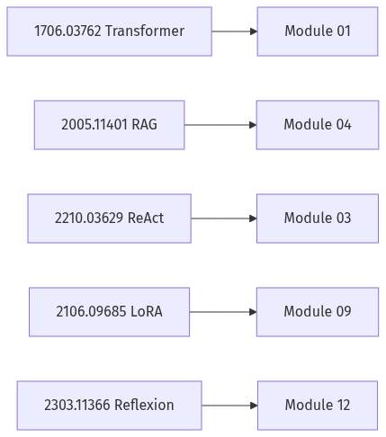
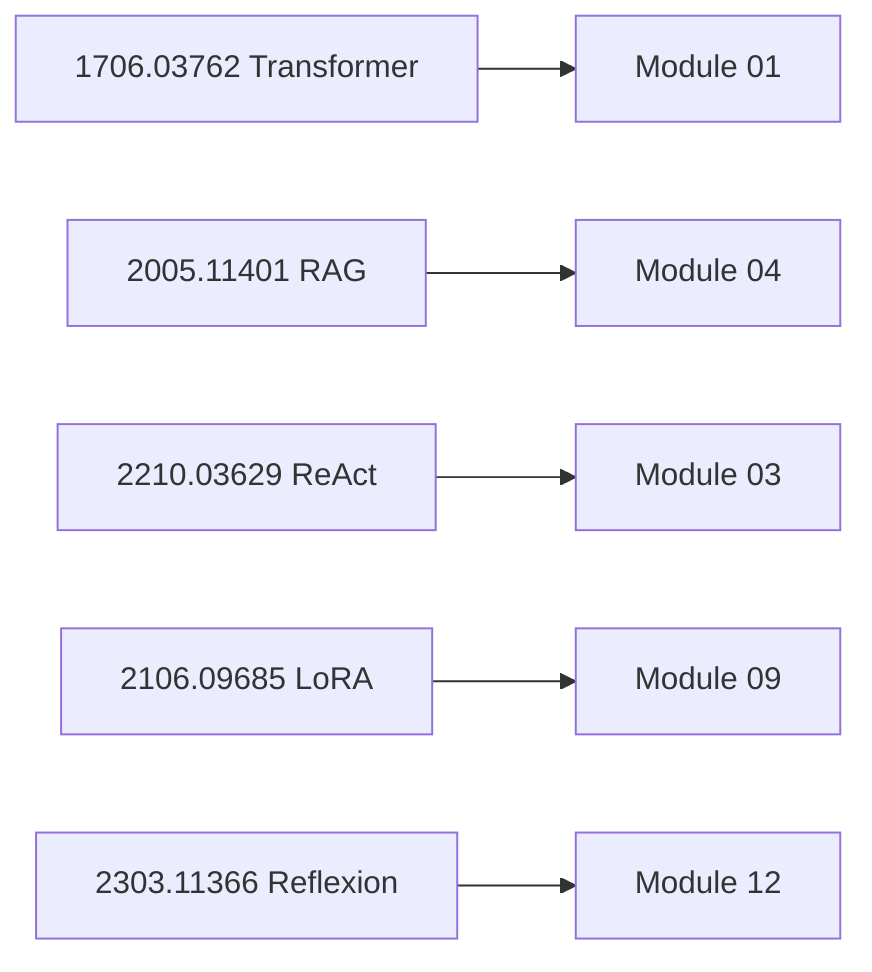

# Paper Database

> Curated papers for GenAI Masterclass. Each entry: problem, architecture, production impact, interview importance.
> Use with [Study Plan](../Study Plan.md) reading timeline and module cross-links.

**Related:** [01-01 Transformer](../Modules/01-LLM-Engineering/01-01-Transformer-Architecture.md) · [04-01 RAG](../Modules/04-RAG/04-01-RAG-Architecture.md) · [03-01 Agents](../Modules/03-Agentic-Fundamentals/03-01-Agent-Anatomy-and-Loop.md) · [09-01 PEFT](../Modules/09-Fine-Tuning/09-01-PEFT-LoRA-QLoRA.md) · [Cheatsheets](../Cheatsheets/Cheatsheet-Index.md)

---

## How to Use This Database

| Field | Purpose |
|-------|---------|
| **Problem** | What gap the paper addresses |
| **Motivation** | Why it mattered at publication time |
| **Architecture** | High-level system diagram in prose |
| **How it works** | Mechanism / algorithm |
| **Advantages** | Strengths vs prior art |
| **Disadvantages** | Limits and failure modes |
| **Production Impact** | How teams apply it today |
| **Interview Importance** | Likelihood and depth in Staff+ loops |
| **Summary** | One-paragraph takeaway |

---

## Attention Is All You Need {#attention}

| Field | Content |
|-------|---------|
| **Title** | Attention Is All You Need |
| **Authors** | Vaswani et al. (Google) |
| **Year** | 2017 |
| **URL** | https://arxiv.org/abs/1706.03762 |
| **Module links** | [01-01](../Modules/01-LLM-Engineering/01-01-Transformer-Architecture.md) · [Cheatsheet: Transformers](../Cheatsheets/Prompt-Embeddings-Attention-Transformers.md) |

**Problem:** Sequence modeling relied on RNNs/CNNs with limited parallelization and long-range dependency bottlenecks.

**Motivation:** Train faster on GPUs via full parallelization; capture global dependencies with attention alone.

**Architecture:** Encoder–decoder Transformer with multi-head self-attention, feed-forward sublayers, residual connections, layer normalization.

**How it works:** Queries, keys, values compute scaled dot-product attention; multi-head projections capture diverse relations; positional encodings inject order.

**Advantages:** Parallelizable training; strong BLEU on translation; foundation for GPT/BERT era.

**Disadvantages:** Quadratic attention cost in sequence length; no native recurrence for streaming without tricks.

**Production Impact:** Every production LLM is a Transformer variant; informs context window economics ([01-02](../Modules/01-LLM-Engineering/01-02-Tokenization-Context-Windows.md)) and KV-cache serving ([01-03](../Modules/01-LLM-Engineering/01-03-Inference-Serving-vLLM.md)).

**Interview Importance:** **Critical** — expect encoder vs decoder, self-attention intuition, complexity, KV cache at Staff+.

**Summary:** The foundational architecture paper for modern LLMs — master attention, positional encoding, and encoder/decoder roles before any agent or RAG discussion.

---

## Retrieval-Augmented Generation for Knowledge-Intensive NLP Tasks {#rag}

| Field | Content |
|-------|---------|
| **Title** | Retrieval-Augmented Generation for Knowledge-Intensive NLP Tasks |
| **Authors** | Lewis et al. (Facebook AI) |
| **Year** | 2020 |
| **URL** | https://arxiv.org/abs/2005.11401 |
| **Module links** | [04-01](../Modules/04-RAG/04-01-RAG-Architecture.md) · [04-03 Hybrid Search](../Modules/04-RAG/04-03-Vector-DB-Hybrid-Search-Reranking.md) |

**Problem:** Parametric LLM knowledge is static, opaque, and hard to update without retraining.

**Motivation:** Ground generation in non-parametric memory (retrieved documents) for factual QA and knowledge-intensive tasks.

**Architecture:** Dual components — dense passage retriever (DPR) + seq2seq generator (BART) conditioned on retrieved passages.

**How it works:** Retrieve top-k passages for query; concatenate to input; generate answer; optionally marginalize over passages.

**Advantages:** Updatable knowledge; improved factual QA; interpretable sources.

**Disadvantages:** Retrieval quality ceiling; context length limits; latency of retrieve + generate.

**Production Impact:** Template for all enterprise RAG — vector DB + rerank + cite ([04-01](../Modules/04-RAG/04-01-RAG-Architecture.md)); compare vs fine-tuning ([09-02](../Modules/09-Fine-Tuning/09-02-Prompting-vs-RAG-vs-FineTuning.md)).

**Interview Importance:** **Critical** — define RAG pipeline, failure modes (bad retrieval), hybrid search in one whiteboard.

**Summary:** Canonical RAG reference — retrieval is a first-class citizen, not an afterthought prompt tweak.

---

## ReAct: Synergizing Reasoning and Acting in Language Models {#react}

| Field | Content |
|-------|---------|
| **Title** | ReAct: Synergizing Reasoning and Acting in Language Models |
| **Authors** | Yao et al. |
| **Year** | 2022 |
| **URL** | https://arxiv.org/abs/2210.03629 |
| **Module links** | [03-01](../Modules/03-Agentic-Fundamentals/03-01-Agent-Anatomy-and-Loop.md) · [05-02 PEC](../Modules/05-Multi-Agent/05-02-Planner-Executor-Critic.md) |

**Problem:** Chain-of-thought alone lacks grounding; tool-use alone lacks interpretable reasoning traces.

**Motivation:** Interleave natural language **thought** with **action** (tool/API) and **observation** for multi-hop tasks.

**Architecture:** Single LM generates alternating Thought / Action / Observation until Final Answer.

**How it works:** Prompt with few-shot trajectories; parse actions to invoke Wikipedia search etc.; feed observations back into context.

**Advantages:** Interpretable traces; better multi-hop QA vs act-only or think-only baselines.

**Disadvantages:** Context growth per step; parsing fragility; no built-in safety on tools.

**Production Impact:** Default mental model for agent loops ([03-01](../Modules/03-Agentic-Fundamentals/03-01-Agent-Anatomy-and-Loop.md)); LangGraph/LangChain ReAct agents; research agents ([12-01](../Modules/12-Advanced-Topics/12-01-Research-Agents.md)).

**Interview Importance:** **Critical** — draw Think→Act→Observe loop; compare to planner–executor.

**Summary:** ReAct is the agent interview vocabulary — reasoning and tools in one trace, with explicit observations closing the loop.

---

## LoRA: Low-Rank Adaptation of Large Language Models {#lora}

| Field | Content |
|-------|---------|
| **Title** | LoRA: Low-Rank Adaptation of Large Language Models |
| **Authors** | Hu et al. (Microsoft) |
| **Year** | 2021 |
| **URL** | https://arxiv.org/abs/2106.09685 |
| **Module links** | [09-01](../Modules/09-Fine-Tuning/09-01-PEFT-LoRA-QLoRA.md) · [09-03 Serving FT](../Modules/09-Fine-Tuning/09-03-Serving-Integrating-FineTuned-Models.md) |

**Problem:** Full fine-tuning billions of parameters is expensive and creates full model copies per task.

**Motivation:** Adapt models by training low-rank matrices injected into attention layers — freeze base weights.

**Architecture:** For weight matrix W, learn ΔW = BA with rank r ≪ min(d,k); merge or swap adapters at inference.

**How it works:** Train only A,B; keep base frozen; optional merging for deployment; multi-adapter serving.

**Advantages:** ~100× fewer trainable params; multiple task adapters; near full-FT quality on many tasks.

**Disadvantages:** Rank choice tuning; not always matching full FT; adapter management ops.

**Production Impact:** Default PEFT path ([09-01](../Modules/09-Fine-Tuning/09-01-PEFT-LoRA-QLoRA.md)); QLoRA extends to consumer GPUs; adapter registries on vLLM.

**Interview Importance:** **High** — explain rank, where injected, vs full fine-tune vs RAG.

**Summary:** LoRA made task-specific LLM adaptation economically viable — know injection points, rank tradeoffs, and serving merged vs dynamic adapters.

---

## Chain-of-Thought Prompting Elicits Reasoning in Large Language Models {#cot}

| Field | Content |
|-------|---------|
| **Title** | Chain-of-Thought Prompting Elicits Reasoning in Large Language Models |
| **Authors** | Wei et al. (Google) |
| **Year** | 2022 |
| **URL** | https://arxiv.org/abs/2201.11903 |
| **Module links** | [02-01](../Modules/02-Prompt-Engineering/02-01-Production-Prompt-Engineering.md) · [03-03 Patterns](../Modules/03-Agentic-Fundamentals/03-03-Agentic-Design-Patterns.md) |

**Problem:** Standard prompting fails on multi-step reasoning (math, commonsense).

**Motivation:** Show intermediate reasoning steps in few-shot exemplars to elicit similar decompositions at inference.

**Architecture:** Prompt = {question, rationale steps, answer} exemplars → model completes rationale for new question.

**How it works:** No weight updates — purely in-context learning of reasoning format.

**Advantages:** Large gains on reasoning benchmarks with big models; simple to prototype.

**Disadvantages:** Token cost; verbose outputs; brittle with small models; can hallucinate steps.

**Production Impact:** Support triage rubrics; combined with tools in ReAct; DSPy ChainOfThought modules ([12-04](../Modules/12-Advanced-Topics/12-04-DSPy-Programmatic-Prompting.md)).

**Interview Importance:** **High** — CoT vs ReAct vs reflection; when CoT hurts latency/cost.

**Summary:** CoT proved reasoning can be elicited via prompt structure — foundation for agent traces and programmatic modules.

---

## Training language models to follow instructions with human feedback (InstructGPT) {#instructgpt}

| Field | Content |
|-------|---------|
| **Title** | Training language models to follow instructions with human feedback |
| **Authors** | Ouyang et al. (OpenAI) |
| **Year** | 2022 |
| **URL** | https://arxiv.org/abs/2203.02155 |
| **Module links** | [02-01](../Modules/02-Prompt-Engineering/02-01-Production-Prompt-Engineering.md) · [08-01 Eval](../Modules/08-Evaluation-LLMOps/08-01-Evaluation-Lifecycle.md) |

**Problem:** Base LMs predict text, not helpful, safe instructions.

**Motivation:** SFT on demonstrations + RLHF with human preference model aligns behavior to user intent.

**Architecture:** Pretrain → supervised fine-tune → reward model from comparisons → PPO optimization.

**How it works:** Humans rank outputs; reward model scores candidates; policy optimized with KL to reference model.

**Advantages:** Massive usability jump; template for ChatGPT-class products.

**Disadvantages:** Expensive human labeling; reward hacking; alignment not solved.

**Production Impact:** Explains why API models behave differently from base; eval + red team culture ([08-03](../Modules/08-Evaluation-LLMOps/08-03-Guardrails-Ship-Criteria.md)).

**Interview Importance:** **High** — SFT vs RLHF; preference data; limitations.

**Summary:** InstructGPT documented the alignment stack behind instruction-following APIs — context for evals, guardrails, and fine-tuning decisions.

---

## Reflexion: Language Agents with Verbal Reinforcement Learning {#reflexion}

| Field | Content |
|-------|---------|
| **Title** | Reflexion: Language Agents with Verbal Reinforcement Learning |
| **Authors** | Shinn et al. |
| **Year** | 2023 |
| **URL** | https://arxiv.org/abs/2303.11366 |
| **Module links** | [12-03](../Modules/12-Advanced-Topics/12-03-Self-Improving-Agents.md) · [03-03 Reflection](../Modules/03-Agentic-Fundamentals/03-03-Agentic-Design-Patterns.md) |

**Problem:** Agents repeat mistakes across episodes without learning from failure.

**Motivation:** Store verbal self-reflections in episodic memory to improve subsequent trials without weight updates.

**Architecture:** Actor generates actions; evaluator scores; reflector writes critique → memory for next attempt.

**How it works:** Binary success signal + natural language reflection appended to context on retry.

**Advantages:** Strong gains on AlfWorld, HotPotQA, programming tasks vs base ReAct.

**Disadvantages:** Context bloat; reflection quality variance; not true gradient learning.

**Production Impact:** Inspires generate-test-refine and retry loops ([12-03](../Modules/12-Advanced-Topics/12-03-Self-Improving-Agents.md)) with bounded retries.

**Interview Importance:** **Medium–High** — compare to fine-tuning, DSPy, explicit eval gates.

**Summary:** Reflexion shows agents can improve via language feedback loops — production requires caps, sandboxes, and hold-out evals.

---

## Generative Agents: Interactive Simulacra of Human Behavior {#generative-agents}

| Field | Content |
|-------|---------|
| **Title** | Generative Agents: Interactive Simulacra of Human Behavior |
| **Authors** | Park et al. (Stanford) |
| **Year** | 2023 |
| **URL** | https://arxiv.org/abs/2304.03442 |
| **Module links** | [05-01 Multi-Agent](../Modules/05-Multi-Agent/05-01-Multi-Agent-Orchestration.md) · [03-02 Memory](../Modules/03-Agentic-Fundamentals/03-02-Tools-Memory-Control-Flow.md) |

**Problem:** LLM agents lack coherent long-horizon behavior and memory.

**Motivation:** Combine memory stream, reflection, and planning for believable multi-day agent simulations.

**Architecture:** Observation → memory stream → retrieval by recency/importance/relevance → plan → act in sandbox world.

**How it works:** Periodic reflection synthesizes memories; plans decomposed to actions; agents interact in shared environment.

**Advantages:** Emergent social behavior demo; memory architecture reference.

**Disadvantages:** Heavy token use; simulation not production workflow; scalability unclear.

**Production Impact:** Memory tiering patterns ([03-02](../Modules/03-Agentic-Fundamentals/03-02-Tools-Memory-Control-Flow.md)); multi-agent product inspiration with cost caveats.

**Interview Importance:** **Medium** — memory retrieval scoring; not a production blueprint.

**Summary:** Influential for agent memory design — borrow retrieval scoring ideas, not full simulation cost model.

---

## Direct Preference Optimization (DPO) {#dpo}

| Field | Content |
|-------|---------|
| **Title** | Direct Preference Optimization: Your Language Model is Secretly a Reward Model |
| **Authors** | Rafailov et al. |
| **Year** | 2023 |
| **URL** | https://arxiv.org/abs/2305.18290 |
| **Module links** | [09-01](../Modules/09-Fine-Tuning/09-01-PEFT-LoRA-QLoRA.md) · [08-01 Eval](../Modules/08-Evaluation-LLMOps/08-01-Evaluation-Lifecycle.md) |

**Problem:** RLHF with PPO is complex, unstable, and expensive.

**Motivation:** Optimize preferences with simple classification-style loss on chosen vs rejected completions.

**Architecture:** Single policy training objective derived from Bradley-Terry preferences without explicit reward model training loop.

**How it works:** Maximize likelihood of preferred outputs relative to dispreferred under closed-form objective.

**Advantages:** Simpler than PPO; widely adopted in open models; good alignment results.

**Disadvantages:** Still needs quality preference data; distribution shift; offline only.

**Production Impact:** Alternative to RLHF for custom model alignment; pairs with human review pipelines.

**Interview Importance:** **Medium** — contrast PPO RLHF vs DPO at Principal depth.

**Summary:** DPO simplified preference alignment — know when teams choose it over classical RLHF.

---

## Lost in the Middle: How Language Models Use Long Contexts {#lost-in-the-middle}

| Field | Content |
|-------|---------|
| **Title** | Lost in the Middle: How Language Models Use Long Contexts |
| **Authors** | Liu et al. |
| **Year** | 2023 |
| **URL** | https://arxiv.org/abs/2307.03172 |
| **Module links** | [01-02 Context](../Modules/01-LLM-Engineering/01-02-Tokenization-Context-Windows.md) · [04-02 Chunking](../Modules/04-RAG/04-02-Chunking-Metadata-Embeddings.md) |

**Problem:** Models under-use information placed in middle of long contexts.

**Motivation:** Benchmark U-shaped performance vs position of relevant evidence.

**Architecture:** Controlled experiments varying position of key passage in long multi-document inputs.

**How it works:** Best performance when evidence at start or end; degraded in middle — robust across models.

**Advantages:** Actionable RAG layout guidance; explains retrieval failures.

**Disadvantages:** Model-specific mitigation evolving; not a fix by itself.

**Production Impact:** Rerank + reorder chunks; lost-in-middle aware prompting ([04-03](../Modules/04-RAG/04-03-Vector-DB-Hybrid-Search-Reranking.md)); context budgeting ([10-04](../Modules/10-Production-Infrastructure/10-04-Cost-Latency-Optimization.md)).

**Interview Importance:** **High** — explain U-curve; mitigations in RAG system design.

**Summary:** Essential RAG systems paper — placement and reranking matter as much as retrieval recall.

---

## Toolformer: Language Models Can Teach Themselves to Use Tools {#toolformer}

| Field | Content |
|-------|---------|
| **Title** | Toolformer: Language Models Can Teach Themselves to Use Tools |
| **Authors** | Schick et al. (Meta) |
| **Year** | 2023 |
| **URL** | https://arxiv.org/abs/2302.04761 |
| **Module links** | [03-02 Tools](../Modules/03-Agentic-Fundamentals/03-02-Tools-Memory-Control-Flow.md) · [02-02 Tool Calling](../Modules/02-Prompt-Engineering/02-02-Structured-Outputs-Tool-Calling.md) |

**Problem:** LMs cannot access calculator, search, calendar — limited to parametric knowledge.

**Motivation:** Self-supervised API call insertion where tools improve next-token prediction.

**Architecture:** LM proposes API calls; filter by loss reduction; finetune on augmented corpus.

**How it works:** Sample candidate call sites; execute tools; keep calls that decrease perplexity on continuation.

**Advantages:** Scalable tool learning without massive human tool annotations.

**Disadvantages:** Training pipeline heavy; production uses schema tool-calling instead for most products.

**Production Impact:** Conceptual ancestor of OpenAI/Anthropic function calling ([02-02](../Modules/02-Prompt-Engineering/02-02-Structured-Outputs-Tool-Calling.md)); tool allowlists ([11-01](../Modules/11-Security-Safety/11-01-OWASP-LLM-Top-10.md)).

**Interview Importance:** **Medium** — contrast training-time tool learning vs inference-time tool schemas.

**Summary:** Toolformer framed tools as LM extensions — modern agents use inference-time schemas with strict RBAC instead.

---

## Reading Priority by Interview Track

| Priority | Papers | When |
|----------|--------|------|
| P0 | Attention, RAG, ReAct, LoRA | Weeks 1–6 |
| P1 | CoT, InstructGPT, Lost in the Middle | Weeks 4–8 |
| P2 | Reflexion, DPO, Toolformer | Weeks 10–14 |
| P3 | Generative Agents | Multi-agent depth |

---

## Cross-Reference to Modules

---

## Summary

These twelve papers span **architecture, grounding, agents, alignment, memory, and context** — the minimum corpus for Staff AI interviews. Read for mechanism and production mapping, not citation trivia; each links to handbook modules where the ideas become shippable systems.
