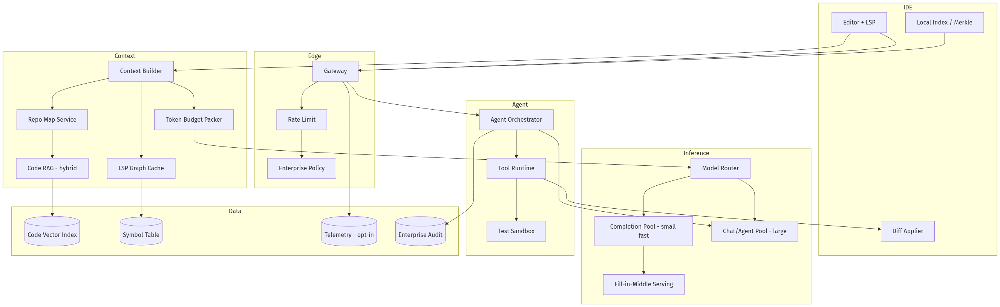
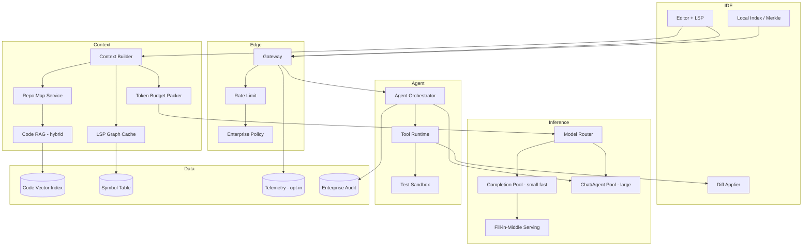
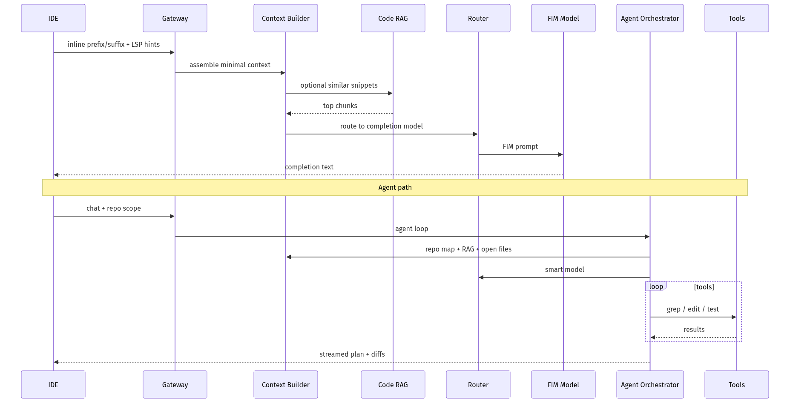
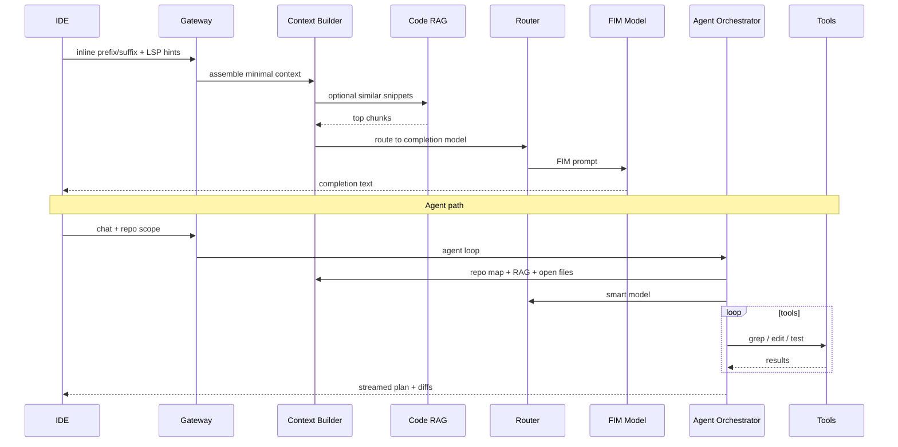
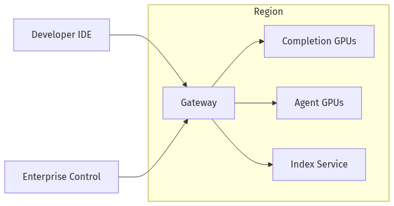
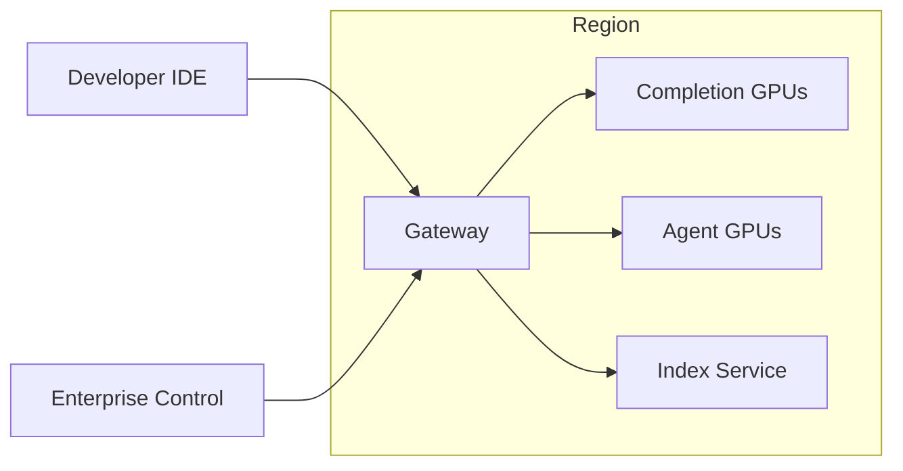

# System Design — AI Coding Assistant (IDE Copilot)

| Meta | Value |
|------|-------|
| **Estimated Time** | 3–4 hours (design 2h · critique 1h · memo 1h) |
| **Difficulty** | Staff / Principal |
| **Prerequisites** | [01-01](../Modules/01-LLM-Engineering/01-01-Transformer-Architecture.md) · [03-01](../Modules/03-Agentic-Fundamentals/03-01-Agent-Anatomy-and-Loop.md) · [08-01](../Modules/08-Evaluation-LLMOps/08-01-Evaluation-Lifecycle.md) · [11-01](../Modules/11-Security-Safety/11-01-OWASP-LLM-Top-10.md) |
| **Related** | [Design Cursor](Design-Cursor.md) · [Design Multi-Agent Workflow Engine](Design-Multi-Agent-Workflow-Engine.md) · [Architecture Index](../Architecture Index.md) |

---

## Interview Framing

> "Design GitHub Copilot / Cursor-class assistant: inline completions, chat with repo context, multi-file edits, terminal commands, and enterprise privacy at millions of developers."

Clarify in first 3 minutes: **inline vs agent mode**, **context window strategy**, **on-prem vs cloud**, **telemetry opt-out**, **languages**, **latency for Tab completion**, **sandbox for code execution**.

---

## Requirements

### Functional

| ID | Requirement |
|----|-------------|
| F1 | Inline ghost-text completions (<100ms perceived) |
| F2 | Chat with @file, @folder, @codebase, @docs, @web |
| F3 | Multi-file agent edits with diff preview and apply |
| F4 | Symbol-aware context: LSP definitions, imports, call graph snippets |
| F5 | Terminal command suggestion (optional sandboxed execution) |
| F6 | PR review comments, test generation, docstrings |
| F7 | Enterprise: no training on customer code; SSO; policy controls |
| F8 | Workspace indexing for monorepos (1M+ LOC) |
| F9 | Model routing: fast completion vs smart agent |

### Non-Functional

| ID | Target (example) |
|----|------------------|
| N1 | Inline p50 latency < 80ms server; p95 < 200ms |
| N2 | Chat TTFT p50 < 500ms |
| N3 | Context relevance: accept rate > 30% inline |
| N4 | Availability 99.9% |
| N5 | Privacy: encrypted transit; zero retention mode |
| N6 | Cost per active dev bounded via caching + small models |

### Out of Scope (initially)

- Fully autonomous unsupervised deploys
- Custom foundation model training on customer code (default)
- Replacing compiler/linter as source of truth

---

## APIs

### Inline completion

```http
POST /v1/completions/inline
Authorization: Bearer <user_token>
Content-Type: application/json

{
  "workspace_id": "ws_abc",
  "file_path": "src/auth/service.ts",
  "prefix": "export async function validate(",
  "suffix": "\n}",
  "cursor": {"line": 42, "col": 28},
  "language": "typescript",
  "lsp_context": {
    "imports": ["..."],
    "definitions_nearby": ["..."],
    "diagnostics": []
  }
}
```

Response (non-streaming for latency):

```json
{
  "choices": [{"text": "token: string): Promise<User>", "score": 0.92}],
  "model": "completion-fast-v3",
  "latency_ms": 67
}
```

### Agent chat (streaming)

```http
POST /v1/chat/agent
{
  "messages": [{"role":"user","content":"Add retry to HTTP client"}],
  "context": {
    "files": ["src/http/client.ts"],
    "repo_map": true,
    "max_tokens": 16000
  },
  "tools": ["edit_file", "run_tests", "grep_repo"],
  "stream": true
}
```

### Tool: edit_file

```json
{
  "name": "edit_file",
  "arguments": {
    "path": "src/http/client.ts",
    "patch": "unified diff or structured edit"
  },
  "requires_confirmation": true
}
```

### Index sync (IDE → cloud)

```http
POST /v1/index/sync
{
  "workspace_id": "ws_abc",
  "manifest_hash": "sha256...",
  "chunks": [{"path":"...","hash":"...","embedding_ref":"..."}]
}
```

---

## Architecture





---

## Data Flow





---

## Scaling

| Layer | Strategy |
|-------|----------|
| Completions | Dedicated low-latency GPU pool; batch disabled |
| FIM serving | Speculative decoding; KV cache for file prefix |
| Repo index | Incremental Merkle sync; shard by workspace |
| Monorepo | Repo map (tree + summaries); retrieve not whole repo |
| Agent | Concurrency limits per user; queue long jobs |
| Sandbox | Ephemeral containers; pool warm |

---

## Caching

| Cache | Key | Value | TTL |
|-------|-----|-------|-----|
| File embedding | path + content_hash | vector | until change |
| Repo map | manifest_hash | tree summary | session |
| LSP symbols | file_hash | defs/refs | minutes |
| Completion prefix | model + prefix_hash | logits prefix KV | seconds |
| RAG chunks | query + manifest | snippets | minutes |

**When NOT to cache:** zero-retention enterprise mode (disable persistent caches).

---

## Latency

| Segment | Budget |
|---------|--------|
| Network IDE→edge | < 30ms regional |
| Context build inline | < 20ms (local + tiny RAG) |
| FIM inference | < 50ms p50 target |
| Chat RAG | < 150ms |
| Agent tools | async with UI progress |

**Techniques:** Local context in IDE; debounce completions; smaller model for Tab; truncate to surrounding window + imports.

---

## Security

| Threat | Control |
|--------|---------|
| Secret leakage in context | Secret scanners; redact before send |
| Malicious repo (prompt injection) | Data channel separation; tool allowlists |
| Arbitrary code exec | Sandbox; user confirm; network egress off |
| IP exfiltration via model | Enterprise no-training + DLP |
| Dependency confusion in suggestions | Lint/test gate before apply |

---

## Observability

| Signal | Why |
|--------|-----|
| Accept rate / chars accepted | Completion quality |
| Time-to-first-token chat | UX |
| Tool failure rate | Agent reliability |
| Context tokens / request | Cost |
| Index sync lag | RAG quality |
| Sandbox escape attempts | Security |

---

## Cost

\[
Cost \approx N_{inline} \cdot small\_FIM + N_{chat} \cdot large\_tokens + index\_embed + sandbox\_CPU
\]

Levers: aggressive debounce; cheap completion model; repo map vs full RAG; cap agent iterations; local embeddings option.

---

## Failure Modes

| Failure | Impact | Mitigation |
|---------|--------|------------|
| Completion timeout | No ghost text | Silent skip |
| Wrong multi-file edit | Broken build | Diff preview + undo |
| Index stale | Irrelevant RAG | Show index age; resync |
| Sandbox OOM | Test fail | Retry smaller scope |
| Model hallucinated API | Compile error | LSP diagnostics feedback loop |

---

## Tradeoffs

| Decision | Option A | Option B | Pick when |
|----------|----------|----------|-----------|
| Index | Cloud | Local-only | Local for strict enterprise |
| Agent autonomy | Auto-apply | Confirm each edit | Confirm default |
| Context | Full open files | RAG retrieval | Hybrid |
| Completion | Single model | Router | Router at scale |
| Telemetry | On | Opt-out | Opt-out enterprise |

---

## Deployment





- Completion and chat pools isolated
- Enterprise VPC deployment option
- Canary model versions per org

---

## Interview Answer Skeleton (45–60 min)

1. Inline vs agent requirements + latency (7)
2. Context: LSP, repo map, RAG (10)
3. FIM serving architecture (7)
4. Agent loop + sandbox (8)
5. Enterprise privacy (5)
6. Scale + cache (7)
7. Security + failure (8)
8. Metrics + cost (5)

---

## Practice Prompts

1. Design Tab completion for 200ms RTT users—what moves local vs cloud?
2. Agent proposes deleting auth checks—architecture defenses?
3. Index a 5M LOC monorepo without sending all code to the model each request.

---

## Further Reading

| Title | URL | Why |
|-------|-----|-----|
| GitHub Copilot Docs | https://docs.github.com/en/copilot | Product + privacy modes |
| Cursor Docs | https://cursor.com/docs | Agent + codebase context |
| Code Llama paper | https://arxiv.org/abs/2308.12950 | FIM training |
| SWE-bench | https://www.swebench.com/ | Agent eval benchmark |
| Tree-sitter | https://tree-sitter.github.io/tree-sitter/ | Parsing for chunking |

---

## Resume Bullet

- Built architecture for an IDE AI assistant spanning sub-100ms FIM completions, LSP-aware context packing, Merkle-synced repo RAG, sandboxed agent tools, and enterprise zero-retention modes.
