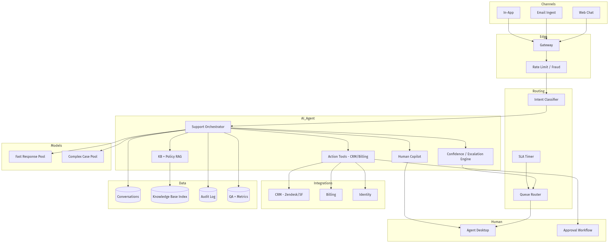
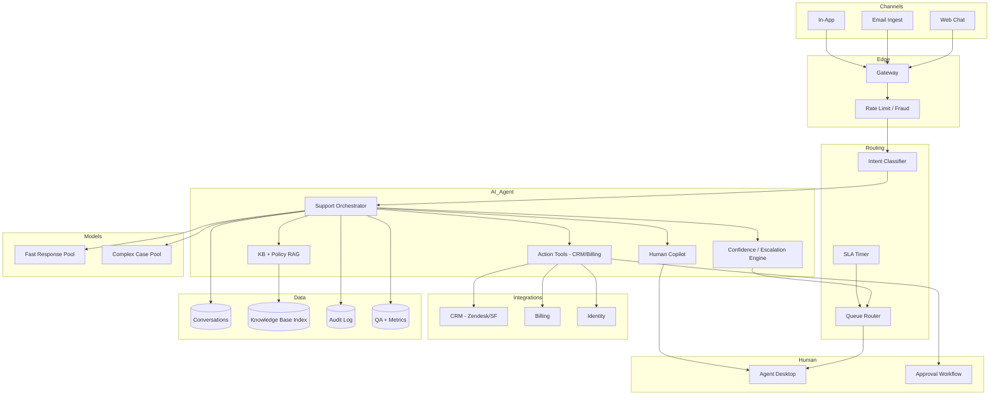
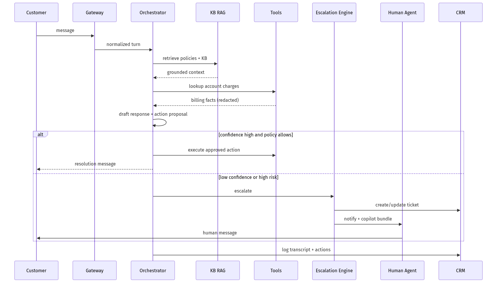
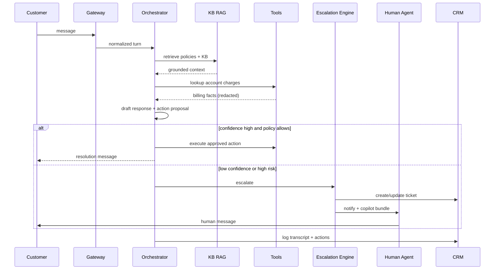
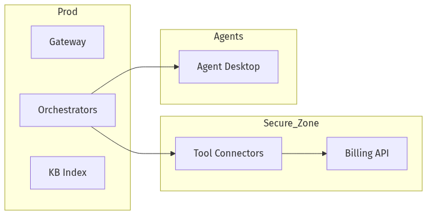
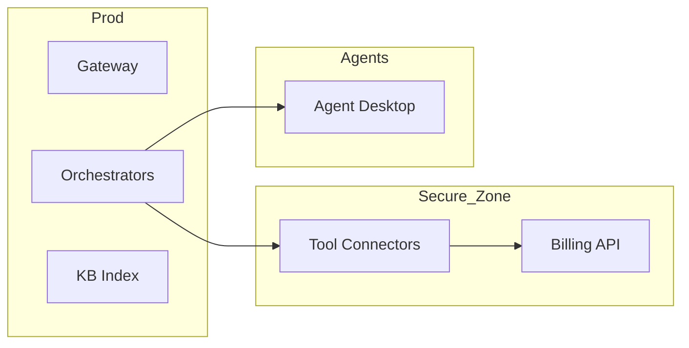

# System Design — AI Customer Support (Agent + Human Handoff)

| Meta | Value |
|------|-------|
| **Estimated Time** | 3–4 hours (design 2h · critique 1h · memo 1h) |
| **Difficulty** | Staff / Principal |
| **Prerequisites** | [03-01](../Modules/03-Agentic-Fundamentals/03-01-Agent-Anatomy-and-Loop.md) · [08-01](../Modules/08-Evaluation-LLMOps/08-01-Evaluation-Lifecycle.md) · [11-01](../Modules/11-Security-Safety/11-01-OWASP-LLM-Top-10.md) |
| **Related** | [Design Slack AI](Design-Slack-AI.md) · [Design Multi-Agent Workflow Engine](Design-Multi-Agent-Workflow-Engine.md) · [Architecture Index](../Architecture Index.md) |

---

## Interview Framing

> "Design AI customer support for a fintech SaaS: chat/email/voice deflection, grounded answers from KB + account data, tool actions (refund, reset), and seamless human escalation with full context."

Clarify in first 3 minutes: **channels**, **automation boundaries**, **PII/regulatory**, **languages**, **CSAT target**, **when to escalate**, **CRM integration (Zendesk/Salesforce)**.

---

## Requirements

### Functional

| ID | Requirement |
|----|-------------|
| F1 | Omnichannel: web chat, email, in-app, optional voice |
| F2 | Intent detection + routing (billing, technical, account) |
| F3 | RAG over KB, macros, policies; account-specific lookups via tools |
| F4 | Actions: ticket create, password reset, refund (<$X), plan change |
| F5 | Human handoff with transcript, suggested reply, customer 360 |
| F6 | Confidence-based escalation; SLA timers |
| F7 | Admin: playbooks, tone, forbidden topics, approval workflows |
| F8 | QA sampling, coaching, and feedback to improve prompts/KB |
| F9 | Proactive outreach (optional): outage notices, renewal reminders |

### Non-Functional

| ID | Target (example) |
|----|------------------|
| N1 | Chat first response < 3s; resolution deflection 40–60% |
| N2 | Escalation accuracy: humans agree AI decision > 90% |
| N3 | PII minimization; PCI scope isolation for payments |
| N4 | Availability 99.95% chat |
| N5 | Audit trail for regulated actions |
| N6 | Multilingual with fallback to human |

### Out of Scope (initially)

- Fully autonomous legal advice
- Unbounded refunds without human approval
- Custom model training on all tickets (default anonymized eval only)

---

## APIs

### Customer message

```http
POST /v1/support/conversations/{id}/messages
Authorization: Bearer <customer_session>
Content-Type: application/json

{
  "channel": "chat",
  "text": "I was charged twice this month",
  "locale": "en-US",
  "metadata": {"plan": "pro", "account_id": "acc_123"}
}
```

### Agent response (streaming)

```text
event: intent
data: {"label":"billing_duplicate_charge","confidence":0.94}

event: retrieval
data: {"kb_articles":["kb_456"],"policy":"refund_policy_v3"}

event: token
data: {"delta":"I see two charges on"}

event: action_proposal
data: {"tool":"billing.issue_refund","amount":29.99,"requires_approval":true}

event: escalate
data: {"reason":"high_value_customer","queue":"billing_t2"}

event: done
data: {"resolved":false,"ticket_id":"tkt_789"}
```

### Human agent cockpit

```http
GET /v1/support/conversations/{id}/copilot
```

Returns: summary, sentiment, suggested reply, linked account facts, action history.

### Tool: account lookup (internal)

```json
{
  "name": "crm.get_account",
  "authz": "service_role_scoped_to_conversation",
  "inputs": {"account_id": "acc_123"},
  "pii_fields": ["email", "last4"]
}
```

---

## Architecture





---

## Data Flow





---

## Scaling

| Layer | Strategy |
|-------|----------|
| Chat | Stateless orchestrators; regional |
| Email | Async workers; batch ingest |
| RAG | Shared KB index; cache hot articles |
| Tools | Rate limit per account; circuit breakers |
| Human queues | Skill-based routing; peak staffing signals |
| Voice (optional) | Separate low-latency pool |

---

## Caching

| Cache | Key | Value | TTL |
|-------|-----|-------|-----|
| KB article | article_id + version | text + embed | until publish |
| Intent | message_hash | label | minutes |
| Account snapshot | account_id | non-sensitive facts | seconds (careful) |
| Macro templates | intent | response skeleton | hours |

**When NOT to cache:** account balances during dispute; post-action state.

---

## Latency

| Segment | Budget |
|---------|--------|
| Intent | < 100ms |
| KB retrieval | < 150ms |
| Account tool | < 300ms |
| LLM first token | < 1s |
| Human copilot gen | async < 3s |

**Techniques:** Fast model for greetings; parallel RAG + account fetch; precomputed macros.

---

## Security

| Threat | Control |
|--------|---------|
| Account takeover via support | Step-up auth before sensitive actions |
| PII in logs | Redaction pipeline |
| Prompt injection in tickets | Data channel isolation |
| Excessive agency | Policy engine on tools; amount caps |
| Social engineering | Escalation on credential requests |

---

## Observability

| Signal | Why |
|--------|-----|
| Deflection rate | ROI |
| CSAT / thumbs | Quality |
| Escalation precision/recall | Routing |
| AHT for humans | Handoff quality |
| Tool error / approval rate | Safety |
| Policy violation attempts | Compliance |

---

## Cost

\[
Cost \approx N_{chats} \cdot tokens + tool\_calls + human\_minutes\_saved
\]

Levers: deflect with fast model; macro templates; limit tool calls; batch email.

---

## Failure Modes

| Failure | Impact | Mitigation |
|---------|--------|------------|
| Wrong refund | Financial loss | Approval thresholds |
| KB stale | Wrong policy | Version tags + effective dates |
| Tool timeout | Frustration | Escalate with context |
| Over-deflection | Bad CSAT | Confidence tuning |
| LLM outage | Queue spike | Human-only mode + status page |

---

## Tradeoffs

| Decision | Option A | Option B | Pick when |
|----------|----------|----------|-----------|
| Automation | Aggressive deflect | Conservative escalate | Regulated → conservative |
| Actions | AI executes | Human approves | Approvals for money |
| KB | Static articles | Live account only | Both |
| Tone | Brand voice fine-tune | Prompt only | Prompt + eval first |
| Channels | Unified orchestrator | Per-channel | Unified for context |

---

## Deployment





- Tool connectors in PCI-scoped network segment
- Blue/green prompt/policy; canary by queue
- CRM webhooks for bidirectional sync

---

## Interview Answer Skeleton (45–60 min)

1. Channels + business metrics (5)
2. Orchestrator + RAG + tools (10)
3. Escalation + human copilot (8)
4. Policy/approval for actions (7)
5. PII/security/compliance (7)
6. Scale + latency (5)
7. QA eval loop (5)
8. Failures + cost (8)

---

## Practice Prompts

1. Customer asks for refund outside policy via prompt injection—walk through defenses.
2. Design handoff so human never re-asks account ID.
3. Email thread 40 messages long—context strategy?

---

## Further Reading

| Title | URL | Why |
|-------|-----|-----|
| Zendesk AI | https://www.zendesk.com/service/ai/ | Industry patterns |
| Intercom Fin | https://www.intercom.com/fin | RAG support agent |
| Salesforce Einstein Service | https://www.salesforce.com/service/ai/ | CRM-integrated support |
| OWASP LLM Top 10 | https://owasp.org/www-project-top-10-for-large-language-model-applications/ | Excessive agency |
| ITIL escalation | https://www.axelos.com/certifications/itil-service-management | SLA/queue concepts |

---

## Resume Bullet

- Architected omnichannel AI support with policy-grounded RAG, confidence-driven escalation, approval-gated billing tools, and human copilot handoff—balancing deflection ROI with fintech compliance.
