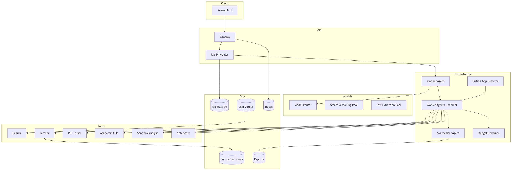
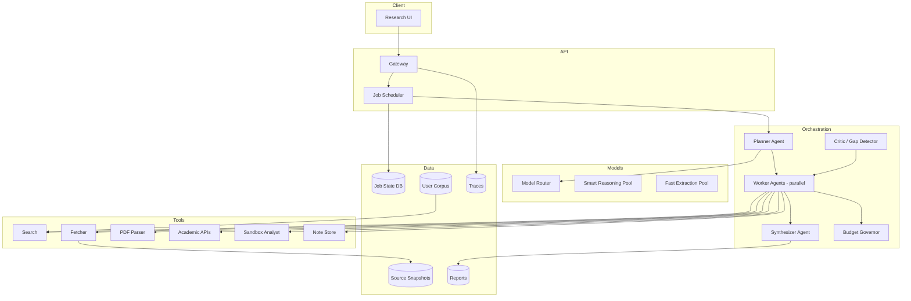
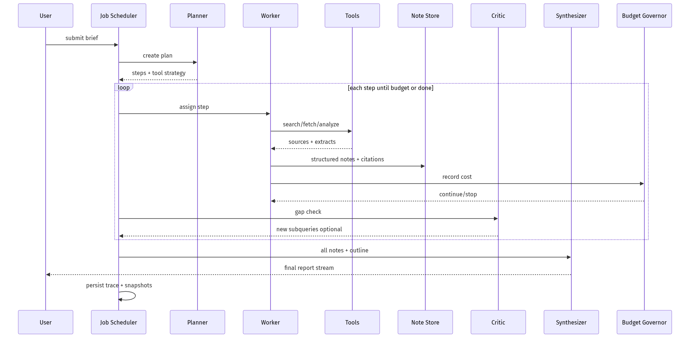
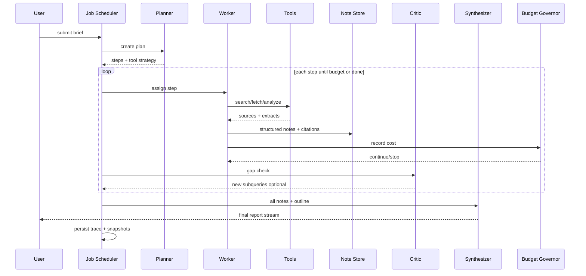
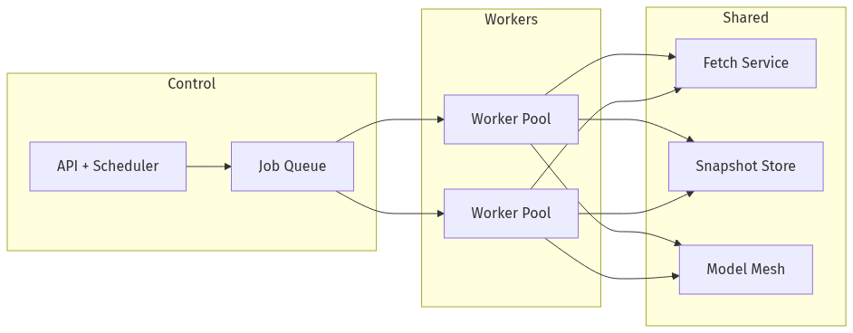
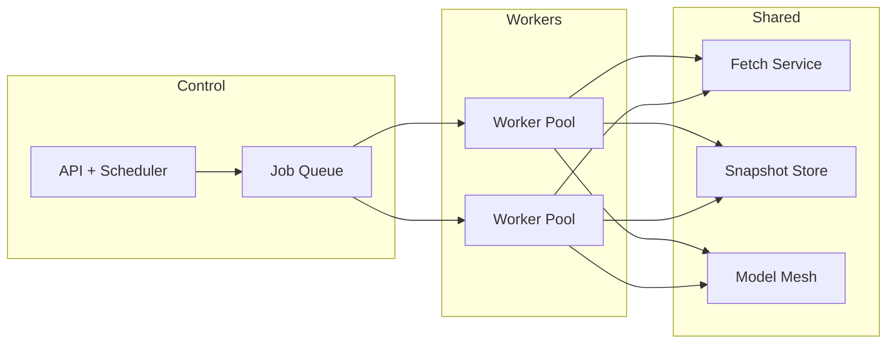

# System Design — AI Research Agent (Deep Multi-Step)

| Meta | Value |
|------|-------|
| **Estimated Time** | 3–4 hours (design 2h · critique 1h · memo 1h) |
| **Difficulty** | Staff / Principal |
| **Prerequisites** | [03-01](../Modules/03-Agentic-Fundamentals/03-01-Agent-Anatomy-and-Loop.md) · [08-01](../Modules/08-Evaluation-LLMOps/08-01-Evaluation-Lifecycle.md) · [11-01](../Modules/11-Security-Safety/11-01-OWASP-LLM-Top-10.md) |
| **Related** | [Design AI Search Engine](Design-AI-Search-Engine.md) · [Design Multi-Agent Workflow Engine](Design-Multi-Agent-Workflow-Engine.md) · [Architecture Index](../Architecture Index.md) |

---

## Interview Framing

> "Design a deep research agent (OpenAI Deep Research / Gemini Deep Research class): given a complex question, plan subtasks, browse corpora, synthesize a report with citations over 5–30 minutes."

Clarify in first 3 minutes: **time budget**, **source types (web, PDF, paywall)**, **human-in-the-loop**, **output format**, **cost cap**, **concurrency**, **eval criteria**.

---

## Requirements

### Functional

| ID | Requirement |
|----|-------------|
| F1 | Accept research brief; clarify ambiguities (optional) |
| F2 | Generate research plan with subquestions and source strategy |
| F3 | Tools: web search, fetch, PDF parse, academic APIs, code/data analysis |
| F4 | Iterative loop: search → read → note → gap detect → refine |
| F5 | Structured report: executive summary, sections, citations, confidence |
| F6 | Progress UI: plan steps, sources found, time elapsed |
| F7 | Export: Markdown, PDF, slide outline |
| F8 | User attachments + private corpus with ACL |
| F9 | Cancel/pause/resume long runs |

### Non-Functional

| ID | Target (example) |
|----|------------------|
| N1 | Simple runs < 5 min; deep runs < 30 min p95 |
| N2 | Citation coverage: >90% factual sentences supported |
| N3 | Max cost per run configurable (e.g. $5 default) |
| N4 | Isolation: no cross-user corpus leakage |
| N5 | Availability 99.5% job accept |
| N6 | Reproducibility: saved trace + source snapshots |

### Out of Scope (initially)

- Unsupervised autonomous actions (email, purchase)
- Real-time breaking news ticker
- Peer-review grade novelty claims without human review

---

## APIs

### Start research job

```http
POST /v1/research/jobs
Authorization: Bearer <user_jwt>
Content-Type: application/json

{
  "brief": "Compare CRDT vs OT for collaborative editors in 2026",
  "depth": "deep",
  "max_minutes": 20,
  "max_cost_usd": 8,
  "sources": ["web", "arxiv", "user_files"],
  "file_ids": ["file_abc"],
  "output_format": "markdown_report"
}
```

Response:

```json
{
  "job_id": "job_xyz",
  "status": "planning",
  "stream_url": "/v1/research/jobs/job_xyz/events"
}
```

### Job events (SSE)

```text
event: plan
data: {"steps":[{"id":1,"title":"Survey CRDT literature","status":"pending"}]}

event: tool
data: {"step":1,"tool":"web.search","query":"CRDT survey 2025"}

event: source
data: {"url":"https://arxiv.org/...","title":"...","relevance":0.88}

event: note
data: {"step":1,"finding":"CRDTs favor availability..."}

event: report_chunk
data: {"section":"Background","markdown":"..."}

event: done
data: {"report_id":"rep_123","citations":42,"cost_usd":6.2}
```

### Get report

```http
GET /v1/research/jobs/job_xyz/report
```

---

## Architecture





---

## Data Flow





---

## Scaling

| Layer | Strategy |
|-------|----------|
| Jobs | Queue (SQS/Kafka); worker pool autoscale |
| Parallelism | Independent subqueries on separate workers |
| Fetch | Global fetch pool with domain limits |
| Snapshots | Object store; compress; TTL policy |
| Synthesis | Single heavy call; stream sections |
| User corpus | Sharded vector index |

---

## Caching

| Cache | Key | Value | TTL |
|-------|-----|-------|-----|
| Fetch | url_hash | extracted text | days |
| Search | query_hash | results | hours |
| PDF parse | file_hash | structured text | 30d |
| Notes | job_id + step | findings | job lifetime |
| Plan template | topic_class | plan skeleton | days |

---

## Latency

Long-running by design; optimize **perceived** progress:

| Segment | Target |
|---------|--------|
| Plan visible | < 15s |
| First source | < 60s |
| Progress events | every 5–10s |
| Report streaming | begin before all reads complete (outline first) |

**Techniques:** Parallel workers; fast model for extract; smart model for plan/synth only; prefetch from plan.

---

## Security

| Threat | Control |
|--------|---------|
| SSRF in fetch | URL allowlists; sandbox |
| Prompt injection in PDFs/web | Notes as data; never execute hidden instructions |
| Cross-user file access | ACL on corpus |
| Runaway cost | Budget governor hard stop |
| Harmful research | Policy on brief; output moderation |

---

## Observability

| Signal | Why |
|--------|-----|
| Cost/job vs budget | Finance |
| Steps completed / replans | Agent quality |
| Sources per claim | Citation eval |
| Tool error rate | Reliability |
| Time per phase | UX tuning |
| User export rate | Success proxy |

---

## Cost

\[
Cost \approx \sum steps (search + fetch + extract_{tokens} + worker_{tokens}) + synthesize_{tokens}
\]

Levers: cap parallel workers; fast extract model; dedupe URLs; early stop when critic satisfied; cache fetches globally (privacy-safe URLs only).

---

## Failure Modes

| Failure | Impact | Mitigation |
|---------|--------|------------|
| Budget exhausted | Partial report | Deliver partial + gaps section |
| Paywall block | Missing sources | Note limitation; alternate sources |
| Worker crash | Stalled job | Retry step; checkpoint state |
| Citation drift | Wrong refs | Snapshot hash in citation |
| Plan too broad | Timeout | Planner narrows with user confirm |

---

## Tradeoffs

| Decision | Option A | Option B | Pick when |
|----------|----------|----------|-----------|
| Architecture | Single agent loop | Planner + workers | Workers for parallelism |
| Depth | Fixed steps | Critic-driven | Critic for quality/$ |
| Sources | Web only | + sandbox code | Code for data questions |
| Output | One-shot report | Interactive outline first | Interactive for trust |
| Storage | Ephemeral snapshots | Long retention | Policy per tier |

---

## Deployment





- Async job platform (not synchronous RPC)
- Idempotent steps keyed by `job_id + step_id`
- Regional fetch compliance

---

## Interview Answer Skeleton (45–60 min)

1. Brief + SLOs vs chat (5)
2. Job model + checkpointing (8)
3. Planner/worker/critic loop (10)
4. Tools + snapshots + citations (8)
5. Budget governor (5)
6. Scale + parallelism (7)
7. Security + failure (7)
8. Evals + cost (5)

---

## Practice Prompts

1. Job hits $ cap at 80% plan—what does user receive?
2. Two workers fetch contradictory papers—how does synthesizer resolve?
3. Design eval harness for citation coverage without human labelers on every run.

---

## Further Reading

| Title | URL | Why |
|-------|-----|-----|
| OpenAI Deep Research | https://openai.com/index/introducing-deep-research/ | Product reference |
| Gemini Deep Research | https://blog.google/products/gemini/google-gemini-deep-research/ | Alternative architecture cues |
| ReAct | https://arxiv.org/abs/2210.03629 | Tool loop foundation |
| LangGraph persistence | https://langchain-ai.github.io/langgraph/concepts/persistence/ | Checkpoint patterns |
| WebArena / BrowseComp evals | https://arxiv.org/abs/2404.05990 | Agent browsing benchmarks |

---

## Resume Bullet

- Designed a long-horizon research agent with planner–worker–critic orchestration, budget-governed tool loops, source snapshots for reproducible citations, and parallel subquery execution for 5–30 minute structured reports.
