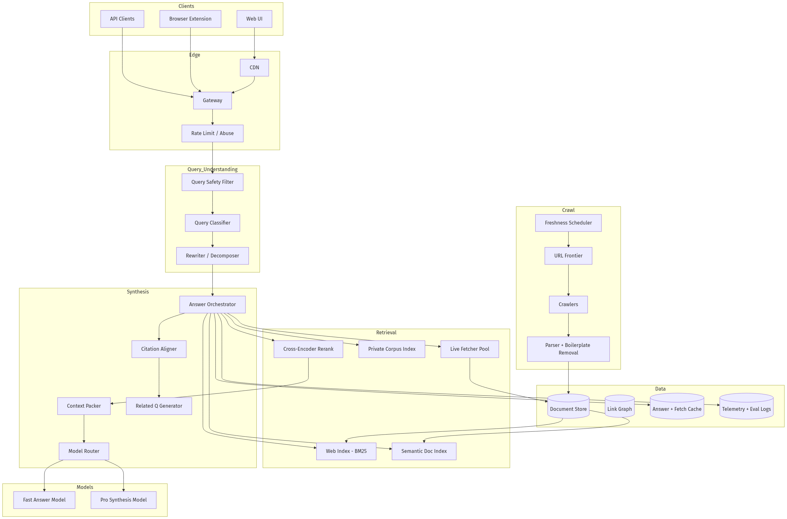
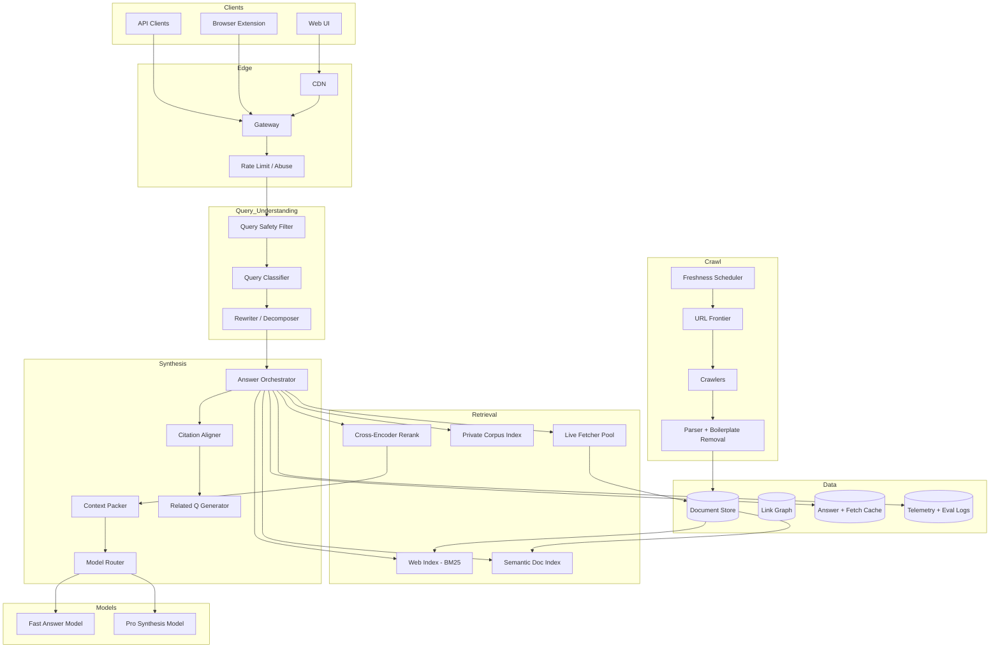
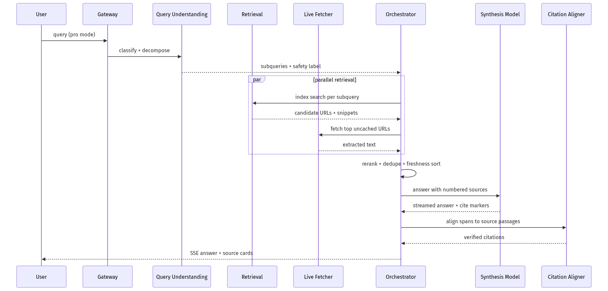
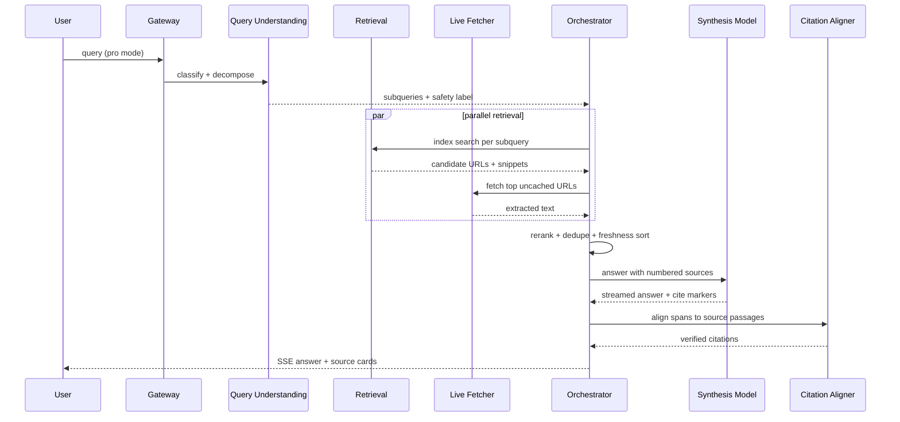
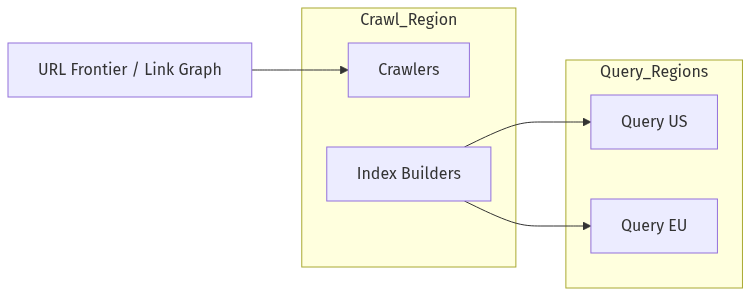
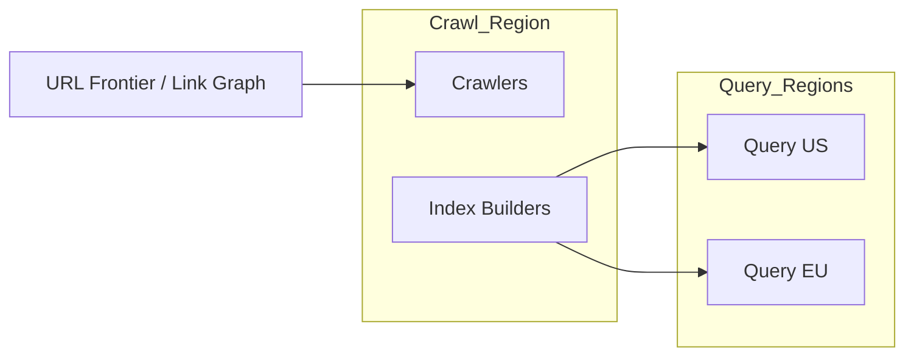

# System Design — AI Search Engine (Answer + Citations)

| Meta | Value |
|------|-------|
| **Estimated Time** | 3–4 hours (design 2h · critique 1h · memo 1h) |
| **Difficulty** | Staff / Principal |
| **Prerequisites** | [01-01](../Modules/01-LLM-Engineering/01-01-Transformer-Architecture.md) · [03-01](../Modules/03-Agentic-Fundamentals/03-01-Agent-Anatomy-and-Loop.md) · [08-01](../Modules/08-Evaluation-LLMOps/08-01-Evaluation-Lifecycle.md) |
| **Related** | [Design Slack AI](Design-Slack-AI.md) · [Design AI Research Agent](Design-AI-Research-Agent.md) · [Architecture Index](../Architecture Index.md) |

---

## Interview Framing

> "Design an AI-native search engine (Perplexity-style): real-time web + optional private corpus, cited answers, follow-ups, and pro search with multi-step retrieval at 100M queries/day."

Clarify in first 3 minutes: **web-only vs hybrid**, **freshness SLO**, **pro vs fast tier**, **ads/monetization**, **geo/language**, **user accounts & history**, **safety bar for YMYL queries**.

---

## Requirements

### Functional

| ID | Requirement |
|----|-------------|
| F1 | Natural-language queries with direct answers + inline citations |
| F2 | Web crawl/index + live fetch for breaking news |
| F3 | Optional user collections / enterprise corpus (ACL-aware) |
| F4 | Follow-up conversation with query rewriting |
| F5 | Pro mode: multi-hop retrieval, query decomposition, deeper synthesis |
| F6 | Related questions, source cards, image/video snippets |
| F7 | Safe handling of medical/legal/financial (disclaimers + high-quality sources) |
| F8 | Export/share answer pages; API for developers |
| F9 | Feedback loop: thumbs, report incorrect citation |

### Non-Functional

| ID | Target (example) |
|----|------------------|
| N1 | Fast tier E2E p50 < 2s; Pro p95 < 8s |
| N1b | TTFT < 800ms fast tier |
| N2 | Citation accuracy > 95% on golden eval set |
| N3 | Index freshness: news < 15 min; general crawl lag acceptable tiered |
| N4 | Availability 99.9% |
| N5 | Scale 100M+ Q/day; burst 10× on events |
| N6 | Cost per query bounded via tiering |

### Out of Scope (initially)

- Full general-purpose agent with arbitrary code execution
- Personalized ad auction (mention architecture hook only)
- Training foundation models in-house

---

## APIs

### Search / answer

```http
POST /v1/search
Authorization: Bearer <api_key_or_user>
Content-Type: application/json

{
  "query": "Latest FDA approval for drug X?",
  "mode": "pro",
  "stream": true,
  "locale": "en-US",
  "sources": ["web"],
  "follow_up_of": "thread_uuid"
}
```

### Streaming

```text
event: plan
data: {"subqueries":["FDA drug X approval 2026","drug X press release"]}

event: sources
data: {"urls":[{"url":"https://fda.gov/...","title":"...","fetched_at":"..."}]}

event: token
data: {"delta":"On July 10, 2026"}

event: citation
data: {"idx":1,"url":"https://fda.gov/...","span":[0,28]}

event: related
data: {"questions":["Side effects of drug X?"]}

event: done
data: {"usage":{...},"confidence":"medium"}
```

### Internal fetch contract

```json
{
  "url": "https://example.com/article",
  "max_bytes": 500000,
  "timeout_ms": 3000,
  "extract": "readability",
  "robots_respect": true
}
```

---

## Architecture





---

## Data Flow





---

## Scaling

| Layer | Strategy |
|-------|----------|
| Crawl | Distributed frontier; politeness per domain; priority by PageRank + news |
| Index | Sharded inverted index; separate hot news shard |
| Live fetch | Large pool; per-domain rate limits; proxy rotation |
| Query path | Stateless orchestrators; regional |
| Pro mode | Queue with SLA; shed to fast mode under load |
| Private corpus | Tenant-isolated indexes |

---

## Caching

| Cache | Key | Value | TTL |
|-------|-----|-------|-----|
| Fetch | normalized_url | extracted text + hash | hours–days |
| Index snippet | url + index_version | snippet | until recrawl |
| Answer | query_hash + mode + locale | full answer | minutes (non-news) |
| Embeddings | passage_hash | vector | days |
| Domain robots | host | robots.txt | hours |

**When NOT to cache:** breaking news queries; personalized corpus; YMYL after source updates.

---

## Latency

| Segment | Budget |
|---------|--------|
| Query understanding | < 80ms |
| Index retrieval | < 150ms |
| Live fetch (parallel 3–5) | < 1.5s p95 |
| Rerank | < 100ms |
| Synthesis TTFT | < 800ms fast |
| Citation align | overlap with stream |

**Techniques:** Speculative fetch on autocomplete; fast mode skips decomposition; cache hot URLs; smaller model for related questions.

---

## Security

| Threat | Control |
|--------|---------|
| SSRF via live fetch | URL blocklists; no internal IP; sandboxed fetchers |
| Misinformation | Source quality scoring; YMYL templates |
| Prompt injection in web pages | Untrusted passages in data channel |
| Crawl abuse | robots.txt; legal compliance |
| API scraping | Rate limits; bot detection |

---

## Observability

| Signal | Why |
|--------|-----|
| Citation accuracy eval | Core product metric |
| Live fetch fail rate | Freshness |
| Pro queue depth | Capacity |
| Source diversity | Bias detection |
| $/query by mode | Unit economics |
| Thumbs down rate | Quality regression |

---

## Cost

\[
Cost \approx crawl + index + fetch\_bandwidth + rerank + LLM_{tokens} + GPU_{embed}
\]

Levers: aggressive fetch cache; fast mode default; limit pro hops; cheaper model for classifier/rewriter; recrawl tiering by PageRank.

---

## Failure Modes

| Failure | Impact | Mitigation |
|---------|--------|------------|
| Fetch timeout | Thin answer | Partial answer + "sources limited" |
| Stale index | Wrong facts | Live fetch boost; show timestamps |
| Citation mismatch | Trust loss | Post-align + refuse unsupported claims |
| Crawler block | Missing sources | Alternate mirrors; user report |
| LLM outage | No synthesis | Snippet-only fallback |

---

## Tradeoffs

| Decision | Option A | Option B | Pick when |
|----------|----------|----------|-----------|
| Freshness | Index-only | Index + live fetch | Always hybrid for AI search |
| Answer style | Abstractive | Extractive-heavy | Extractive for YMYL |
| Pro | More hops | Better rerank only | Hops for research queries |
| Monetization | Subscription | Ads | Sub for trust-first brand |

---

## Deployment





- Crawl/index centralized or regional; query regional
- Canary ranking + prompt changes
- Kill switch for live fetch domains

---

## Interview Answer Skeleton (45–60 min)

1. Product tiers + SLOs (5)
2. Crawl/index/live fetch (10)
3. Query path fast vs pro (10)
4. Synthesis + citations (8)
5. Safety YMYL (5)
6. Scale + cache (7)
7. Cost + failure (8)
8. Metrics/evals (5)

---

## Practice Prompts

1. User asks about breaking election results—design freshness path end-to-end.
2. Citation points to page that contradicts your answer—how detect in production?
3. Cut live fetch cost 50% without killing quality on news.

---

## Further Reading

| Title | URL | Why |
|-------|-----|-----|
| Perplexity API | https://docs.perplexity.ai/ | Answer + search API patterns |
| Bing Web Search API | https://learn.microsoft.com/en-us/bing/search-apis/bing-web-search/overview | Hybrid retrieval reference |
| Google Research: RAG | https://research.google/blog/dear-google-search-its-time-for-rag/ | Industry RAG direction |
| Freshness in search | https://arxiv.org/abs/1206.2081 | Crawl scheduling concepts |
| OWASP LLM Top 10 | https://owasp.org/www-project-top-10-for-large-language-model-applications/ | Untrusted web content |

---

## Resume Bullet

- Designed an AI search engine combining sharded web index, parallel live fetch, query decomposition for pro mode, citation-aligned synthesis, and YMYL safety tiers—optimized for sub-2s fast answers at 100M+ Q/day scale.
