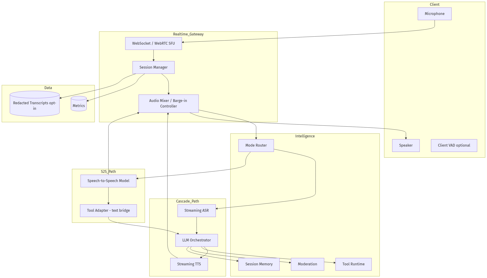
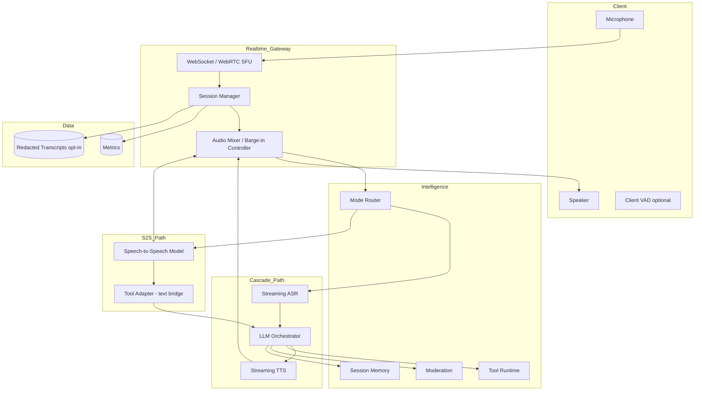
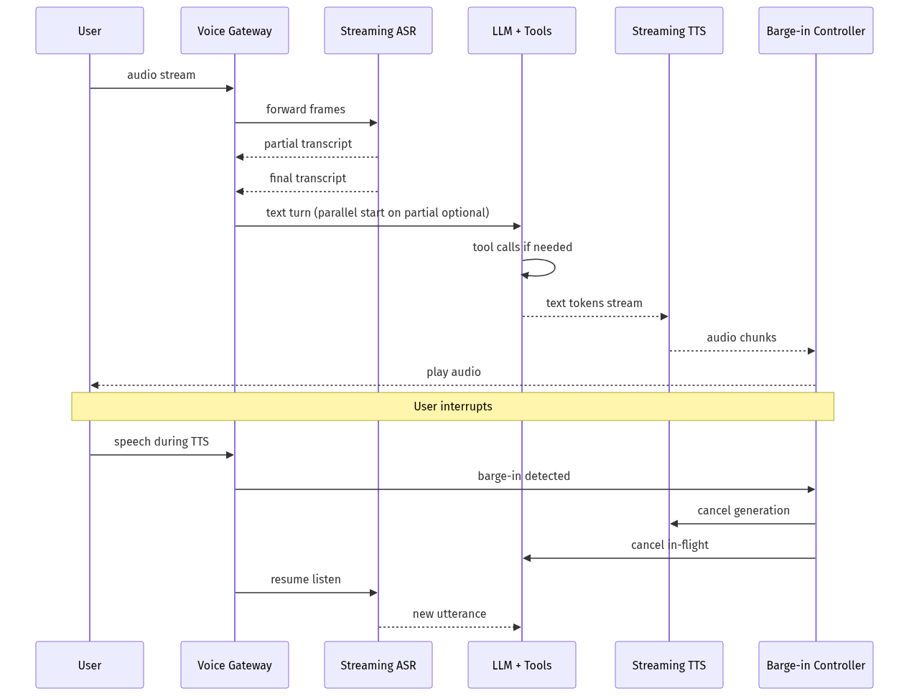
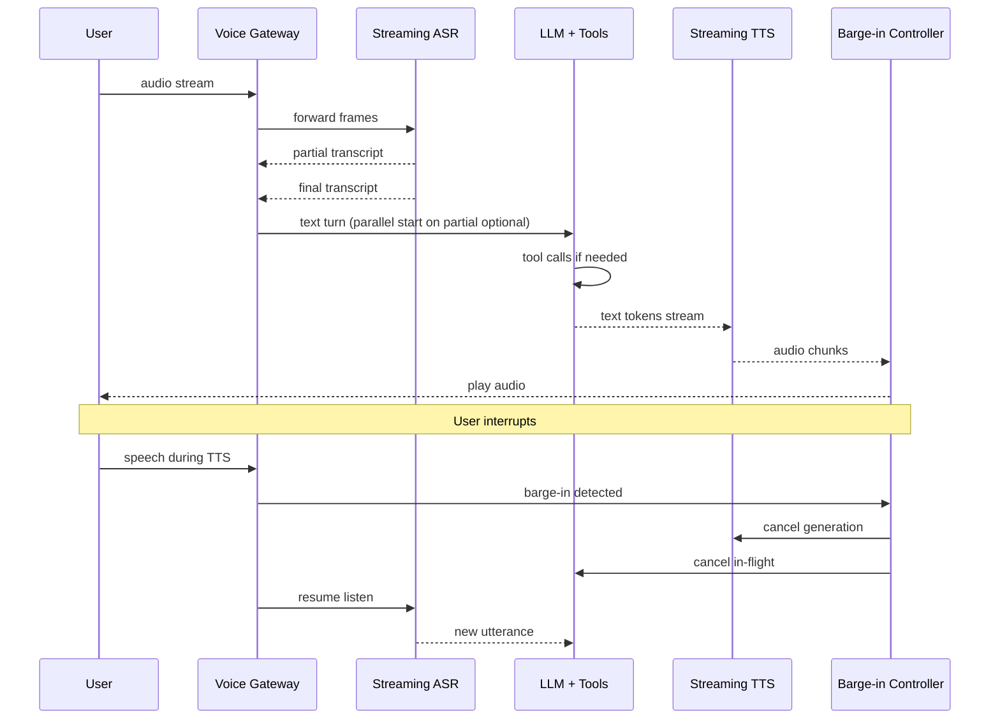
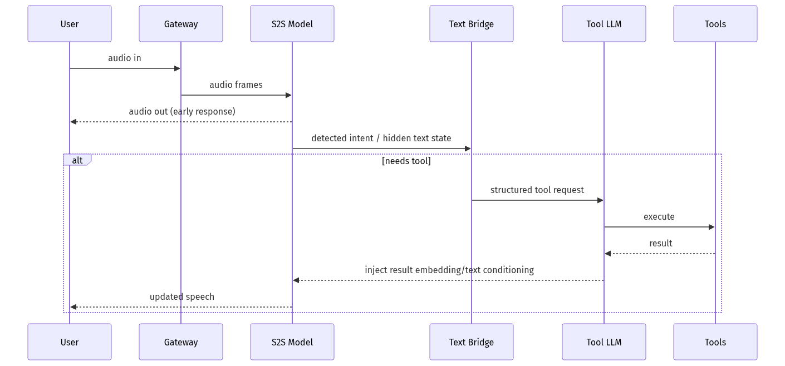
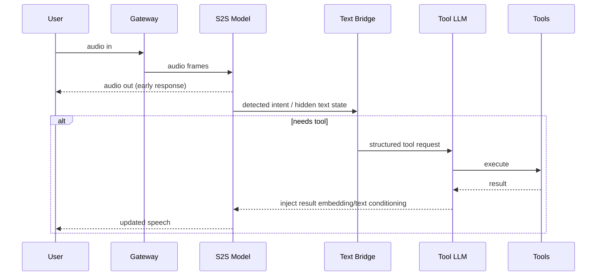
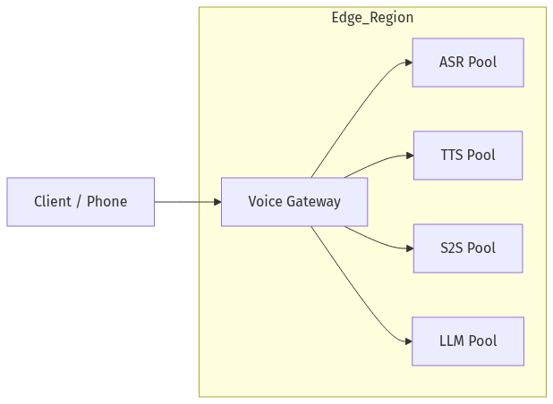
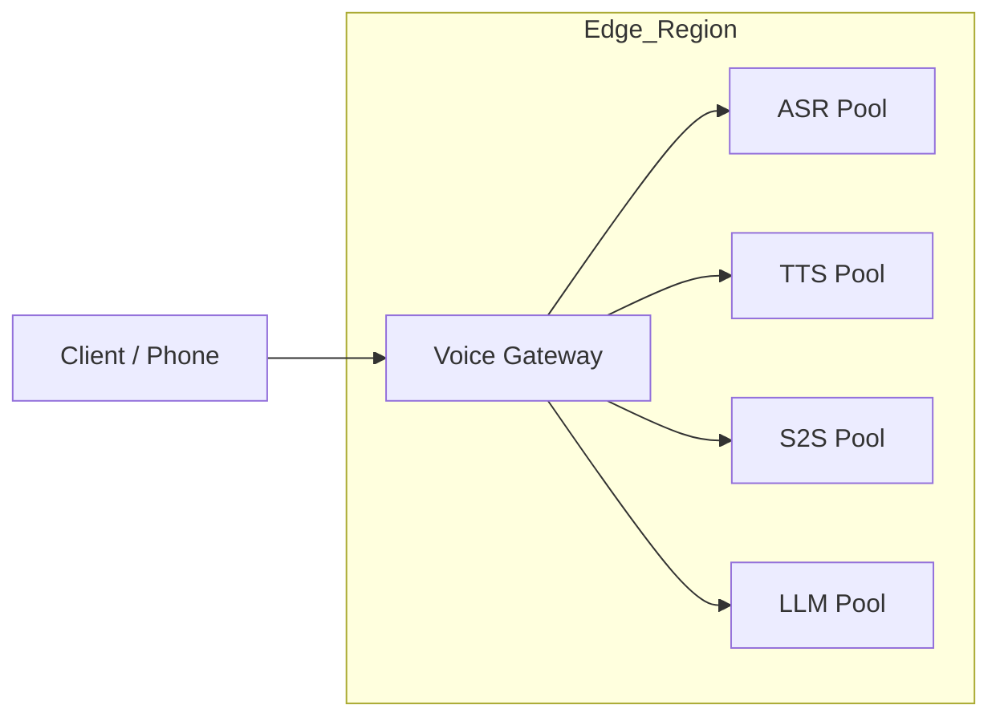

# System Design — AI Voice Assistant (Real-Time Speech)

| Meta | Value |
|------|-------|
| **Estimated Time** | 3–4 hours (design 2h · critique 1h · memo 1h) |
| **Difficulty** | Staff / Principal |
| **Prerequisites** | [01-01](../Modules/01-LLM-Engineering/01-01-Transformer-Architecture.md) · [03-01](../Modules/03-Agentic-Fundamentals/03-01-Agent-Anatomy-and-Loop.md) · [08-01](../Modules/08-Evaluation-LLMOps/08-01-Evaluation-Lifecycle.md) |
| **Related** | [Design ChatGPT](Design-ChatGPT.md) · [Design AI Customer Support](Design-AI-Customer-Support.md) · [Architecture Index](../Architecture Index.md) |

---

## Interview Framing

> "Design a real-time voice AI assistant (ChatGPT Voice / Alexa+ class): bidirectional audio, barge-in, tools, low latency—compare cascaded ASR→LLM→TTS vs end-to-end speech-to-speech (S2S)."

Clarify in first 3 minutes: **use case (open dialog vs task)**, **latency target**, **on-device vs cloud**, **languages**, **privacy (always listening?)**, **tool needs**, **telephony vs app**.

---

## Requirements

### Functional

| ID | Requirement |
|----|-------------|
| F1 | Push-to-talk and hands-free wake word modes |
| F2 | Streaming ASR with partial transcripts |
| F3 | Conversational LLM with memory + tools |
| F4 | Streaming TTS with natural prosody |
| F5 | Barge-in: user interrupts TTS; pipeline cancels and listens |
| F6 | Multimodal context (optional): screen/camera for "what am I looking at" |
| F7 | Telephony/PSTN bridge (optional) |
| F8 | Personalization: voice selection, speed, locale |
| F9 | Safety: refuse harmful requests; child mode |

### Non-Functional

| ID | Target (example) |
|----|------------------|
| N1 | **End-to-end voice latency** p50 < 700ms (user stops speaking → first audio byte) |
| N2 | Barge-in stop TTS < 150ms |
| N3 | WER < 8% clean speech; robust to noise |
| N4 | Availability 99.9% session |
| N5 | Concurrent sessions 100K+ regional |
| N6 | Cost per minute bounded |

### Out of Scope (initially)

- Full offline on small devices without cloud fallback
- Real-time translation dubbing studio quality
- Custom voice cloning without consent verification

---

## Architecture Comparison: ASR-LLM-TTS vs S2S

| Dimension | Cascaded ASR → LLM → TTS | End-to-End S2S |
|-----------|--------------------------|----------------|
| Latency | Higher (3 hops); optimizable with streaming | Lower potential single model |
| Debuggability | High (text traces) | Harder (audio latent) |
| Tools/RAG | Native text tool loop | Needs text side-channel or adapter |
| Controllability | Prompt, moderation on text | Harder output control |
| Voice consistency | Pick any TTS voice | Model-native voice |
| Failure isolation | Replace ASR or TTS independently | Monolithic |
| Cost | Pay 3 services; cache text | Single GPU but heavy |
| **Typical pick** | **Enterprise assistants, tool-heavy** | **Consumer natural dialog** |

**Hybrid (production common):** S2S for open conversation UX + text LLM branch for tool calls ("silent thinking").

---

## APIs

### WebSocket session

```http
GET /v1/voice/session
Upgrade: websocket
Authorization: Bearer <token>

// Client → Server (binary frames or JSON)
{"type":"audio","codec":"opus","seq":102,"payload":"base64..."}
{"type":"vad","state":"speech_end"}
{"type":"config","locale":"en-US","voice":"alloy","mode":"cascade"}

// Server → Client
{"type":"transcript_partial","text":"What's the weather"}
{"type":"transcript_final","text":"What's the weather in Boston?"}
{"type":"tool_status","name":"weather.lookup","state":"running"}
{"type":"audio","codec":"opus","seq":1,"payload":"..."}
{"type":"turn_end"}
{"type":"barge_in_ack"}
```

### REST fallback (telephony webhook)

```http
POST /v1/voice/twilio/inbound
Content-Type: application/x-www-form-urlencoded
CallSid=...&SpeechResult=...
```

---

## Architecture (Cascaded + Optional S2S)





---

## Data Flow (Cascaded with Barge-In)





---

## Data Flow (S2S with Tool Bridge)





---

## Scaling

| Layer | Strategy |
|-------|----------|
| WebSocket | Regional sticky sessions; SFU for WebRTC |
| ASR | GPU pool; batch streaming workers |
| LLM | Low-latency tier; speculative tool prefetch |
| TTS | Phoneme/stream cache; voice-specific pools |
| S2S | Dedicated high-memory GPUs; shorter contexts |
| Telephony | Media gateway horizontal scale |

---

## Caching

| Cache | Key | Value | TTL |
|-------|-----|-------|-----|
| TTS audio | text_hash + voice | opus frames | hours (non-personal) |
| ASR hotwords | user_id | custom vocabulary | session |
| Tool results | tool_args_hash | json | minutes |
| Session memory | session_id | summary | session |

**When NOT to cache:** personalized health/finance answers; user-specific audio biometrics.

---

## Latency

| Segment | Cascade budget | S2S budget |
|---------|----------------|------------|
| VAD end detection | 200–400ms tunable | same |
| ASR final | 150–300ms | N/A |
| LLM TTFT | 200–400ms | internal |
| TTS first byte | 100–200ms | 0 (native audio) |
| **Total target** | **< 700ms p50** | **< 500ms potential** |

**Cascade optimizations:** Start LLM on stable partial; streaming TTS per sentence; colocate ASR/LLM/TTS in same AZ; opus low bitrate.

**S2S optimizations:** Small model for chitchat; cascade fallback for tools.

---

## Security

| Threat | Control |
|--------|---------|
| Deepfake voice auth | No voice-only auth; PIN for sensitive actions |
| Eavesdropping | TLS/WebRTC encryption; no raw audio logs default |
| Prompt injection via ASR homoglyphs | Normalize transcript; moderation |
| Always-on privacy | Local wake word; explicit indicator |
| Toll fraud (telephony) | Rate limits; geo blocks |

---

## Observability

| Signal | Why |
|--------|-----|
| E2E latency (VAD end → audio) | Core UX |
| Barge-in success rate | Natural conversation |
| WER / semantic WER | ASR quality |
| Tool latency in voice | Cascade pain point |
| Session drop rate | Network/server |
| Minutes/$ | Cost |
| Mode mix cascade vs S2S | Routing efficacy |

---

## Cost

\[
Cost_{cascade} \approx ASR_{min} + LLM_{tokens} + TTS_{chars}
\]
\[
Cost_{s2s} \approx GPU_{sec}^{S2S}
\]

Levers: route simple turns to S2S; tools via smaller text LLM; TTS cache for common phrases; shorten responses in voice mode.

---

## Failure Modes

| Failure | Impact | Mitigation |
|---------|--------|------------|
| ASR error | Wrong action | Confirm critical actions verbally |
| TTS stall | Awkward silence | Filler audio; timeout apology |
| Barge-in race | Talk-over | Hard cancel tokens |
| Tool slow | Long pause | Progress utterance ("Checking...") |
| S2S hallucination audio | Unsafe | Text moderation side-channel |
| Network jitter | Stutter | Adaptive buffer; PLC |

---

## Tradeoffs

| Decision | Option A | Option B | Pick when |
|----------|----------|----------|-----------|
| Pipeline | ASR-LLM-TTS | S2S | Tools → cascade; natural chat → S2S |
| Transport | WebSocket | WebRTC | WebRTC for mobile latency |
| VAD | Server | Client | Client saves bandwidth |
| Partial LLM | Wait final ASR | Early start | Early start if partial stable |
| Transcripts | Store | Ephemeral | Ephemeral default privacy |

---

## Deployment





- Colocate streaming components per region
- Separate pools for telephony (8kHz) vs HD voice
- Feature flag: `voice_mode=cascade|s2s|hybrid`
- Canary S2S model per cohort

---

## Interview Answer Skeleton (45–60 min)

1. Requirements + latency definition (5)
2. Compare cascade vs S2S (10)
3. Session + barge-in architecture (8)
4. Tool calling in voice (7)
5. ASR/TTS streaming details (7)
6. Scale + cost (5)
7. Security + privacy (5)
8. Failures + hybrid routing (8)

---

## Practice Prompts

1. User barge-ins during tool execution—state machine?
2. When would you reject S2S for enterprise banking IVR?
3. Design latency budget for 300ms RTT mobile network.

---

## Further Reading

| Title | URL | Why |
|-------|-----|-----|
| OpenAI Realtime API | https://platform.openai.com/docs/guides/realtime | S2S / voice API patterns |
| WebRTC fundamentals | https://webrtc.org/getting-started/overview | Transport layer |
| Whisper paper | https://arxiv.org/abs/2212.04356 | ASR baseline |
| Moshi (S2S) | https://arxiv.org/abs/2406.11776 | Full-duplex speech models |
| Google duplex architecture talks | https://ai.googleblog.com/2018/05/duplex-ai-system-for-natural-conversation.html | Latency + barge-in history |

---

## Resume Bullet

- Designed real-time voice AI comparing cascaded ASR–LLM–TTS vs speech-to-speech, with WebRTC gateway, barge-in cancellation, hybrid tool-bridge pattern, and sub-700ms E2E latency budgets.
