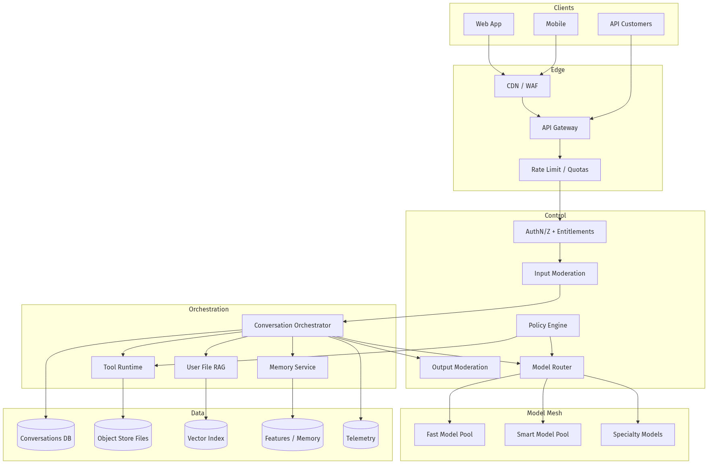
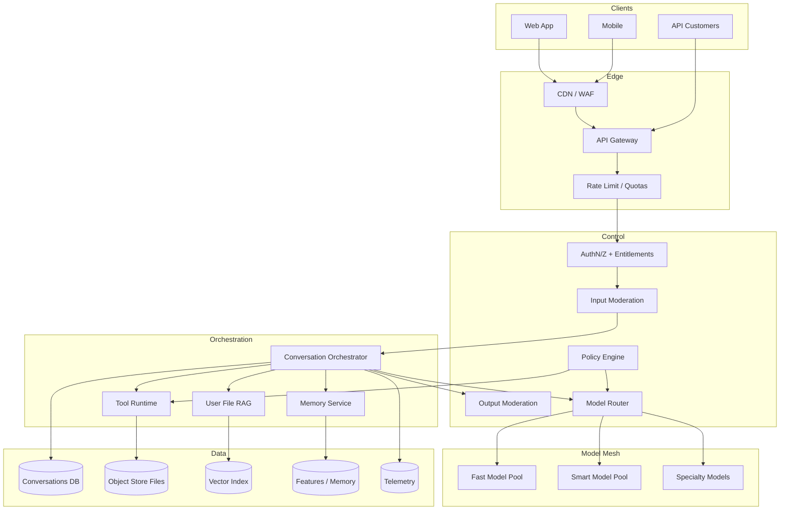
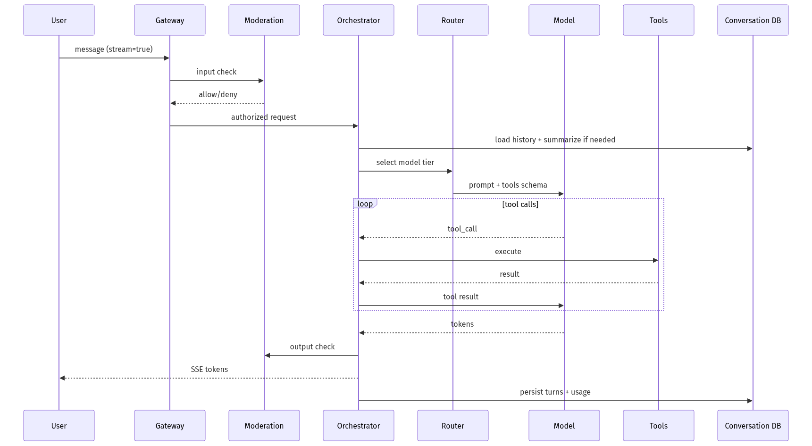
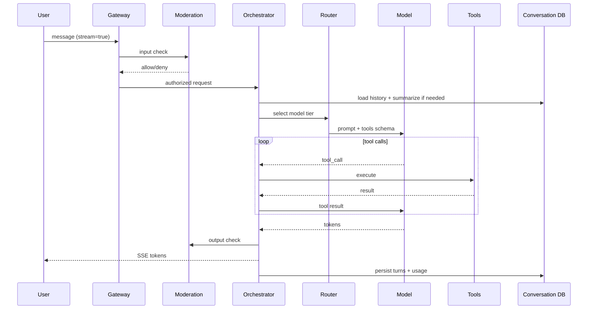
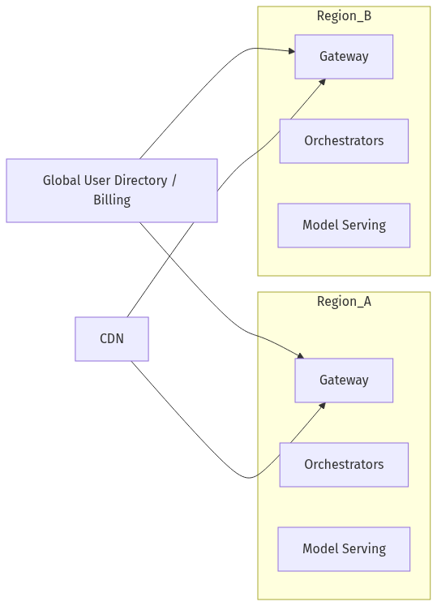
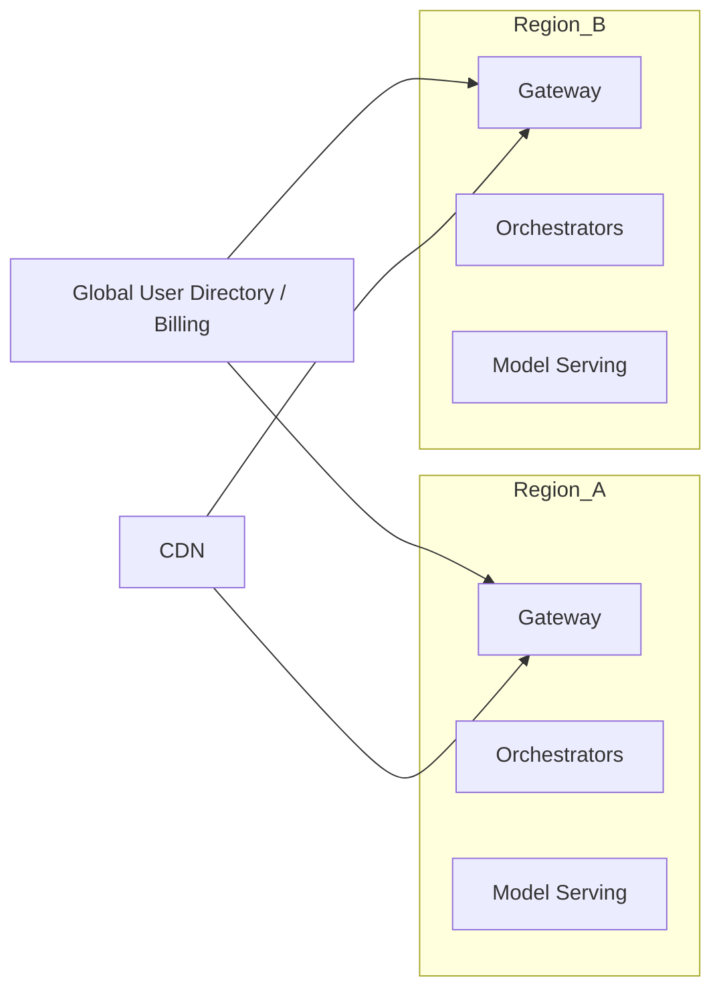

# System Design — Design ChatGPT

| Meta | Value |
|------|-------|
| **Estimated Time** | 3–4 hours (design 2h · critique 1h · memo 1h) |
| **Difficulty** | Staff / Principal |
| **Prerequisites** | [01-01](../Modules/01-LLM-Engineering/01-01-Transformer-Architecture.md) · [03-01](../Modules/03-Agentic-Fundamentals/03-01-Agent-Anatomy-and-Loop.md) · [08-01](../Modules/08-Evaluation-LLMOps/08-01-Evaluation-Lifecycle.md) · [11-01](../Modules/11-Security-Safety/11-01-OWASP-LLM-Top-10.md) |
| **Related** | [Design Claude](Design-Claude.md) · [Design Cursor](Design-Cursor.md) · [Architecture Index](../Architecture Index.md) |

---

## Interview Framing

> “Design a ChatGPT-like consumer assistant that supports multi-turn chat, tools (browse/code), file uploads, memory, and safety at 100M+ DAU scale.”

Clarify in first 3 minutes: **consumer vs enterprise**, **latency SLO**, **tool set**, **memory retention**, **moderation bar**, **regions**, **cost target**.

---

## Requirements

### Functional

| ID | Requirement |
|----|-------------|
| F1 | Multi-turn chat with streaming tokens |
| F2 | Model selection / tiers (fast vs smart) |
| F3 | Tool use: web browse, code interpreter, image gen (optional) |
| F4 | File upload + RAG over user files (session or workspace) |
| F5 | Optional long-term memory preferences |
| F6 | Share conversations / export |
| F7 | Safety: refuse disallowed content; reduce jailbreaks |
| F8 | Auth, rate limits, billing entitlements |

### Non-Functional

| ID | Target (example) |
|----|------------------|
| N1 | TTFT p50 < 500ms (fast tier), p95 < 1.5s |
| N2 | Availability 99.9% chat accept |
| N3 | Horizontal scale to bursty traffic |
| N4 | Regional data residency options |
| N5 | Cost: optimize $/active user / day |
| N6 | Auditability for safety reviews |

### Out of Scope (initially)

- Full enterprise admin SSO suite (see Slack/Notion designs)
- Real-time voice S2S (see Voice Assistant design)
- Fine-tuning UI for end users

---

## APIs

### Client → Gateway

```http
POST /v1/chat/completions
Authorization: Bearer <user_jwt>
Content-Type: application/json

{
  "conversation_id": "uuid",
  "messages": [{"role":"user","content":"..."}],
  "model": "assistant-fast",
  "stream": true,
  "tools": ["web", "python"],
  "file_ids": ["file_123"]
}
```

### Streaming (SSE)

```text
event: token
data: {"delta":"Hello"}

event: tool_call
data: {"id":"call_1","name":"web.search","arguments":{...}}

event: tool_result
data: {"id":"call_1","status":"ok"}

event: done
data: {"usage":{"input_tokens":1200,"output_tokens":340},"safety":"pass"}
```

### Internal tool contract

```json
{
  "name": "web.search",
  "timeout_ms": 4000,
  "retry": {"max": 2, "backoff_ms": 200},
  "authz": "user_scoped",
  "side_effect": false
}
```

---

## Architecture





---

## Data Flow





---

## Scaling

| Layer | Strategy |
|-------|----------|
| Gateway | Stateless, regional, autoscaling |
| Orchestrator | Shard by `conversation_id`; sticky for in-flight streams |
| Model mesh | Separate pools; queue + backpressure; degraded mode → fast-only |
| History | Hot recent turns in cache; cold in DB; hierarchical summarization |
| Files/RAG | Async ingest; per-user namespaces; TTL |
| Tools | Isolate in sandboxes; concurrency caps; circuit breakers |

---

## Caching

| Cache | Key | Value | TTL |
|-------|-----|-------|-----|
| Prompt prefix | model+system_hash | KV-cache friendly prefix | session |
| Embeddings | file_chunk_hash | vector | 30d |
| Web search | query_hash | results | minutes |
| Safety embeddings | text_hash | label | hours |
| Entitlements | user_id | plan flags | minutes |

**When NOT to cache:** personalized safety decisions that depend on account standing; non-idempotent tool results.

---

## Latency

| Segment | Budget mindset |
|---------|----------------|
| Auth + quota | < 20ms |
| Input mod | < 50ms parallel |
| History assemble | < 30ms |
| TTFT model | dominant |
| Tools | async where possible; show “working” events |
| Output mod | stream-compatible classifiers / chunk checks |

**Techniques:** speculative decoding (serving), streaming, parallel tool calls, prompt compression, router to smaller model for easy prompts.

---

## Security

| Threat | Control |
|--------|---------|
| Prompt injection via tools/files | Dual-model: untrusted content in data channel; tool allowlists |
| Data exfiltration | Sandbox egress controls; DLP on tools |
| Account takeover | Standard auth + anomaly rate limits |
| Model DoS | Quotas, abuse classifiers, progressive challenges |
| Training data leakage concerns | Product policy + output filters |

See [11-02 Prompt Injection](../Modules/11-Security-Safety/11-02-Prompt-Injection-Defense.md).

---

## Observability

| Signal | Why |
|--------|-----|
| TTFT / TPOT | UX |
| Tool error rate | Reliability |
| Refusal rate | Safety + product balance |
| $/conversation | Finance |
| Regeneration rate | Quality proxy |
| Jailbreak attempt rate | Abuse |
| Trace per turn | Debug agent/tool loops |

---

## Cost

\[
Cost \approx \sum (tokens_{in}+tokens_{out})\cdot price_{model} + tool\_cost + storage + GPU/serving
\]

Levers: routing, caching, summarization, shorter system prompts, batch embeddings, limit browse depth, cheaper models for title generation.

---

## Failure Modes

| Failure | User impact | Mitigation |
|---------|-------------|------------|
| Model pool exhaustion | Queue / errors | Degrade to fast model; shed load |
| Tool timeout | Stuck “thinking” | Hard timeouts + partial answer |
| Context overflow | Truncation bugs | Summarize + retrieve |
| Safety false positive | Over-refuse | Appeal + eval tuning |
| Safety false negative | Harm | Layered mod + red team |
| Memory wrong fact | Creepy/wrong personalization | Memory confirm UX + delete |

---

## Tradeoffs

| Decision | Option A | Option B | Pick when |
|----------|----------|----------|-----------|
| Memory | Stateless | Long-term memory | B if retention uplift > privacy cost |
| Tools | Always on | Opt-in | Opt-in for trust-sensitive markets |
| Routing | User picks model | Auto router | Auto at scale; power users override |
| History | Full raw | Summaries | Summaries beyond N turns |
| Moderation | Pre-only | Pre+post+stream | Always layered in consumer |

---

## Deployment





- Blue/green for orchestrator
- Canary for prompt/policy and model versions
- Feature flags for tools
- Secrets via KMS; never in prompts logs without redaction

---

## Interview Answer Skeleton (45–60 min)

1. Requirements & SLOs (5 min)
2. High-level diagram (5)
3. Request path + streaming (8)
4. Context/memory/RAG (7)
5. Tools + sandbox (7)
6. Safety layered (5)
7. Scale / cost / failure (8)
8. Metrics & iteration (5)

---

## Practice Prompts

1. Cut cost 40% without destroying quality—what do you change first?
2. A tool returns malicious instructions—how does architecture contain it?
3. Design conversation sharing without leaking other users’ RAG namespaces.

---

## Further Reading

| Title | URL | Why |
|-------|-----|-----|
| OpenAI API Docs | https://developers.openai.com/api/docs/ | Real API shapes for chat/tools |
| OWASP LLM Top 10 | https://owasp.org/www-project-top-10-for-large-language-model-applications/ | Safety requirements |
| LangGraph HITL / persistence | https://langchain-ai.github.io/langgraph/concepts/high_level/ | Stateful orchestration patterns |
| ReAct paper | https://arxiv.org/abs/2210.03629 | Tool-loop reasoning |

---

## Resume Bullet

- Authored a consumer-scale ChatGPT-style architecture covering streaming orchestration, model routing, sandboxed tools, user-file RAG, layered moderation, and cost/latency controls suitable for Staff/Principal design interviews.
