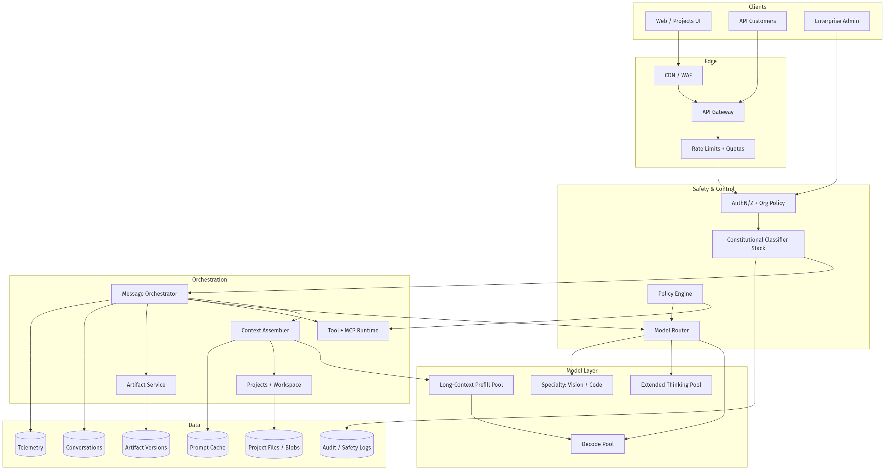
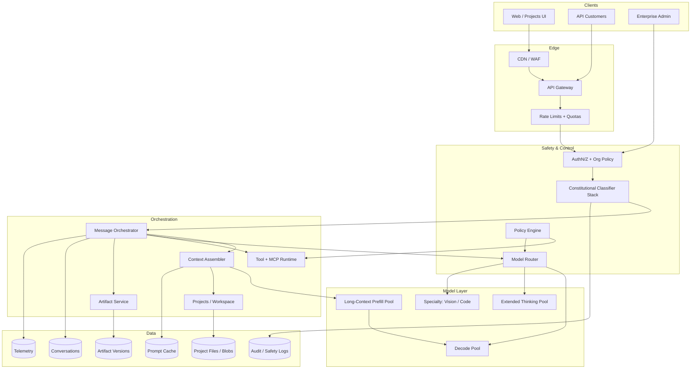
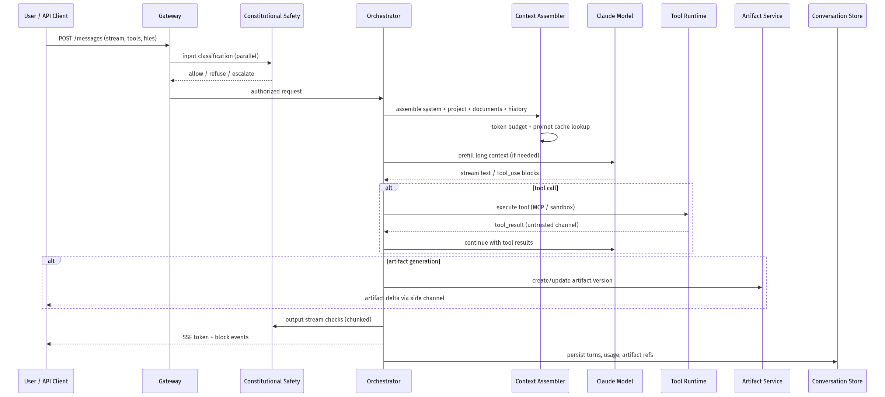
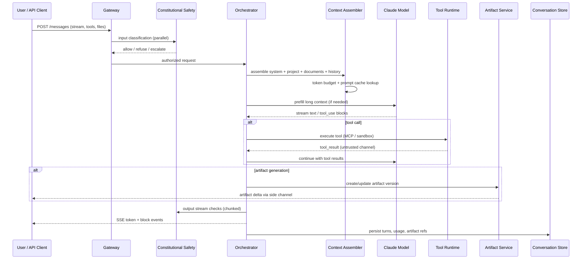
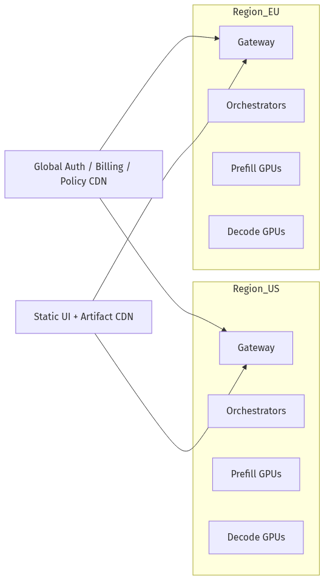
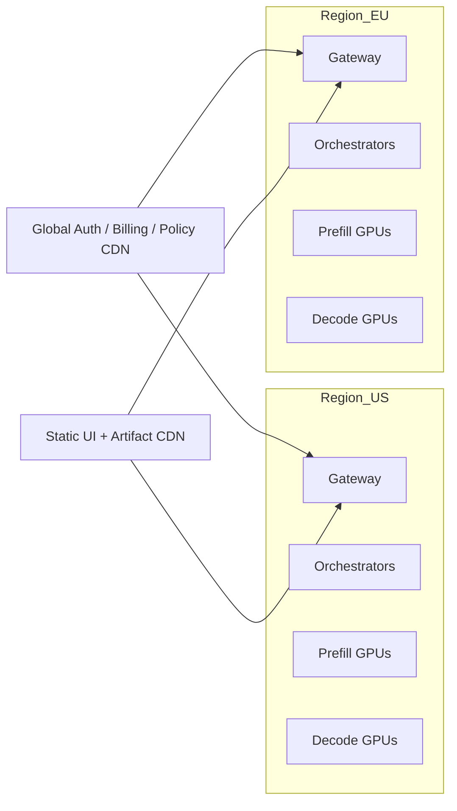

# System Design — Design Claude

| Meta | Value |
|------|-------|
| **Estimated Time** | 3–4 hours (design 2h · critique 1h · memo 1h) |
| **Difficulty** | Staff / Principal |
| **Prerequisites** | [01-02](../Modules/01-LLM-Engineering/01-02-Tokenization-Context-Windows.md) · [02-02](../Modules/02-Prompt-Engineering/02-02-Structured-Outputs-Tool-Calling.md) · [03-01](../Modules/03-Agentic-Fundamentals/03-01-Agent-Anatomy-and-Loop.md) · [11-01](../Modules/11-Security-Safety/11-01-OWASP-LLM-Top-10.md) |
| **Related** | [Design ChatGPT](Design-ChatGPT.md) · [Design Cursor](Design-Cursor.md) · [Architecture Index](../Architecture Index.md) |

---

## Interview Framing

> “Design a Claude-like assistant with constitutional safety, 200K+ token context, tool use, and artifacts-style structured outputs at enterprise scale.”

Clarify in first 3 minutes: **consumer vs API vs enterprise**, **context window tier**, **tool/MCP surface**, **artifact types (docs/code/diagrams)**, **data retention / training opt-out**, **safety bar (refusal vs helpfulness)**, **multi-region**.

---

## Requirements

### Functional

| ID | Requirement |
|----|-------------|
| F1 | Multi-turn chat with streaming; optional extended thinking / reasoning mode |
| F2 | Long-context ingestion: documents, code repos (partial), pasted text up to 200K+ tokens |
| F3 | Tool use: web search, code execution, MCP servers, custom enterprise tools |
| F4 | Artifacts-like outputs: side-panel structured content (markdown, code, SVG, React preview) versioned per turn |
| F5 | Constitutional safety: refuse harmful requests; reduce jailbreaks; explain refusals when appropriate |
| F6 | Projects / workspaces: scoped files, instructions, and conversation history |
| F7 | Computer use / browser automation (optional tier) with user consent |
| F8 | API parity: Messages API, tool schemas, batch, streaming, usage metering |
| F9 | Admin: org policies, audit logs, SSO, data residency controls |

### Non-Functional

| ID | Target (example) |
|----|------------------|
| N1 | TTFT p50 < 600ms (standard), p95 < 2s; extended context may add prefill latency |
| N2 | Availability 99.9% API accept; graceful degradation on context-heavy requests |
| N3 | Horizontal scale for bursty API + consumer traffic |
| N4 | Prompt-cache hit rate > 40% for repeated system prefixes (API customers) |
| N5 | Safety: layered checks without blocking stream > 200ms p95 on happy path |
| N6 | Enterprise: zero training on customer data by default; configurable retention TTL |
| N7 | Cost: $/1M tokens competitive; route by task complexity |

### Out of Scope (initially)

- Full IDE integration (see [Design Cursor](Design-Cursor.md))
- Real-time voice (see Voice Assistant design)
- User-facing fine-tuning studio
- On-device inference

---

## APIs

### Messages API (client → gateway)

```http
POST /v1/messages
x-api-key: <key>
anthropic-version: 2023-06-01
Content-Type: application/json

{
  "model": "claude-sonnet-4-20250514",
  "max_tokens": 4096,
  "stream": true,
  "system": [{"type":"text","text":"You are a helpful assistant..."}],
  "messages": [
    {"role":"user","content":[{"type":"text","text":"Summarize this PDF"}]}
  ],
  "tools": [
    {"name":"web_search","description":"...","input_schema":{...}}
  ],
  "metadata": {"user_id":"org_123"},
  "cache_control": {"type":"ephemeral"}
}
```

### Streaming events (SSE)

```text
event: message_start
data: {"type":"message_start","message":{"id":"msg_01","model":"..."}}

event: content_block_delta
data: {"type":"content_block_delta","delta":{"type":"text_delta","text":"Hello"}}

event: content_block_start
data: {"type":"content_block_start","content_block":{"type":"tool_use","id":"toolu_01","name":"web_search"}}

event: content_block_delta
data: {"type":"content_block_delta","delta":{"type":"input_json_delta","partial_json":"{\"query\":"}}

event: message_delta
data: {"type":"message_delta","usage":{"output_tokens":12}}

event: message_stop
data: {"type":"message_stop"}
```

### Artifacts channel (internal / product extension)

```json
{
  "artifact_id": "art_9f2a",
  "conversation_id": "conv_uuid",
  "type": "application/vnd.ant.code",
  "language": "python",
  "title": "data_pipeline.py",
  "content": "...",
  "version": 3,
  "parent_version": 2
}
```

### Tool execution contract (orchestrator ↔ runtime)

```json
{
  "tool_use_id": "toolu_01",
  "name": "mcp://filesystem/read",
  "arguments": {"path": "/docs/spec.md"},
  "timeout_ms": 8000,
  "trust_tier": "user_approved_mcp",
  "side_effect": false,
  "retry": {"max": 1}
}
```

---

## Architecture





---

## Data Flow





---

## Scaling

| Layer | Strategy |
|-------|----------|
| Gateway | Stateless regional pools; token-bucket quotas per org/key |
| Context assembly | Shard by `project_id`; parallel chunk embedding for new uploads |
| Long-context prefill | Dedicated GPU pool; chunk-attention / sparse patterns; queue long jobs |
| Decode | Continuous batching (see [01-03](../Modules/01-LLM-Engineering/01-03-Inference-Serving-vLLM.md)); separate pools for thinking mode |
| Tool runtime | Per-tenant concurrency caps; MCP connection pooling; sandbox autoscale |
| Artifacts | CRDT or version-chain storage; CDN for static previews |
| Safety classifiers | Small-model sidecars; scale independently of main model |

**Backpressure:** When prefill queue depth exceeds threshold, offer truncated context, async document processing, or route to smaller context tier with explicit UX message.

---

## Caching

| Cache | Key | Value | TTL |
|-------|-----|-------|-----|
| Prompt cache (API) | model + system_hash + prefix_hash | KV blocks / prefix embeddings | 5–60 min |
| Document chunks | content_hash | embeddings + text | 30d |
| Project instructions | project_id + version | compiled system block | until edit |
| Safety verdict | text_hash + policy_version | label + confidence | hours |
| Tool schema | tool_manifest_hash | JSON schema | session |
| Web fetch | url_hash | sanitized excerpt | minutes |

**When NOT to cache:** user-specific safety escalations; tool results with side effects; artifact content mid-edit without version pin.

Prompt caching is a major API cost lever—design system prompts and few-shot prefixes for cache stability ([01-02](../Modules/01-LLM-Engineering/01-02-Tokenization-Context-Windows.md)).

---

## Latency

| Segment | Budget mindset |
|---------|----------------|
| Auth + quota | < 15ms |
| Input safety (parallel) | < 80ms |
| Context assembly | < 50ms (excluding prefill) |
| Long-context prefill | 1–30s depending on tokens; stream “reading document” UX |
| TTFT decode | 300ms–1.5s after prefill |
| Tool round-trip | budget per tool; show progress events |
| Artifact render | async preview compile; don’t block chat stream |
| Output safety | streaming classifiers; pause only on high confidence |

**Techniques:** prompt caching, speculative decoding, parallel tool calls, hierarchical summarization for history beyond window, route easy queries to Haiku-class model ([01-04](../Modules/01-LLM-Engineering/01-04-Model-Routing-LiteLLM.md)).

---

## Security

| Threat | Control |
|--------|---------|
| Prompt injection via documents/tools | Untrusted content in separate channel; tool allowlists; constitutional refusal training |
| MCP / tool exfiltration | Scoped credentials; egress firewall; user approval for new servers |
| Jailbreak / roleplay bypass | Layered CA classifiers + RLHF; canary prompts; red-team loop |
| Cross-tenant data leak | Strict namespace isolation for projects; encrypt at rest; row-level ACL |
| Artifact XSS / code execution | Sandboxed preview iframe; CSP; no eval in preview host |
| API key abuse | Anomaly detection; org-level spend caps |

Constitutional AI trains models with self-critique against a written constitution—architecture must log refusal reasons and support policy updates without full redeploy. See [11-02](../Modules/11-Security-Safety/11-02-Prompt-Injection-Defense.md).

---

## Observability

| Signal | Why |
|--------|-----|
| TTFT / TPOT by context length | Long-context UX |
| Prompt cache hit rate | API cost |
| Tool latency + error rate | Agent reliability |
| Refusal rate by category | Safety/product balance |
| Artifact adoption / edit rate | Feature value |
| Jailbreak attempt rate | Abuse |
| $/request by model tier | Finance |
| Trace: context tokens breakdown | Debug bloat |

OpenTelemetry spans per turn: `assemble_context`, `prefill`, `decode`, `tool:*`, `artifact:*`, `safety:*` ([08-02](../Modules/08-Evaluation-LLMOps/08-02-Observability-LangSmith-OTel.md)).

---

## Cost

\[
Cost \approx \sum (tokens_{in}\cdot price_{in} + tokens_{out}\cdot price_{out}) + prefill\_compute + tool\_cost + storage + safety\_inference
\]

| Lever | Impact |
|-------|--------|
| Prompt caching | −30–60% input cost for API repeat prefixes |
| Model routing (Haiku/Sonnet/Opus) | −40% on easy tasks |
| Context compression / RAG within window | Avoid million-token prefill |
| Tool budget caps | Prevent runaway agent loops |
| Batch API for offline jobs | −50% on non-latency-sensitive work |

---

## Failure Modes

| Failure | User impact | Mitigation |
|---------|-------------|------------|
| Prefill timeout on huge context | Stuck or error | Chunk docs; async ingest; offer summary-first |
| Context window overflow | Silent truncation | Hard budget enforcement + user warning |
| Tool/MCP hang | Incomplete answer | Hard timeouts; partial response with disclaimer |
| Safety false positive | Over-refusal | Appeal path; eval tuning; human review queue |
| Safety false negative | Harm | Layered output checks; kill switch for tool tiers |
| Artifact desync | Wrong version shown | Version pins; optimistic UI rollback |
| Prompt cache stampede | Latency spike | Warm caches; jitter TTL |
| Constitutional policy drift | Inconsistent refusals | Policy versioning + shadow eval |

---

## Tradeoffs

| Decision | Option A | Option B | Pick when |
|----------|----------|----------|-----------|
| Context | Single 200K dump | Hierarchical RAG + summary | B for very large corpora; A for code review in one file |
| Safety | Model-only (CA) | Model + external classifiers | Always B at scale; CA alone insufficient for new attack vectors |
| Artifacts | Inline in chat | Side panel with versions | Side panel for edit/export workflows |
| Tools | Native only | MCP ecosystem | MCP for enterprise extensibility |
| Thinking mode | Always on | Opt-in | Opt-in; costs latency and tokens |
| Data retention | Infinite history | TTL + user delete | TTL default for enterprise trust |

---

## Deployment





- **Model deploy:** Canary new weights; shadow traffic on safety eval suite before full promotion
- **Policy deploy:** Versioned constitution snippets; blue/green for classifier thresholds
- **Regional:** Data residency pins project storage and inference to region
- **Secrets:** KMS for API keys; MCP OAuth tokens in vault with rotation
- **Disaster recovery:** Conversation DB cross-region replica (async); RPO/RTO defined per tier

---

## Interview Answer Skeleton (45–60 min)

1. **Requirements & SLOs** (5 min) — long context, CA safety, tools, artifacts, enterprise
2. **High-level architecture** (5) — gateway, orchestrator, model pools, artifact side channel
3. **Context assembly & long-context path** (8) — prefill vs decode, caching, token budgets
4. **Constitutional safety** (7) — layered checks, refusal UX, policy versioning
5. **Tools & MCP** (7) — trust tiers, sandbox, parallel execution
6. **Artifacts pattern** (5) — versioning, preview sandbox, sync with chat
7. **Scale, cost, failure modes** (8) — routing, cache, backpressure
8. **Metrics & iteration** (5) — eval harness, red team, ship criteria ([08-03](../Modules/08-Evaluation-LLMOps/08-03-Guardrails-Ship-Criteria.md))

---

## Practice Prompts

1. A user uploads a 2M-token codebase—how do you serve useful answers without melting prefill costs?
2. Design MCP tool approval so enterprise admins can allowlist servers without blocking power users.
3. An artifact preview runs user-generated React—how do you prevent credential theft from the parent page?
4. Constitutional AI refuses less than competitors but users complain about inconsistency—what do you measure and change?

---

## Further Reading

| Title | URL | Why |
|-------|-----|-----|
| Constitutional AI paper | https://arxiv.org/abs/2212.08073 | Core alignment approach |
| Anthropic Messages API | https://docs.anthropic.com/en/api/messages | Real API shapes, streaming, tools |
| Prompt caching docs | https://docs.anthropic.com/en/docs/build-with-claude/prompt-caching | Cost/latency architecture |
| Model Context Protocol | https://modelcontextprotocol.io/ | Tool server standard |
| OWASP LLM Top 10 | https://owasp.org/www-project-top-10-for-large-language-model-applications/ | Security requirements |
| ReAct paper | https://arxiv.org/abs/2210.03629 | Tool-loop reasoning |

---

## Resume Bullet

- Architected a Claude-class assistant platform with constitutional safety layers, 200K-token context prefill/decode pools, MCP tool runtime, versioned artifacts side channel, and enterprise data isolation—optimized for API prompt-cache economics and Staff/Principal system design depth.
