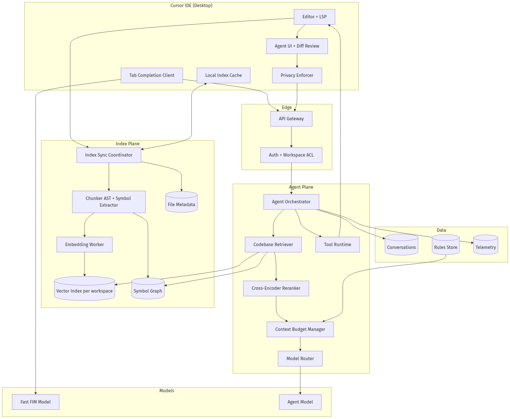
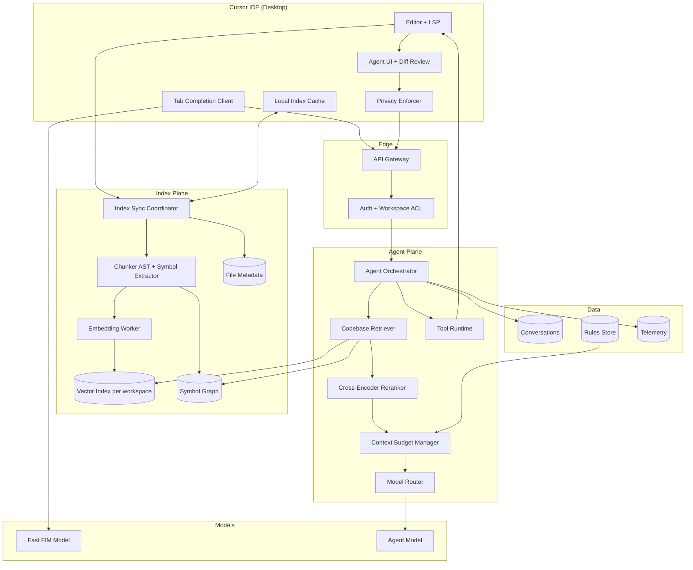
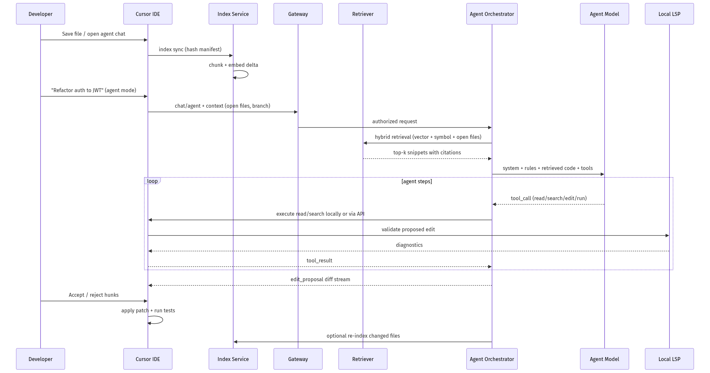
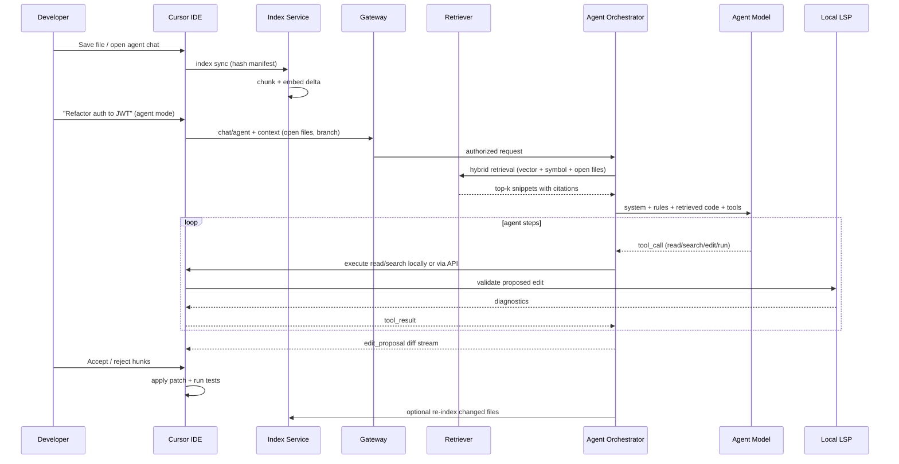
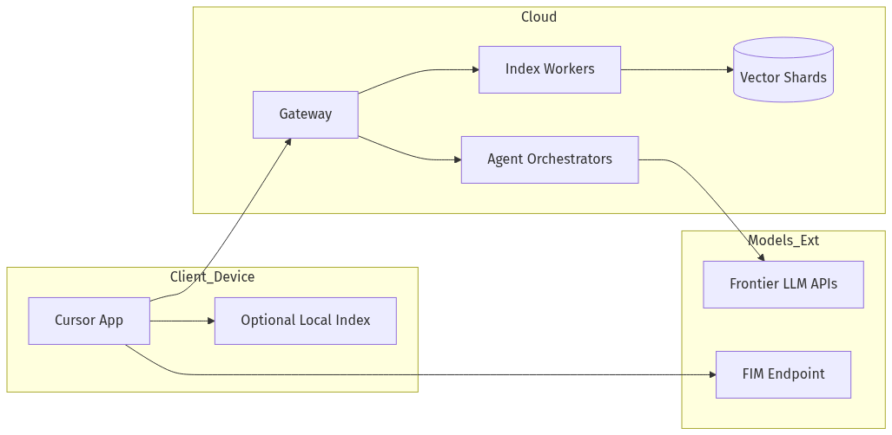
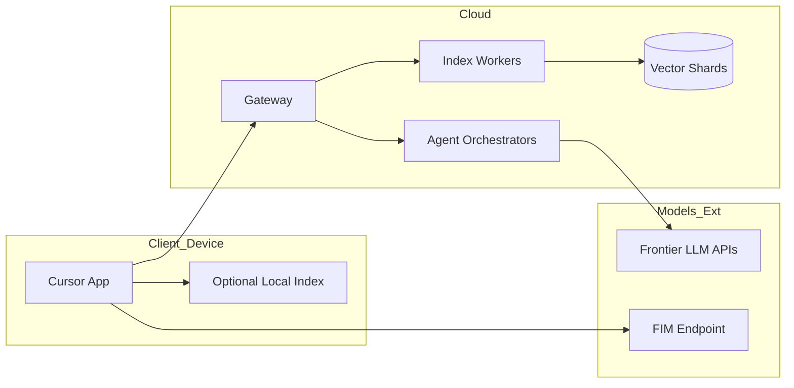

# System Design — Design Cursor

| Meta | Value |
|------|-------|
| **Estimated Time** | 3–4 hours (design 2h · critique 1h · memo 1h) |
| **Difficulty** | Staff / Principal |
| **Prerequisites** | [03-01](../Modules/03-Agentic-Fundamentals/03-01-Agent-Anatomy-and-Loop.md) · [04-01](../Modules/04-RAG/04-01-RAG-Architecture.md) · [04-03](../Modules/04-RAG/04-03-Vector-DB-Hybrid-Search-Reranking.md) · [07-01](../Modules/07-Protocols-MCP-A2A/07-01-MCP-Model-Context-Protocol.md) |
| **Related** | [Design GitHub Copilot](Design-GitHub-Copilot.md) · [Design Claude](Design-Claude.md) · [Architecture Index](../Architecture Index.md) |

---

## Interview Framing

> “Design Cursor—a VS Code–fork IDE with repo-wide codebase RAG, multi-file edit apply, and an autonomous agent loop, with privacy modes for enterprise.”

Clarify in first 3 minutes: **local vs cloud indexing**, **privacy mode (no retention)**, **agent autonomy level**, **supported languages**, **monorepo scale**, **latency SLO for chat vs Tab completion**, **team vs individual**.

---

## Requirements

### Functional

| ID | Requirement |
|----|-------------|
| F1 | IDE integration: open files, diagnostics, git, terminal, extensions (VS Code compatible) |
| F2 | Repo indexing: AST-aware chunking, embeddings, symbol graph, incremental re-index on save |
| F3 | Codebase RAG: retrieve relevant files/snippets for chat and agent given query + open editors |
| F4 | Inline Tab completion (FIM) delegated to low-latency completion path |
| F5 | Chat: ask about codebase with @-mentions (file, folder, docs, web) |
| F6 | Agent mode: plan → tool loop (read, search, edit, run terminal, browser) until task done or budget |
| F7 | Edit apply: unified diff / search-replace blocks applied with user accept/reject per hunk |
| F8 | Composer / multi-file edits with preview diff |
| F9 | Rules: `.cursorrules`, project rules, user rules injected into context |
| F10 | Privacy modes: Privacy (no code stored), Standard, optional bring-your-own-key |
| F11 | Background agents (optional): cloud worker on repo clone with PR output |

### Non-Functional

| ID | Target (example) |
|----|------------------|
| N1 | Tab completion p95 < 300ms E2E (see Copilot design for FIM path) |
| N2 | Chat TTFT p95 < 2s including retrieval |
| N3 | Index freshness: updated within 30s of file save for medium repos |
| N4 | Agent: max 25 tool steps default; user-visible progress |
| N5 | Privacy mode: zero persistent code storage; ephemeral inference only |
| N6 | Monorepo: index repos up to 100K files with lazy/on-demand indexing |
| N7 | Availability 99.5% for cloud index + agent services |

### Out of Scope (initially)

- Full self-hosted on-prem GPU cluster (enterprise add-on)
- Custom model fine-tuning per repo
- Non-code IDE domains (see general assistant designs)

---

## APIs

### Desktop client ↔ Cloud gateway

```http
POST /v1/chat/agent
Authorization: Bearer <session_token>
X-Cursor-Privacy-Mode: no-storage
Content-Type: application/json

{
  "workspace_id": "ws_abc",
  "conversation_id": "conv_uuid",
  "messages": [{"role":"user","content":"Refactor auth middleware to use JWT"}],
  "context": {
    "open_files": ["src/auth/middleware.ts"],
    "cursor_position": {"file":"src/auth/middleware.ts","line":42},
    "git_branch": "feature/jwt",
    "rules_hash": "rul_9f2"
  },
  "mode": "agent",
  "model": "claude-sonnet",
  "max_steps": 25
}
```

### Indexing service

```http
POST /v1/index/sync
{
  "workspace_id": "ws_abc",
  "manifest": [
    {"path":"src/auth/middleware.ts","hash":"sha256:...","size":4200}
  ],
  "privacy_mode": "no-storage"
}
```

Response: `{ "indexed": 12, "deleted": 1, "pending_embeddings": 0 }`

### Retrieval (internal)

```json
{
  "query": "JWT validation middleware",
  "workspace_id": "ws_abc",
  "top_k": 20,
  "filters": {"language": ["typescript"], "path_prefix": "src/"},
  "include_symbols": true,
  "rerank": true
}
```

### Edit apply (client-local primary)

```json
{
  "edit_id": "ed_01",
  "file": "src/auth/middleware.ts",
  "type": "search_replace",
  "blocks": [
    {"old_string":"session.validate(req)","new_string":"jwt.verify(req.headers.authorization)"}
  ]
}
```

Client validates syntax via LSP before commit; server never auto-applies without client ack in default mode.

### Streaming agent events (SSE)

```text
event: retrieval
data: {"files":["src/auth/middleware.ts","src/auth/jwt.ts"],"scores":[0.92,0.87]}

event: tool_call
data: {"name":"read_file","path":"src/auth/middleware.ts"}

event: edit_proposal
data: {"edit_id":"ed_01","diff":"..."}

event: terminal
data: {"command":"npm test","status":"running"}

event: done
data: {"steps":8,"usage":{"input_tokens":45000,"output_tokens":3200}}
```

---

## Architecture





---

## Data Flow





---

## Scaling

| Layer | Strategy |
|-------|----------|
| Index sync | Per-workspace queues; content-defined chunking; skip unchanged hashes |
| Embeddings | Batch embed; GPU worker pool; prioritize open files + @mentions |
| Vector search | Shard by `workspace_id`; HNSW per shard; metadata filters |
| Monorepo | Lazy index: index on first access; .cursorignore / .gitignore respect |
| Agent orchestrator | Stateless; sticky session for in-flight agent run |
| Tool execution | Client-side reads for privacy; sandboxed cloud terminal for background agents |
| Tab completion | Separate low-latency pool (see [Design-GitHub-Copilot](Design-GitHub-Copilot.md)) |

**Hot path isolation:** Never block Tab completion behind agent or indexing backlog.

---

## Caching

| Cache | Key | Value | TTL |
|-------|-----|-------|-----|
| Local file hash | path | sha256 | until change |
| Embedding | chunk_hash | vector | until file change |
| Retrieval | query_hash + ws_id | ranked chunks | minutes |
| Symbol lookup | symbol_fqn | file:line | until index version bump |
| Rules compile | rules_hash | system prompt block | until edit |
| LSP diagnostics | file_version | errors | session |

**Privacy mode:** No embedding persistence in cloud—compute embed on the fly or use local embed model; retrieval may be client-only with encrypted transit.

---

## Latency

| Segment | Budget mindset |
|---------|----------------|
| Index delta (save) | async; < 2s for typical file |
| Retrieval | < 150ms p95 |
| Rerank | < 100ms on top-50 |
| Context assembly | < 50ms |
| Agent TTFT | < 2s after retrieval |
| Edit proposal → LSP validate | < 500ms local |
| Tab completion | < 300ms (separate path) |

**Techniques:** prioritize open buffers in context; MMR for diversity; truncate with repo map summary; parallel read tool calls; stream partial diffs early.

---

## Security

| Threat | Control |
|--------|---------|
| Code exfiltration via agent | Privacy mode; no training on code; tenant isolation |
| Prompt injection in repo | Treat all retrieved code as untrusted; rules in system channel |
| Malicious `.cursorrules` | Warn user; rules sandboxed in prompt layer |
| Terminal command abuse | User approval for destructive cmds; allowlist in enterprise |
| Cross-workspace leak | Strict `workspace_id` on every retrieval query |
| Supply chain in extensions | VS Code extension compatibility + signing |

Enterprise: SOC2, data processing agreement, optional zero-retention inference. See [11-02](../Modules/11-Security-Safety/11-02-Prompt-Injection-Defense.md).

---

## Observability

| Signal | Why |
|--------|-----|
| Index lag per workspace | Stale retrieval |
| Retrieval recall@k (offline) | RAG quality |
| Agent steps to completion | Efficiency |
| Edit accept rate | UX quality |
| LSP error rate post-apply | Edit safety |
| Tab vs agent latency | Pool isolation |
| Privacy mode adoption | Trust |
| $/active developer / day | Cost |

Trace spans: `index_sync`, `retrieve`, `rerank`, `agent_step`, `edit_propose`, `lsp_validate`.

---

## Cost

\[
Cost \approx embedding\_cost + retrieval\_infra + \sum agent\_tokens \cdot price + FIM\_cost + background\_agent\_compute
\]

| Lever | Impact |
|-------|--------|
| Incremental index only | Avoid full re-embed |
| Smaller embed model for retrieval | −60% embed cost |
| Retrieve less, rerank more | Better quality per token |
| Agent step budget | Cap runaway loops |
| Route simple chat to smaller model | −30% on non-agent |
| Local embed in privacy mode | Shift cost to client GPU |

---

## Failure Modes

| Failure | User impact | Mitigation |
|---------|-------------|------------|
| Stale index | Wrong/missing context | Show index status; force refresh; open-file fallback |
| Retrieval miss | Hallucinated file paths | Symbol graph fallback; @file explicit |
| Bad edit apply | Broken build | LSP gate; undo stack; test runner integration |
| Agent loop | Token burn, no progress | Step cap; stagnation detector |
| Monorepo timeout | Partial index | Lazy index + user scope folder |
| Privacy vs quality | Worse RAG | Local index option |
| Model outage | No agent | Queue; fallback model; offline Tab if local |

---

## Tradeoffs

| Decision | Option A | Option B | Pick when |
|----------|----------|----------|-----------|
| Index location | Cloud | Local-only | B for privacy-sensitive; A for multi-device |
| Retrieval | Pure vector | Hybrid + symbols | Hybrid for code; vectors alone miss exact matches |
| Edit format | Unified diff | Search-replace blocks | Blocks for LLM reliability; diff for multi-hunk |
| Agent autonomy | Auto-apply tests | Always confirm | Confirm default; auto for trusted workflows |
| Background agent | Cloud clone | Local only | Cloud for long tasks; local for air-gapped |
| Context | Whole files | Snippets | Snippets + signature lines; whole file for small modules |

---

## Deployment





- **Desktop:** Electron/VS Code fork; auto-update channel; feature flags
- **Cloud:** K8s for index + agent; regional deployments for data residency
- **Background agents:** Ephemeral VMs; repo clone destroyed after job
- **Canary:** New retrieval ranker, prompt templates, agent tools

---

## Interview Answer Skeleton (45–60 min)

1. **Requirements** (5) — IDE, RAG, agent, privacy, monorepo
2. **Architecture** (5) — client/cloud split, index plane vs agent plane
3. **Indexing pipeline** (8) — AST chunking, incremental sync, symbols
4. **Retrieval** (7) — hybrid search, rerank, context budget ([04-03](../Modules/04-RAG/04-03-Vector-DB-Hybrid-Search-Reranking.md))
5. **Agent loop** (8) — tools, edit apply, LSP validation ([03-01](../Modules/03-Agentic-Fundamentals/03-01-Agent-Anatomy-and-Loop.md))
6. **Privacy modes** (5) — no-storage path, enterprise
7. **Scale, cost, failures** (7)
8. **Metrics** (5)

---

## Practice Prompts

1. Design indexing for a 500K-file monorepo without indexing everything upfront.
2. User enables Privacy Mode—how does codebase RAG still work?
3. Agent proposes 40-file refactor—how do you UX and validate without melting the user?
4. Compare Cursor agent architecture vs GitHub Copilot Workspace—when is each appropriate?

---

## Further Reading

| Title | URL | Why |
|-------|-----|-----|
| Cursor Docs | https://docs.cursor.com/ | Product capabilities, rules, privacy |
| Model Context Protocol | https://modelcontextprotocol.io/ | Tool server integration pattern |
| ReAct paper | https://arxiv.org/abs/2210.03629 | Agent tool loop |
| RAG survey | https://arxiv.org/abs/2312.10997 | Retrieval architecture baseline |
| VS Code Extension API | https://code.visualstudio.com/api | IDE integration constraints |
| Tree-sitter | https://tree-sitter.github.io/tree-sitter/ | AST-aware parsing for chunking |

---

## Resume Bullet

- Designed a Cursor-class IDE agent platform with incremental AST-aware repo indexing, hybrid codebase RAG with symbol graph reranking, client-side edit apply with LSP validation, privacy-mode zero-retention inference, and isolated low-latency Tab completion paths for Staff/Principal interviews.
