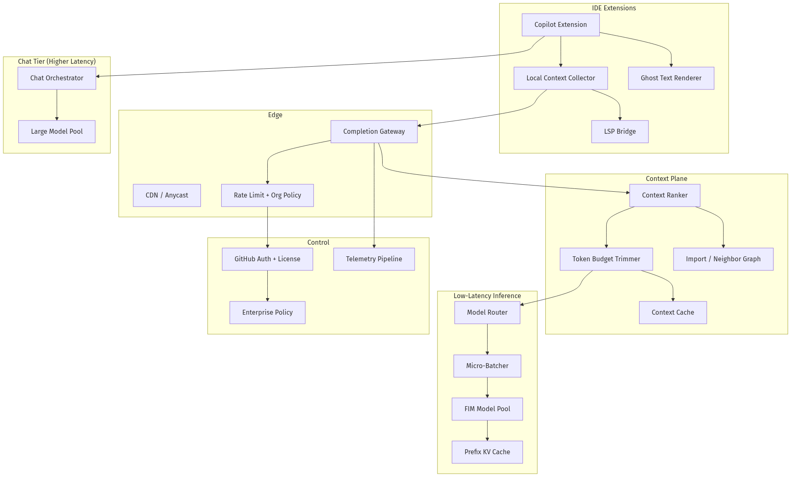
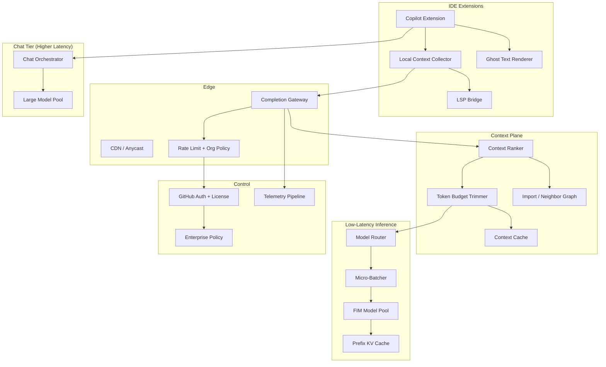
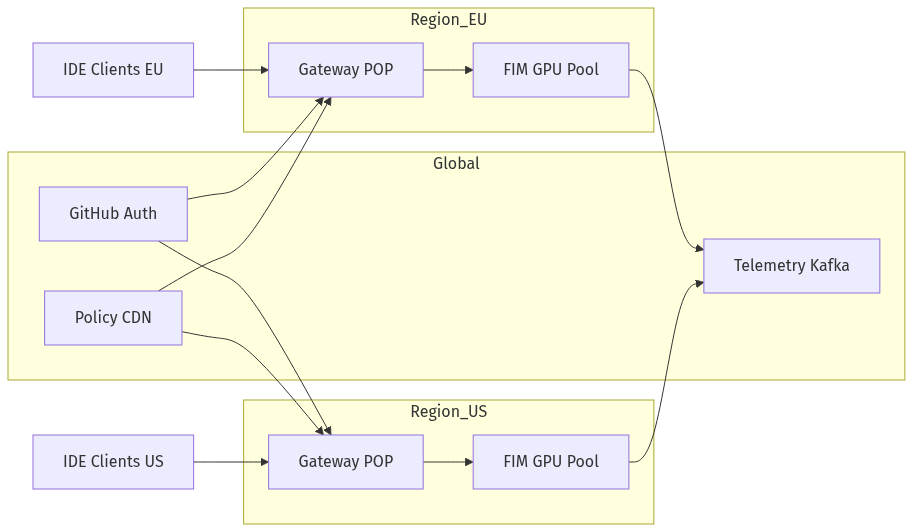
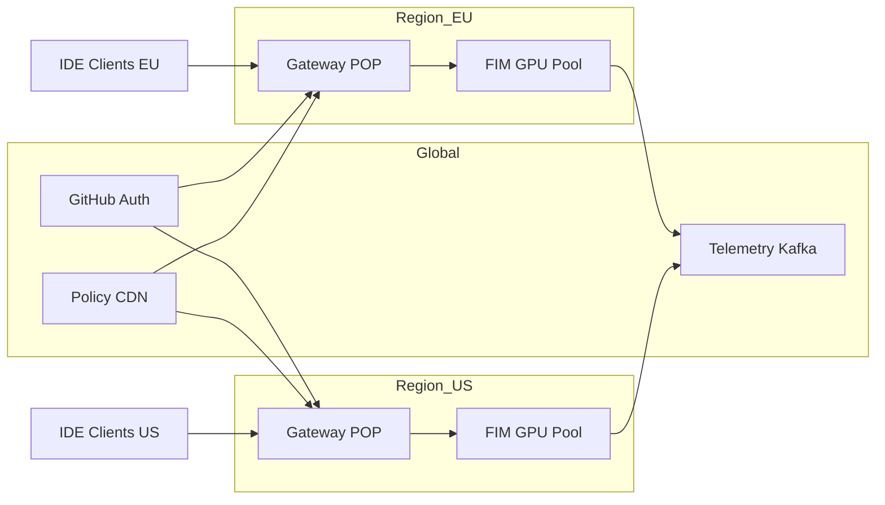

# System Design — Design GitHub Copilot

| Meta | Value |
|------|-------|
| **Estimated Time** | 3–4 hours (design 2h · critique 1h · memo 1h) |
| **Difficulty** | Staff / Principal |
| **Prerequisites** | [01-03](../Modules/01-LLM-Engineering/01-03-Inference-Serving-vLLM.md) · [01-02](../Modules/01-LLM-Engineering/01-02-Tokenization-Context-Windows.md) · [04-01](../Modules/04-RAG/04-01-RAG-Architecture.md) · [10-04](../Modules/10-Production-Infrastructure/10-04-Cost-Latency-Optimization.md) |
| **Related** | [Design Cursor](Design-Cursor.md) · [Design AI Coding](Design-AI-Coding-Assistant.md) · [Architecture Index](../Architecture Index.md) |

---

## Interview Framing

> “Design GitHub Copilot—a low-latency inline code completion system integrated into IDEs, with intelligent context assembly from open tabs, repo, and LSP signals at millions of requests per minute.”

Clarify in first 3 minutes: **inline ghost text vs chat**, **FIM (fill-in-the-middle) requirement**, **p95 latency target**, **languages**, **enterprise telemetry opt-out**, **multi-line vs single-line**, **on-prem vs cloud**.

---

## Requirements

### Functional

| ID | Requirement |
|----|-------------|
| F1 | Inline completions (ghost text) triggered on typing pause / explicit invoke |
| F2 | Fill-in-the-middle: prefix + suffix + cursor position for mid-file edits |
| F3 | Multi-line suggestions with sane block boundaries |
| F4 | Context assembly: current file, related open tabs, recently edited files, imports |
| F5 | LSP integration: diagnostics, symbols, types (where available) |
| F6 | Repo-aware context (Copilot Workspace / agents—separate path; core is local-first) |
| F7 | Chat panel: explain, fix, generate tests (higher latency tier) |
| F8 | IDE plugins: VS Code, JetBrains, Neovim, Visual Studio |
| F9 | Copilot CLI (optional): shell command suggestions |
| F10 | Enterprise: policy controls, audit, no code retention options, license management |
| F11 | Accept / dismiss telemetry for model improvement (with opt-out) |

### Non-Functional

| ID | Target (example) |
|----|------------------|
| N1 | Inline completion E2E p50 < 150ms, p95 < 300ms, p99 < 500ms |
| N2 | Cancel in-flight request if user keeps typing (< 20ms client-side abort) |
| N3 | Throughput: millions of completion requests/minute globally |
| N4 | Availability 99.9% for completion API |
| N5 | Suggestion relevance: accept rate > 25% (product metric) |
| N6 | Privacy: no long-term storage of code snippets for enterprise tier |
| N7 | Fairness: degrade gracefully under load—shorter suggestions vs hard fail |

### Out of Scope (initially)

- Full autonomous multi-file agent (see [Design Cursor](Design-Cursor.md))
- Custom per-repo fine-tuning
- On-device-only inference (Copilot Chat may use cloud)

---

## APIs

### Inline completion (IDE extension → completion service)

```http
POST /v1/completions/inline
Authorization: Bearer <copilot_token>
Copilot-Integration-Id: vscode/1.85
Content-Type: application/json

{
  "model": "copilot-fast",
  "language": "typescript",
  "filepath": "src/utils/auth.ts",
  "repo": {"name":"acme/web","visibility":"private"},
  "prefix": "export function validateToken(\n  token: string\n): boolean {\n  ",
  "suffix": "\n}",
  "cursor": {"line": 2, "column": 2},
  "context": {
    "open_tabs": [{"path":"src/types/user.ts","content":"..."}],
    "recent_edits": ["src/api/login.ts"],
    "lsp": {"symbols":["validateToken"],"diagnostics":[]}
  },
  "max_lines": 12,
  "temperature": 0.1
}
```

### Response (non-streaming for inline)

```json
{
  "choices": [{
    "text": "if (!token) return false;\n  try {\n    return jwt.verify(token, SECRET);\n  } catch {\n    return false;\n  }",
    "finish_reason": "length"
  }],
  "usage": {"prompt_tokens": 890, "completion_tokens": 42},
  "latency_ms": 87
}
```

### Streaming variant (for longer chat, not inline critical path)

```text
event: completion
data: {"delta":"const "}

event: done
data: {"usage":{"prompt_tokens":1200,"completion_tokens":180}}
```

### Context ranking (internal microservice)

```json
{
  "request_id": "req_01",
  "candidates": [
    {"source":"open_tab","path":"src/types/user.ts","score":0.91,"tokens":400},
    {"source":"import_graph","path":"src/lib/jwt.ts","score":0.84,"tokens":600}
  ],
  "budget_tokens": 8192
}
```

### Enterprise policy hook

```http
POST /v1/policy/evaluate
{"org_id":"org_1","action":"completion","language":"python","repo":"classified"}
→ {"allowed": true, "log_level": "metadata_only"}
```

---

## Architecture





---

## Data Flow

```mermaid
sequenceDiagram
    participant Dev as Developer
    participant EXT as IDE Extension
    participant LSP as Language Server
    participant GW as Completion Gateway
    participant RANK as Context Ranker
    participant INF as FIM Inference
    participant POL as Policy Service

    Dev->>EXT: types pause / invoke completion
    EXT->>EXT: debounce 75ms; abort prior request if new keystroke
    EXT->>LSP: symbols, diagnostics (async cache)
    EXT->>GW: prefix + suffix + local context bundle
    GW->>POL: license + org policy check
    POL-->>GW: allow / deny / metadata_only
    GW->>RANK: score candidate files/snippets
    RANK-->>GW: trimmed prompt within token budget
    GW->>INF: FIM request (batched)
    INF-->>GW: completion text
    GW-->>EXT: suggestion JSON
    EXT->>EXT: render ghost text; Tab to accept
    alt user accepts
        EXT->>GW: acceptance telemetry (if opted in)
    else user keeps typing
        EXT->>GW: cancel / dismiss event
    end
```

---

## Scaling

| Layer | Strategy |
|-------|----------|
| Gateway | Global anycast; regional POPs; connection pooling from extensions |
| Context ranker | CPU-light; horizontal scale; stateless |
| FIM inference | GPU pools per region; continuous batching; max batch wait 5–10ms |
| Prefix caching | KV-cache for repeated file prefixes within session |
| Chat tier | Separate queue; never steal GPU from inline path |
| Telemetry | Kafka ingest; sampled for privacy tier |

**Load shedding:** Under stress, reduce `max_lines`, shrink context window, skip neighbor files—never exceed p95 SLO on happy path volume.

**Debounce + cancel:** Client-side debounce (50–100ms) and abort reduces effective QPS 3–5× vs raw keystrokes.

---

## Caching

| Cache | Key | Value | TTL |
|-------|-----|-------|-----|
| Prefix KV | model + prefix_hash | attention KV blocks | seconds–minutes |
| Context rank | file_set_hash + cursor | ranked snippets | session |
| LSP snapshot | file_version | symbols/diagnostics | until edit |
| Policy | org_id + action | allow/deny | minutes |
| Negative cache | prefix_hash | empty completion | seconds (avoid repeat junk) |

**When NOT to cache:** completions after file content change (invalidate on hash); enterprise metadata-only mode skips content caches in shared infra.

---

## Latency

| Segment | Budget (p95 target) |
|---------|---------------------|
| Client debounce | 50–100ms (intentional) |
| Extension pack context | < 10ms |
| Network RTT | < 30ms (edge proximity) |
| Auth + policy | < 15ms |
| Context rank + trim | < 20ms |
| Queue + batch wait | < 10ms |
| FIM inference | < 120ms |
| Response parse + render | < 10ms |
| **Total E2E** | **< 300ms** |

**Techniques:** speculative execution on partial debounce; FIM-specialized smaller models; quantization (INT8/FP8); edge routing; prefix KV reuse; early exit on high-confidence short completions ([01-03](../Modules/01-LLM-Engineering/01-03-Inference-Serving-vLLM.md)).

---

## Security

| Threat | Control |
|--------|---------|
| Code leakage in logs | Enterprise metadata-only; scrub prompts at ingest |
| Suggestion of secrets | Secret scanner on output; block known patterns |
| License violation | GitHub auth binds seat; org policy |
| Prompt injection via comments | Comments included but lower rank; output filters |
| Model inversion concerns | No per-snippet retention for enterprise |
| Supply chain (extension) | Signed VSIX; official marketplace |

Training data policy: separate enterprise agreements; opt-out paths for telemetry used in model improvement.

---

## Observability

| Signal | Why |
|--------|-----|
| E2E latency histogram | Core SLO |
| Accept rate / partial accept | Quality |
| Cancel rate | Debounce tuning |
| Context tokens used | Cost + quality |
| GPU batch utilization | Capacity |
| Policy deny rate | Enterprise |
| Language breakdown | Model routing |
| Error budget burn | Reliability |

SLO dashboards: p95 latency by region, by language, by IDE. Alert on accept rate drop (model regression proxy).

---

## Cost

\[
Cost \approx QPS \cdot avg\_prompt\_tokens \cdot GPU\_sec\_per\_token + gateway + telemetry
\]

| Lever | Impact |
|-------|--------|
| Smaller FIM model vs chat model | 10× cheaper per token |
| Aggressive cancel | −50% effective QPS |
| Shorter max_lines under load | −completion tokens |
| Context trim | −prompt tokens |
| Quantization | +throughput per GPU |
| Accept-rate-weighted eval | Avoid quality regressions that increase regens |

Inline completion is **high volume × small payload**—optimize inference $/req, not $/conversation.

---

## Failure Modes

| Failure | User impact | Mitigation |
|---------|-------------|------------|
| Latency spike | Ghost text late; ignored | Shed context; regional failover |
| Stale suggestion after edit | Wrong insert | Client hash check; discard on mismatch |
| Bad multi-line block | Broken syntax | LSP post-check; shorter suggestions |
| GPU pool exhaustion | No completion | Silent degrade; increase debounce |
| Context overflow | Truncated mid-function | Priority: prefix > suffix > nearest symbol |
| License expired | Hard stop | Clear UX in IDE |
| Secret in suggestion | Security incident | Output filter + block |

---

## Tradeoffs

| Decision | Option A | Option B | Pick when |
|----------|----------|----------|-----------|
| Model | Single large | Small FIM specialist | Small for inline; large for chat only |
| Context | More files | Deeper current file | Deeper file for completion; more files for chat |
| Streaming | Stream ghost text | Single blob | Single blob faster for short inline |
| Ranking | Heuristic | ML ranker | ML at scale; heuristics for cold start |
| Telemetry | Full snippets | Metadata only | Metadata for enterprise default |
| Placement | Central cloud | Edge GPU | Edge when RTT dominates |

---

## Deployment





- **Inference:** Triton/vLLM/TensorRT-LLM; autoscale on queue depth + GPU util
- **Rollout:** Canary model version per 1% traffic; compare accept rate + latency
- **IDE extensions:** Separate release train; backward compatible API
- **Enterprise:** Dedicated policy endpoint; optional VPC peering for metadata

---

## Interview Answer Skeleton (45–60 min)

1. **Requirements & latency SLO** (5) — FIM, p95 300ms, IDE integration
2. **Architecture** (5) — extension, gateway, context ranker, FIM pool
3. **FIM prompt structure** (7) — prefix/suffix/cursor, token budget
4. **Context assembly** (8) — open tabs, imports, LSP, ranking
5. **Low-latency inference** (8) — batching, KV cache, quantization
6. **Client debounce/cancel** (5) — effective QPS control
7. **Enterprise privacy & policy** (5)
8. **Scale, cost, failures, metrics** (7)

---

## Practice Prompts

1. p95 latency regressed from 250ms to 450ms—walk through your debugging tree.
2. How is Copilot inline architecturally different from Cursor Agent? Draw both data paths.
3. Design context assembly for a 5K-line file with 2K-token budget.
4. Enterprise forbids code leaving the laptop—what architecture options exist?

---

## Further Reading

| Title | URL | Why |
|-------|-----|-----|
| GitHub Copilot Docs | https://docs.github.com/en/copilot | Product surfaces, policies |
| InCoder (FIM) paper | https://arxiv.org/abs/2204.05999 | Fill-in-the-middle foundation |
| Code Llama paper | https://arxiv.org/abs/2308.12950 | FIM-capable code models |
| vLLM PagedAttention | https://arxiv.org/abs/2309.06180 | Serving efficiency |
| OpenAI FIM API patterns | https://platform.openai.com/docs/guides/code-generation | Industry FIM prompt shape |
| OWASP LLM Top 10 | https://owasp.org/www-project-top-10-for-large-language-model-applications/ | Secret leakage risks |

---

## Resume Bullet

- Engineered a GitHub Copilot-scale inline completion architecture with FIM-optimized inference pools, sub-300ms p95 latency via micro-batching and prefix KV caching, IDE-side debounce/cancel, ML-ranked context assembly from LSP and open tabs, and enterprise metadata-only telemetry modes.
