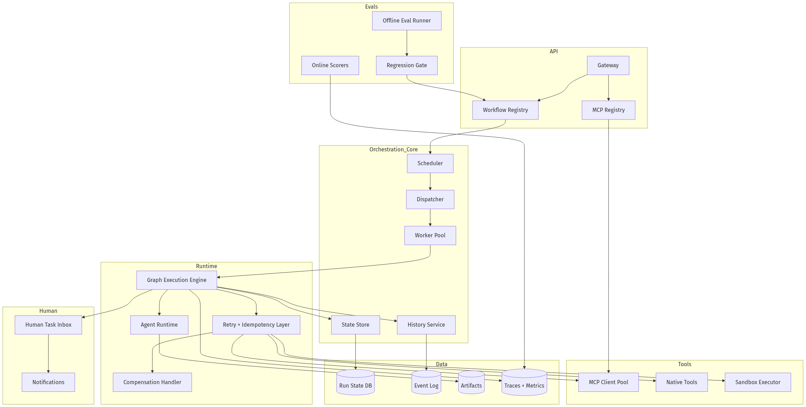
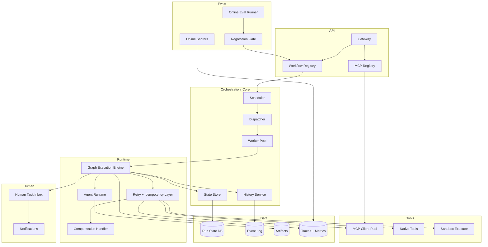
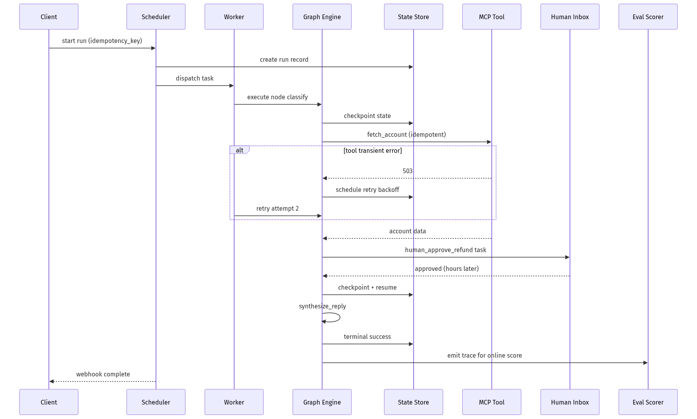
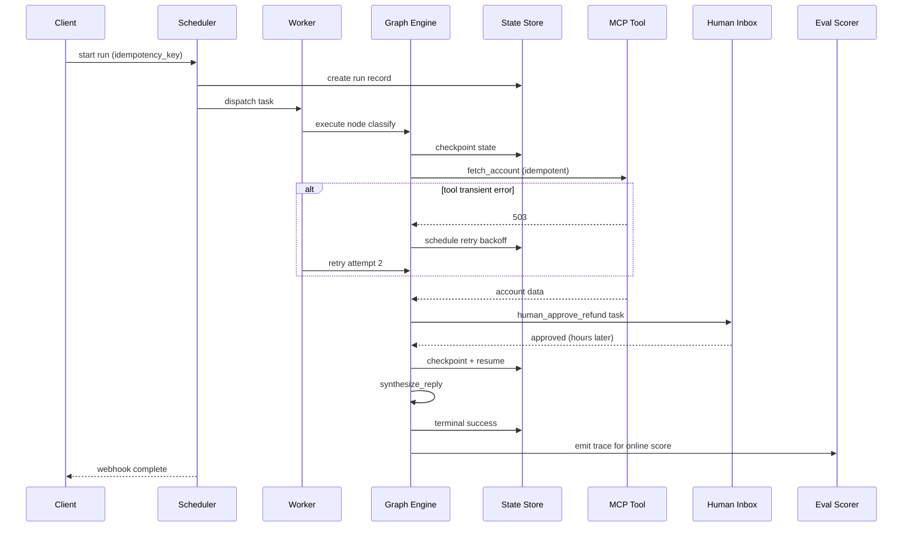
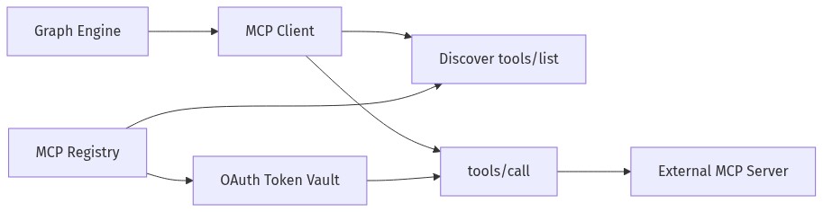
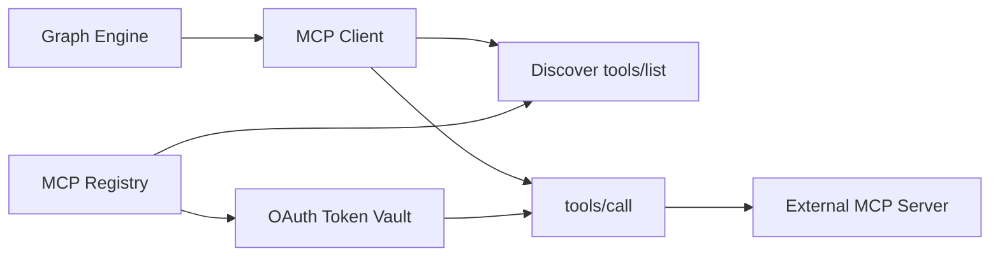
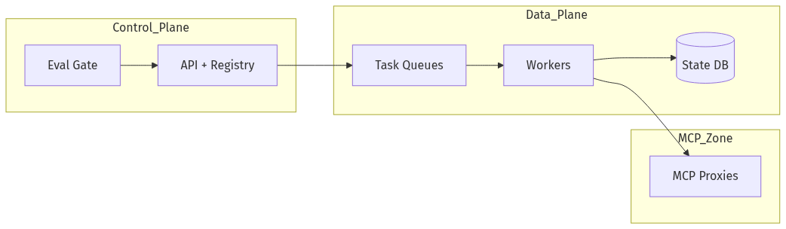
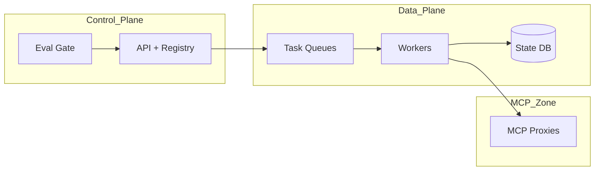

# System Design — Multi-Agent Workflow Engine

| Meta | Value |
|------|-------|
| **Estimated Time** | 4–5 hours (design 2h · critique 1.5h · memo 1h) |
| **Difficulty** | Staff / Principal |
| **Prerequisites** | [03-01](../Modules/03-Agentic-Fundamentals/03-01-Agent-Anatomy-and-Loop.md) · [08-01](../Modules/08-Evaluation-LLMOps/08-01-Evaluation-Lifecycle.md) · [11-01](../Modules/11-Security-Safety/11-01-OWASP-LLM-Top-10.md) |
| **Related** | [Design AI Research Agent](Design-AI-Research-Agent.md) · [Design AI Customer Support](Design-AI-Customer-Support.md) · [Architecture Index](../Architecture Index.md) |

---

## Interview Framing

> "Design a multi-agent workflow engine (Temporal + LangGraph + n8n AI class): durable state, human approvals, retries, MCP tool registry, observability, and offline evals for production agent graphs."

Clarify in first 3 minutes: **sync vs async workflows**, **determinism vs LLM nondeterminism**, **who authors graphs (code vs UI)**, **tenant isolation**, **max runtime**, **MCP vs native tools**.

---

## Requirements

### Functional

| ID | Requirement |
|----|-------------|
| F1 | Define workflows as DAGs/state machines: nodes = agents, tools, human gates |
| F2 | **Durable state**: pause/resume; survive worker crashes |
| F3 | **Retries** with exponential backoff, idempotency keys, compensating transactions |
| F4 | Multi-agent: planner, workers, critic, synthesizer roles |
| F5 | **MCP tools**: register servers, discover tools, schema validation, OAuth |
| F6 | Human-in-the-loop: approve/reject/edit with timeout policies |
| F7 | Versioning: workflow defs, prompts, tool schemas pinned per run |
| F8 | **Evals**: offline suites, online scoring, regression gates on deploy |
| F9 | Scheduler: cron, webhooks, event triggers |
| F10 | Tenant quotas, secrets, audit |

### Non-Functional

| ID | Target (example) |
|----|------------------|
| N1 | Workflow start accept < 200ms |
| N2 | State checkpoint persist < 100ms p95 |
| N3 | Exactly-once side effects (via idempotency) |
| N4 | 99.95% orchestrator availability |
| N5 | Runs up to 24h; 1M+ concurrent sleeping workflows |
| N6 | Full trace replay for debugging |

### Out of Scope (initially)

- Arbitrary user-uploaded Python on shared workers without sandbox
- Guaranteeing LLM deterministic outputs
- Building a general BPMN editor day one (API-first OK)

---

## APIs

### Start workflow run

```http
POST /v1/workflows/{workflow_id}/runs
Authorization: Bearer <tenant_api_key>
Content-Type: application/json

{
  "input": {"ticket_id": "tkt_123", "goal": "resolve billing dispute"},
  "version": "wf_v3.2.1",
  "idempotency_key": "run_unique_abc",
  "labels": {"env": "prod", "team": "support"}
}
```

Response:

```json
{
  "run_id": "run_xyz",
  "status": "running",
  "events_url": "/v1/runs/run_xyz/events"
}
```

### Workflow definition (DSL excerpt)

```yaml
workflow_id: support_resolution
version: wf_v3.2.1
nodes:
  - id: classify
    type: agent
    model: fast-v2
    retry: {max_attempts: 3, backoff: exponential}
  - id: fetch_account
    type: mcp_tool
    server: crm-mcp
    tool: get_account
    idempotent: true
  - id: human_approve_refund
    type: human_gate
    timeout: 4h
    on_timeout: escalate
  - id: synthesize_reply
    type: agent
    model: smart-v1
edges:
  - from: classify
    to: fetch_account
    when: "$.intent == 'billing'"
```

### MCP tool registration

```http
POST /v1/mcp/servers
{
  "name": "crm-mcp",
  "transport": "stdio|sse",
  "endpoint": "https://mcp.internal/crm",
  "oauth": {"client_id": "...", "scopes": ["crm.read"]},
  "allowed_tenants": ["tenant_a"]
}
```

### Human gate callback

```http
POST /v1/runs/run_xyz/gates/human_approve_refund
{
  "decision": "approve",
  "edited_payload": {"amount": 25.00},
  "actor": "user_456"
}
```

### Eval run

```http
POST /v1/evals/suites/support_wf_v3/run
{
  "workflow_version": "wf_v3.2.1",
  "dataset_id": "golden_500",
  "metrics": ["task_success", "tool_accuracy", "cost", "latency"]
}
```

---

## Architecture





---

## Data Flow (Run with Retry + Human Gate)





---

## State Model

| Concept | Storage | Notes |
|---------|---------|-------|
| Run | `run_id`, status, workflow_version | Immutable version pin |
| Checkpoint | `run_id`, `node_id`, payload hash | After every side effect |
| Event log | append-only events | Replay source |
| Idempotency | `idempotency_key` → result | DB unique constraint |
| Human gate | pending actor, deadline | Wakeup timer |
| Artifacts | large blobs in object store | References in state |

**Determinism boundary:** Orchestration deterministic; LLM outputs stored as artifacts at checkpoint—not recomputed on replay unless node marked `nondeterministic_retry_ok`.

---

## Retries

| Error class | Policy |
|-------------|--------|
| Transient (503, timeout) | Exponential backoff, max N |
| Rate limit | Respect Retry-After |
| Validation | No retry; fail run |
| LLM refusal | Retry once with modified prompt |
| Idempotent tool | Same key returns cached result |
| Non-idempotent tool | Require idempotency key or saga compensate |

Compensation example: `charge_refund` fails after `create_ticket` → run compensating `close_ticket`.

---

## MCP Tools Integration





| Control | Purpose |
|---------|---------|
| Tenant allowlist | Which servers per tenant |
| Schema validation | Reject unknown args |
| Timeout + budget | Per-call caps |
| Audit | Tool name, args hash, result hash |
| Sandboxed transport | stdio workers isolated |

---

## Evals

| Type | When | Metrics |
|------|------|---------|
| Offline suite | Pre-deploy gate | task success, tool selection accuracy |
| Shadow runs | Canary | compare vN vs vN+1 |
| Online scorers | Production sample | latency, cost, human override rate |
| Red team | Periodic | policy violations |

Regression gate blocks workflow version promote if `task_success` drops >2% on golden set.

---

## Scaling

| Layer | Strategy |
|-------|----------|
| Scheduler | Horizontal; shard by tenant |
| Workers | Pool per task queue; priority queues |
| Sleeping workflows | Timer wheel in DB + wake queue |
| MCP clients | Connection pool per server |
| State DB | Partition by tenant; read replicas |
| Event log | Kafka/Pulsar for high volume |

---

## Caching

| Cache | Key | Value | TTL |
|-------|-----|-------|-----|
| Idempotent tool | idempotency_key | result | days |
| MCP list_tools | server + version | schema | minutes |
| Workflow def | workflow_id + version | compiled graph | until bump |
| LLM prefix | prompt_hash | KV cache handle | session |

---

## Latency

| Segment | Budget |
|---------|--------|
| Run accept + persist | < 200ms |
| Checkpoint write | < 100ms |
| MCP tool (user-facing path) | workflow-specific |
| Human gate | hours—not latency critical |
| Eval suite | async batch |

---

## Security

| Threat | Control |
|--------|---------|
| Tool overreach | MCP allowlist + arg validation |
| Secret leak in state | Encrypt artifacts; redact logs |
| Cross-tenant runs | Hard tenant_id on all rows |
| Prompt injection via tool output | Data channel; schema-only parsing |
| Runaway loops | max_steps, max_cost, max_time |

---

## Observability

| Signal | Why |
|--------|-----|
| Run success/fail by node | Pinpoint flaky step |
| Retry count distribution | Infra health |
| Time in human gate | SLA |
| MCP error rate | Integration |
| Cost/run | Finance |
| Eval regression | Release safety |
| Trace replay | Debug |

OpenTelemetry: span per node with `run_id`, `workflow_version`, `node_id`, `attempt`.

---

## Cost

\[
Cost \approx orchestrator\_CPU + DB_{state} + LLM/tool\_calls + MCP\_ egress
\]

Levers: sleep cheaply; batch evals; cache idempotent reads; small model for routing nodes.

---

## Failure Modes

| Failure | Impact | Mitigation |
|---------|--------|------------|
| Worker crash mid-node | Stuck run | At-least-once dispatch; replay from checkpoint |
| Duplicate dispatch | Double charge | Idempotency keys |
| MCP server down | Blocked run | Retry + degrade path |
| State DB split | Corruption | Strong consistency per run shard |
| Human timeout | Stalled | Policy: auto-escalate |
| Nondeterministic replay | Wrong branch | Store LLM outputs in checkpoint |

---

## Tradeoffs

| Decision | Option A | Option B | Pick when |
|----------|----------|----------|-----------|
| Engine | Custom graph | Temporal + LLM wrapper | Temporal for durability fast |
| Tool protocol | MCP only | MCP + native | Both for performance |
| State | Event sourcing | Snapshot + events | Event sourcing for audit |
| LLM replay | Re-execute | Freeze outputs | Freeze for audit |
| Authoring | Code DSL | Visual UI | DSL first; UI later |

---

## Deployment





- Blue/green workers; workflow version pinned per run
- MCP proxies in isolated network
- Canary tenant on new workflow version

---

## Interview Answer Skeleton (45–60 min)

1. Workflow vs chat agent requirements (5)
2. State machine + checkpoint model (10)
3. Retries, idempotency, sagas (8)
4. Multi-agent graph patterns (7)
5. MCP registry + security (7)
6. Human gates (5)
7. Evals + regression gates (5)
8. Scale, observability, failures (8)

---

## Practice Prompts

1. Payment tool succeeds but network times out—exactly-once story?
2. Compare using Temporal vs custom Postgres state for agent runs.
3. Design MCP OAuth token refresh without blocking workflow workers.

---

## Further Reading

| Title | URL | Why |
|-------|-----|-----|
| Temporal docs | https://docs.temporal.io/ | Durable execution |
| LangGraph | https://langchain-ai.github.io/langgraph/ | Agent graph patterns |
| Model Context Protocol | https://modelcontextprotocol.io/ | MCP spec |
| LangGraph persistence | https://langchain-ai.github.io/langgraph/concepts/persistence/ | Checkpoint semantics |
| OpenAI evals guide | https://platform.openai.com/docs/guides/evals | Eval harness design |

---

## Resume Bullet

- Built a multi-agent workflow engine with durable checkpointed state, idempotent MCP tool integration, human-in-the-loop gates, saga compensations, and offline/online eval regression gates for safe agent graph deployments.
