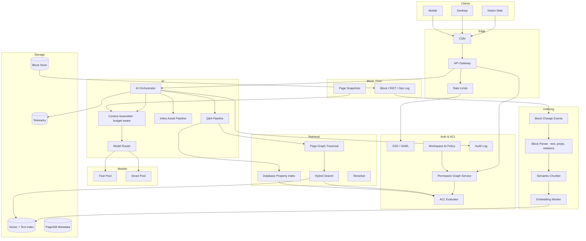
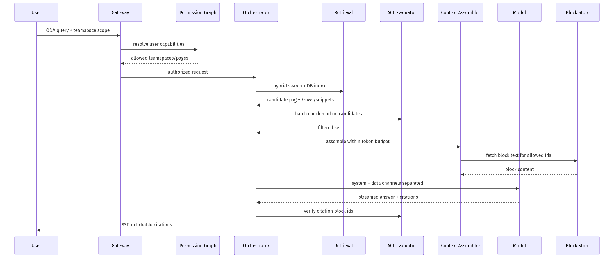
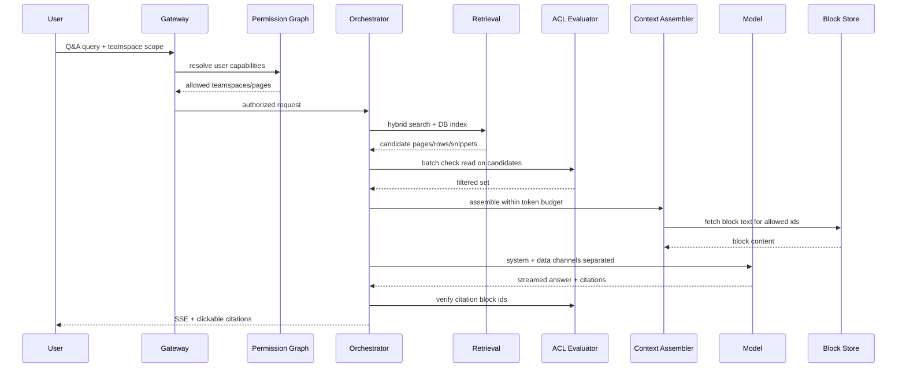
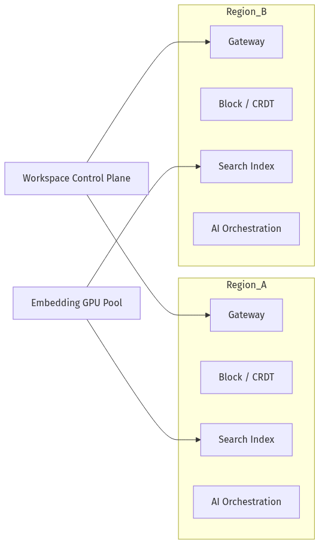
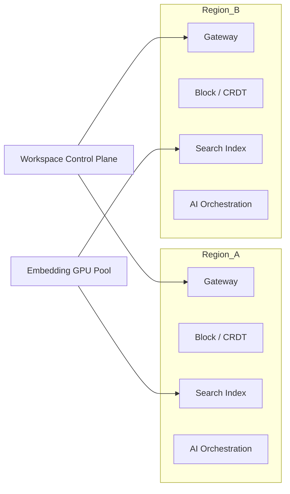

# System Design — Notion AI (Workspace Knowledge + Blocks)

| Meta | Value |
|------|-------|
| **Estimated Time** | 3–4 hours (design 2h · critique 1h · memo 1h) |
| **Difficulty** | Staff / Principal |
| **Prerequisites** | [01-01](../Modules/01-LLM-Engineering/01-01-Transformer-Architecture.md) · [03-01](../Modules/03-Agentic-Fundamentals/03-01-Agent-Anatomy-and-Loop.md) · [08-01](../Modules/08-Evaluation-LLMOps/08-01-Evaluation-Lifecycle.md) · [11-01](../Modules/11-Security-Safety/11-01-OWASP-LLM-Top-10.md) |
| **Related** | [Design Slack AI](Design-Slack-AI.md) · [Design AI Search Engine](Design-AI-Search-Engine.md) · [Architecture Index](../Architecture Index.md) |

---

## Interview Framing

> "Design Notion AI: inline block assist, workspace Q&A, database autofill, and meeting notes across nested pages with granular page/database permissions and enterprise SSO."

Clarify in first 3 minutes: **page vs workspace scope**, **guest access**, **database row ACLs**, **offline/mobile**, **edit vs suggest-only**, **retention/export**, **connector sync (Slack, Drive)**.

---

## Requirements

### Functional

| ID | Requirement |
|----|-------------|
| F1 | Inline AI on blocks: continue writing, improve tone, summarize selection, translate |
| F2 | Workspace Q&A with citations to pages, blocks, and database rows |
| F3 | Database AI: autofill properties, classify tags, extract action items |
| F4 | Page-level context: current page, subpages, linked databases (user-selected scope) |
| F5 | **Enterprise ACL**: respect page permissions, teamspaces, guests, and database row visibility |
| F6 | Suggest-only vs apply modes; undo/history integration with Notion block CRDT |
| F7 | Admin: AI feature toggles, model tier, data training opt-out, connector policies |
| F8 | Audit: AI actions, sources retrieved, content generated, export for compliance |
| F9 | Templates: generate structured pages (PRD, retro, meeting notes) from prompts |

### Non-Functional

| ID | Target (example) |
|----|------------------|
| N1 | Inline assist TTFT p50 < 400ms; Q&A p95 < 1.2s to first token |
| N2 | **Zero unauthorized page leakage** in retrieval or generation |
| N3 | Availability 99.9% |
| N4 | Index update within 30s of block commit p95 |
| N5 | Support workspaces with 1M+ blocks; nested page trees depth 20+ |
| N6 | SOC2/GDPR; regional data residency for enterprise |
| N7 | Cost caps via context budgeting and model routing |

### Out of Scope (initially)

- Arbitrary code execution in workspace
- Public web publishing AI without review
- Real-time multi-user co-editing conflict resolution beyond existing CRDT
- Custom fine-tunes on customer data (default off)

---

## APIs

### Inline block assist

```http
POST /v1/ai/blocks/assist
Authorization: Bearer <session_token>
X-Notion-Workspace-Id: ws_abc
Content-Type: application/json

{
  "page_id": "page_123",
  "block_ids": ["blk_456"],
  "action": "improve_writing",
  "tone": "professional",
  "stream": true
}
```

### Workspace Q&A

```http
POST /v1/ai/ask
{
  "query": "What's our hiring plan for eng?",
  "scope": {
    "type": "teamspace",
    "teamspace_id": "ts_789",
    "include_databases": true,
    "max_pages": 50
  },
  "stream": true
}
```

### Streaming response

```text
event: sources
data: {"pages":[{"id":"page_111","title":"Eng Hiring H2","permission":"read"}]}

event: token
data: {"delta":"The plan targets"}

event: citation
data: {"page_id":"page_111","block_id":"blk_222","quote_span":[10,45]}

event: done
data: {"usage":{"input_tokens":3800,"output_tokens":210},"acl_pass":true}
```

### Permission check (internal)

```json
{
  "user_id": "user_1",
  "workspace_id": "ws_abc",
  "resources": [
    {"type": "page", "id": "page_111", "action": "read"},
    {"type": "database_row", "id": "row_333", "action": "read"}
  ]
}
```

### Apply AI edit (suggest → commit)

```http
POST /v1/ai/blocks/apply
{
  "page_id": "page_123",
  "suggestion_id": "sug_999",
  "mode": "replace_blocks"
}
```

Requires `write` permission on target blocks; creates undo transaction.

---

## Architecture



**Permission graph:** Pages inherit from teamspace + explicit shares; databases have row-level filters. Index stores `visibility_bitmap` or `(workspace_id, permission_epoch)` for filter-at-query-time.

---

## Data Flow





---

## Scaling

| Layer | Strategy |
|-------|----------|
| Block events | Partition by `workspace_id`; debounce rapid edits |
| Index | Workspace shards; sub-shard hot pages |
| Permission graph | Cached adjacency; epoch invalidation on share change |
| Graph traversal | BFS with depth cap; cache page tree for teamspace |
| Database AI | Property-level index; batch row scoring |
| Inline assist | Minimal context (selection + surrounding blocks) |
| Model serving | Separate pools for short inline vs long Q&A |

---

## Caching

| Cache | Key | Value | TTL |
|-------|-----|-------|-----|
| Page tree | teamspace_id + perm_epoch | page id list | minutes |
| Permission | user + resource | read/write | seconds–minutes |
| Block text | block_id + version | plaintext | until version bump |
| Embeddings | block_version_hash | vector | 30d |
| Q&A retrieval | query + scope + perm_epoch | ranked ids | 1–5 min |
| Inline prefix | page_id + block context hash | KV-friendly prefix | session |

**When NOT to cache:** Guest permission changes; private page moved to shared teamspace; compliance export in progress.

---

## Latency

| Segment | Budget mindset |
|---------|----------------|
| Permission resolve | < 40ms |
| Hybrid retrieval | < 250ms p95 |
| Block fetch for top-N | < 80ms batch |
| Context assembly | < 50ms |
| TTFT inline | < 400ms p50 (small model) |
| TTFT Q&A | dominated by retrieval + smart model |

**Techniques:** Route inline to fast model; prefetch surrounding blocks on cursor idle; incremental index on op log; skip retrieval for pure inline rewrite actions.

---

## Security

| Threat | Control |
|--------|---------|
| **Guest/private page leak** | ACL on index query + block fetch + citation verify |
| Prompt injection in page content | Data channel isolation; no tool execution from page text |
| AI apply without write perm | Separate apply endpoint checks write |
| Cross-workspace confusion | Hard workspace_id on every request |
| Data training concerns | Enterprise contract + opt-out flag |
| Bulk exfiltration | Rate limits; anomaly detection on wide Q&A scope |

**Enterprise ACL emphasis:** Database rows may be visible only via filtered views—index must store view_id + filter predicate hash; retrieval respects view semantics, not just page ACL.

---

## Observability

| Signal | Why |
|--------|-----|
| ACL post-filter drop rate | Index/permission bugs |
| Citation click-through | Answer usefulness |
| Apply vs dismiss rate | Inline quality |
| Index lag from CRDT | Freshness |
| Tokens per action type | Cost |
| Permission cache hit rate | Latency |
| Guest-scope query rate | Risk monitoring |

---

## Cost

\[
Cost \approx \sum_{actions} tokens \cdot price + embed_{incremental} + rerank + storage
\]

Levers: inline on fast model only; Q&A retrieval cap; summarize database columns offline; batch property autofill; debounce re-embed on typing pauses.

---

## Failure Modes

| Failure | User impact | Mitigation |
|---------|-------------|------------|
| Permission service down | Fail closed | Block AI; allow manual edit |
| Stale block version | Wrong citation | Version check on fetch |
| Over-broad scope | Slow/expensive | Default narrow scope; warn user |
| CRDT conflict on apply | Lost edit | Suggest-only default; merge UI |
| Database formula break | Bad autofill | Validate against schema |
| Model refusal | Empty assist | Fallback templates |

---

## Tradeoffs

| Decision | Option A | Option B | Pick when |
|----------|----------|----------|-----------|
| Index unit | Page-level | Block-level | Block for precision; page for cost |
| Q&A mode | Retrieval-augmented | Full workspace scan | Always RAG at scale |
| Edits | Auto-apply | Suggest diff | Suggest for enterprise trust |
| DB AI | Sync on edit | Async batch | Async for large DBs |
| Connectors | Live sync | Periodic | Live for freshness; periodic for cost |

---

## Deployment





- Enterprise workspaces pinned to region
- Canary prompts per workspace tier
- Embedding workers scale independently from LLM serving
- Audit logs replicated to customer SIEM via export API

---

## Interview Answer Skeleton (45–60 min)

1. Notion domain: blocks, pages, databases, permissions (6 min)
2. CRDT → index pipeline (7)
3. Inline vs Q&A paths (8)
4. ACL + database row/view semantics (10)
5. Citations and apply/undo (5)
6. Scale + caching + freshness (7)
7. Security + enterprise admin (5)
8. Cost, failures, metrics (7)

---

## Practice Prompts

1. User has access to a database view but not underlying rows—how does AI Q&A behave?
2. Design autofill for 100K-row database without $100K/month embed cost.
3. Two users co-edit while AI suggests rewrites—how do you avoid CRDT corruption?

---

## Further Reading

| Title | URL | Why |
|-------|-----|-----|
| Notion API | https://developers.notion.com/ | Blocks, permissions model |
| Notion AI | https://www.notion.com/product/ai | Product surface area |
| CRDTs (Shapiro et al.) | https://arxiv.org/abs/1608.03960 | Block collaboration foundation |
| Google Zanzibar | https://research.google/pubs/pub48190/ | Enterprise ACL at scale |
| OWASP LLM Top 10 | https://owasp.org/www-project-top-10-for-large-language-model-applications/ | Injection defenses |

---

## Resume Bullet

- Architected Notion-style workspace AI with block-level indexing, permission-graph ACL enforcement, database view-aware retrieval, and suggest/apply flows integrated with CRDT undo—designed for enterprise guest access and audit compliance.
