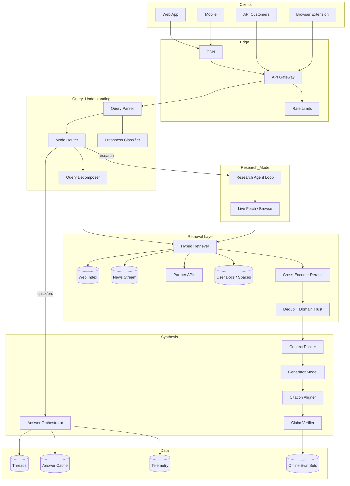
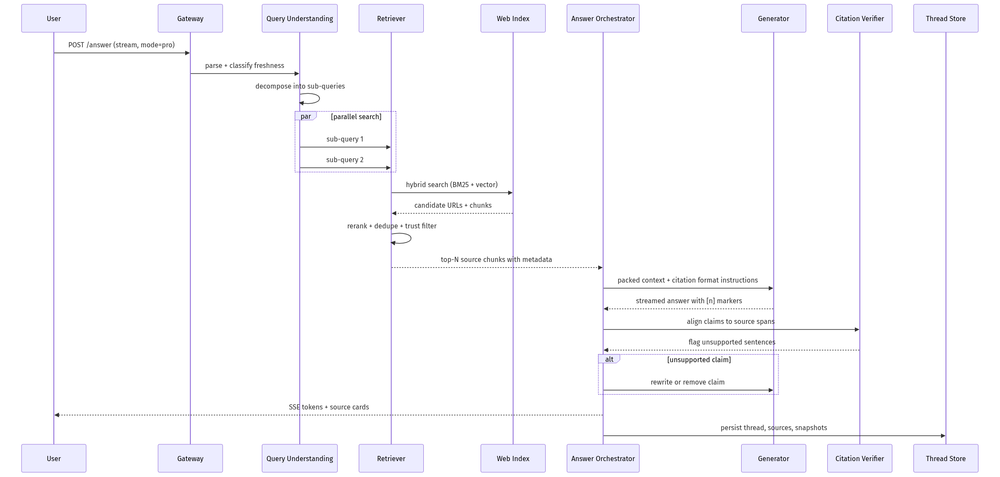
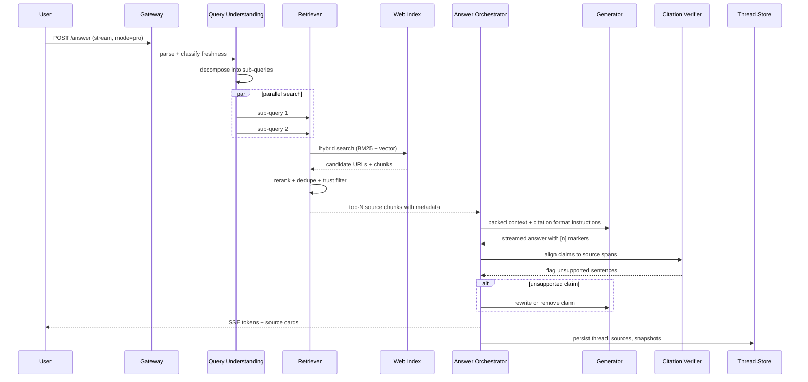
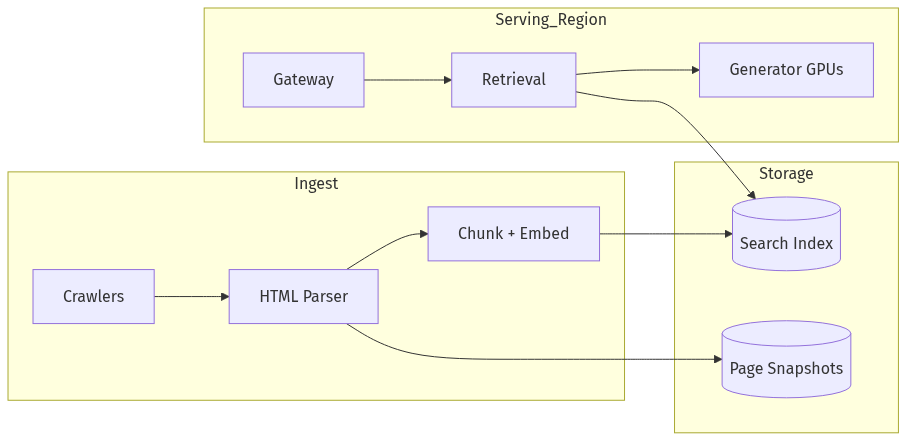
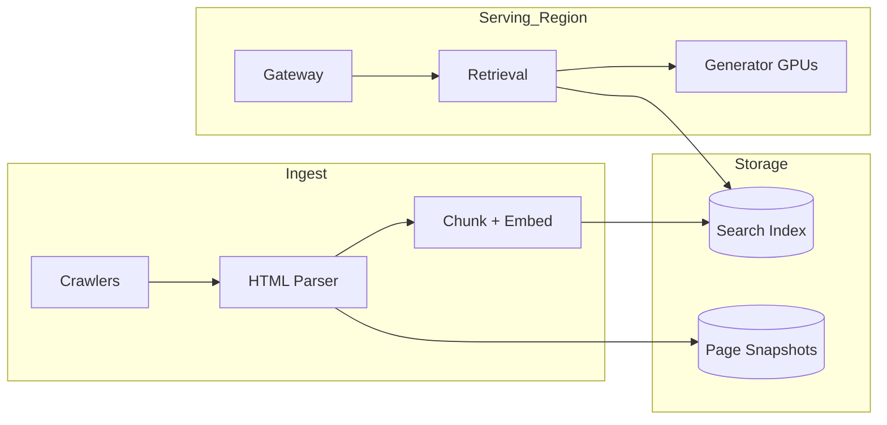

# System Design — Design Perplexity

| Meta | Value |
|------|-------|
| **Estimated Time** | 3–4 hours (design 2h · critique 1h · memo 1h) |
| **Difficulty** | Staff / Principal |
| **Prerequisites** | [04-01](../Modules/04-RAG/04-01-RAG-Architecture.md) · [04-03](../Modules/04-RAG/04-03-Vector-DB-Hybrid-Search-Reranking.md) · [12-01](../Modules/12-Advanced-Topics/12-01-Research-Agents.md) · [08-01](../Modules/08-Evaluation-LLMOps/08-01-Evaluation-Lifecycle.md) |
| **Related** | [Design AI Search](Design-AI-Search-Engine.md) · [Design ChatGPT](Design-ChatGPT.md) · [Architecture Index](../Architecture Index.md) |

---

## Interview Framing

> “Design Perplexity—an answer engine that retrieves live web (and optional file) sources, cites them inline, and synthesizes a concise grounded answer with follow-up threads at search-scale QPS.”

Clarify in first 3 minutes: **web-only vs enterprise KB**, **freshness requirement**, **Pro vs free model tier**, **citation fidelity bar**, **multimodal (images)**, **latency vs depth (Quick vs Research)**, **ads/subscription model**.

---

## Requirements

### Functional

| ID | Requirement |
|----|-------------|
| F1 | Natural-language queries with threaded follow-ups |
| F2 | Retrieve: web crawl index, news, API partners, optional user uploads / connectors |
| F3 | Rank and select top sources; dedupe near-duplicates |
| F4 | Synthesize answer with inline citations `[1][2]` linked to source cards |
| F5 | Source panel: title, URL, snippet, favicon, date, domain trust score |
| F6 | Modes: Quick (1–3 sources), Pro (deeper retrieval + better model), Research (multi-step agent) |
| F7 | Related questions / query refinement suggestions |
| F8 | Focus modes: Web, Academic, Math, Writing, Social (domain filters) |
| F9 | Optional: generate images, charts; code execution for math |
| F10 | Collections / Spaces: persistent threads + uploaded docs |
| F11 | API for developers (search + answer endpoints) |

### Non-Functional

| ID | Target (example) |
|----|------------------|
| N1 | Quick mode: first token < 2s p95; full answer < 8s p95 |
| N2 | Research mode: up to 2–5 min with progress UI |
| N3 | Citation accuracy: > 95% supported claims have valid source span (offline eval) |
| N4 | Freshness: news queries prefer index < 15 min old |
| N5 | Scale: 10K+ QPS peak; bursty around events |
| N6 | Availability 99.9% |
| N7 | Cost: bounded $/query via retrieval depth caps |

### Out of Scope (initially)

- General-purpose unconstrained chat without retrieval
- Full browser replacement (address bar + extensions)
- User-generated content social network

---

## APIs

### Answer query (client → gateway)

```http
POST /v1/answer
Authorization: Bearer <token>
Content-Type: application/json

{
  "query": "What are the latest FDA approvals for GLP-1 drugs in 2025?",
  "thread_id": "th_uuid",
  "mode": "pro",
  "focus": "web",
  "locale": "en-US",
  "stream": true,
  "max_sources": 8
}
```

### Streaming events

```text
event: retrieval
data: {"status":"searching","queries":["FDA GLP-1 approval 2025","..."]}

event: sources
data: {"sources":[{"id":1,"url":"https://fda.gov/...","title":"...","published":"2025-03-01"}]}

event: token
data: {"delta":"The FDA approved "}

event: citation
data: {"source_id":1,"span_start":0,"span_end":45}

event: related
data: {"questions":["How do GLP-1 drugs work?"]}

event: done
data: {"usage":{"search_calls":3,"llm_tokens":2100},"confidence":0.88}
```

### Internal retrieval contract

```json
{
  "sub_queries": ["FDA GLP-1 2025 approval list"],
  "filters": {"recency_days": 30, "domain_allowlist": null},
  "top_k_per_query": 20,
  "rerank": true,
  "dedupe_threshold": 0.92
}
```

### Citation verification (post-generation)

```json
{
  "answer_text": "The FDA approved drug X in March 2025 [1].",
  "sources": [{"id":1,"chunks":[{"text":"...approved X...","embedding_id":"e_99"}]}],
  "check": "claim_source_alignment"
}
```

---

## Architecture



---

## Data Flow





---

## Scaling

| Layer | Strategy |
|-------|----------|
| Query understanding | CPU microservices; cache intent for trending queries |
| Web index | Sharded inverted index + vector sidecar; CDN for static crawl |
| Live fetch | Separate pool for cache-miss URLs; rate limit per domain |
| Reranker | GPU batch inference; cap candidates at 50/query |
| Generator | Model pools by mode (fast vs pro); streaming |
| Research agent | Queue-based; per-user concurrency limit |
| Thread storage | Append-only turns; object store for source snapshots |

**Trending burst:** Pre-warm retrieval for breaking news clusters; shared answer cache with short TTL.

---

## Caching

| Cache | Key | Value | TTL |
|-------|-----|-------|-----|
| Answer | query_hash + mode + focus | full answer + sources | 5–60 min |
| Retrieval | sub_query_hash | ranked URLs | minutes |
| Page chunk | url_hash + content_hash | extracted text | hours–days |
| Embeddings | chunk_hash | vector | days |
| Trending | trending_topic_id | precomputed sources | minutes |
| Thread context | thread_id | prior sources + summary | session |

**When NOT to cache:** personalized Spaces docs; time-sensitive stock/weather; user-specific follow-ups requiring new retrieval.

Invalidate answer cache on `recency_critical` queries detected by freshness classifier.

---

## Latency

| Segment | Budget (Quick/Pro) |
|---------|-------------------|
| Query understanding | < 100ms |
| Retrieval (parallel sub-queries) | < 800ms |
| Rerank + dedupe | < 200ms |
| Context pack | < 50ms |
| TTFT generator | < 500ms after retrieval |
| Citation verify | < 150ms (parallel with final tokens) |
| **Total to first token** | **< 2s p95** |
| Research mode | 30s–5min; progressive source reveal |

**Techniques:** speculative retrieval on query keystroke (extension); early source cards before synthesis; smaller generator for Quick mode; limit chunks per source ([10-04](../Modules/10-Production-Infrastructure/10-04-Cost-Latency-Optimization.md)).

---

## Security

| Threat | Control |
|--------|---------|
| Misinformation / poisoned SEO pages | Domain trust; diversity requirements; authoritative source boost |
| Prompt injection in web pages | Sanitize HTML→text; untrusted channel in prompt; ignore instructions in pages |
| Citation hallucination | Post-hoc verifier; remove unsupported claims |
| User data leak across Spaces | Namespace isolation |
| Scraping abuse | robots.txt respect; legal review; rate limits |
| XSS in source snippets | Sanitize rendered snippets |

Retrieval-grounded systems fail loudly when citations are wrong—invest in offline eval ([08-01](../Modules/08-Evaluation-LLMOps/08-01-Evaluation-Lifecycle.md)).

---

## Observability

| Signal | Why |
|--------|-----|
| Retrieval recall@k (offline) | Source quality |
| Citation support rate | Trust |
| Time-to-first-token | UX |
| Source diversity score | Bubble filter |
| Unsupported claim rewrite rate | Model/regression |
| Mode mix (Quick/Pro/Research) | Cost |
| Click-through on sources | Grounding trust |
| $/query by mode | Finance |

---

## Cost

\[
Cost \approx search\_infra + rerank\_GPU + LLM\_tokens + live\_fetch + storage
\]

| Lever | Impact |
|-------|--------|
| Quick vs Pro routing | −70% tokens on easy queries |
| Answer caching for head queries | −40% at scale |
| Cap sub-queries (1 vs 5) | Linear retrieval savings |
| Smaller reranker | Cheaper per candidate |
| Snapshot sources not full re-fetch | Bandwidth savings |
| Research mode paywall | Offsets 10–50× cost vs Quick |

---

## Failure Modes

| Failure | User impact | Mitigation |
|---------|-------------|------------|
| Stale index | Wrong/outdated answer | Freshness classifier → live fetch |
| Retrieval miss | Generic ungrounded answer | Explicit “insufficient sources”; widen search |
| Citation hallucination | Broken trust | Verifier + strip claims |
| Slow reranker | Late TTFT | Two-stage: fast BM25 → async rerank top-20 |
| Domain block / robots | Missing sources | Disclose gap; alternate sources |
| Research agent loop | Timeout | Step budget; partial report |
| Answer cache poison | Wrong trending answer | Short TTL + freshness bypass |

---

## Tradeoffs

| Decision | Option A | Option B | Pick when |
|----------|----------|----------|-----------|
| Index | Own crawl | Bing/Google API | Own for control; API for speed to market |
| Synthesis | Extractive snippets | Abstractive summary | Abstractive UX; extractive for legal/medical |
| Citations | Inline [n] | Footnotes only | Inline for scanability |
| Verification | Post-hoc | Constrained generation | Both: generate then verify |
| Research | Single LLM loop | Planner + specialists | Specialists for long reports ([12-01](../Modules/12-Advanced-Topics/12-01-Research-Agents.md)) |
| Freshness vs cost | Always live fetch | Index only | Classifier routes critical queries live |

---

## Deployment





- **Crawl pipeline:** Kafka queue; politeness per domain; separate fresh-news lane
- **Serving:** Regional retrieval + generation; cross-region index replica (eventually consistent)
- **Eval gate:** Nightly citation support benchmark before model promotion
- **Feature flags:** Research mode, focus filters, partner APIs

---

## Interview Answer Skeleton (45–60 min)

1. **Requirements** (5) — retrieve, cite, synthesize; modes; freshness
2. **Architecture** (5) — query understanding, retrieval, synthesis, verify
3. **Retrieval pipeline** (8) — decompose, hybrid search, rerank, dedupe ([04-03](../Modules/04-RAG/04-03-Vector-DB-Hybrid-Search-Reranking.md))
4. **Answer generation + citations** (8) — context pack, citation format, streaming UX
5. **Citation verification** (7) — claim-source alignment, rewrite loop
6. **Research mode agent** (5) — multi-step browse ([12-01](../Modules/12-Advanced-Topics/12-01-Research-Agents.md))
7. **Scale, cache, cost** (7)
8. **Failure modes & metrics** (5)

---

## Practice Prompts

1. A viral news event hits—how do you avoid serving cached wrong answers?
2. Design citation verification without adding 2s latency.
3. Compare Perplexity architecture to Google AI Overviews—what differs in retrieval and trust?
4. Enterprise customer wants answers only from their SharePoint—what changes?

---

## Further Reading

| Title | URL | Why |
|-------|-----|-----|
| Perplexity API Docs | https://docs.perplexity.ai/ | Real API modes and limits |
| RAG paper (Lewis et al.) | https://arxiv.org/abs/2005.11401 | Retrieve-then-generate foundation |
| Self-RAG | https://arxiv.org/abs/2310.11511 | Retrieval + critique tokens |
| Bing Grounding (Azure) | https://learn.microsoft.com/en-us/azure/ai-services/agents/how-to/tools/bing-grounding | Industry grounding pattern |
| FreshLLMs (freshness) | https://arxiv.org/abs/2310.03214 | Stale source problem |
| OWASP LLM Top 10 | https://owasp.org/www-project-top-10-for-large-language-model-applications/ | Injection via web content |

---

## Resume Bullet

- Built a Perplexity-class answer engine architecture with query decomposition, hybrid web retrieval, cross-encoder reranking, streaming cited synthesis, post-hoc claim-source verification, and tiered Quick/Pro/Research modes optimized for citation fidelity and sub-2s time-to-first-token at search scale.
