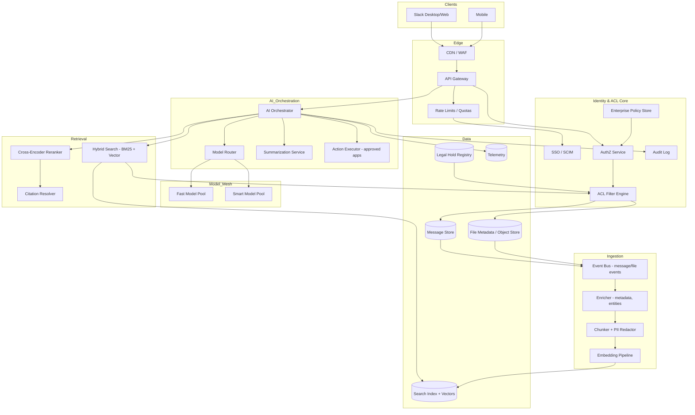
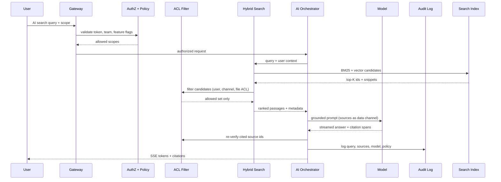
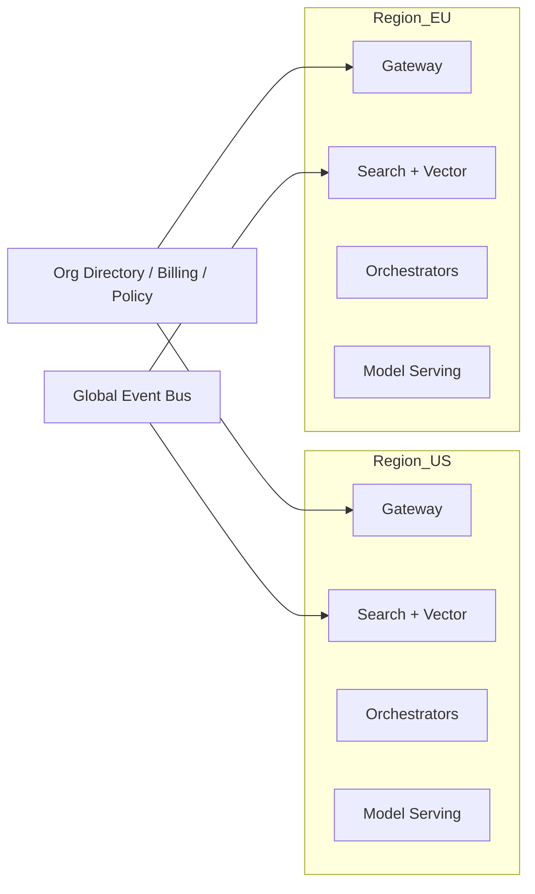

# System Design — Slack AI (Enterprise Search + Assist)

| Meta | Value |
|------|-------|
| **Estimated Time** | 3–4 hours (design 2h · critique 1h · memo 1h) |
| **Difficulty** | Staff / Principal |
| **Prerequisites** | [01-01](../Modules/01-LLM-Engineering/01-01-Transformer-Architecture.md) · [03-01](../Modules/03-Agentic-Fundamentals/03-01-Agent-Anatomy-and-Loop.md) · [08-01](../Modules/08-Evaluation-LLMOps/08-01-Evaluation-Lifecycle.md) · [11-01](../Modules/11-Security-Safety/11-01-OWASP-LLM-Top-10.md) |
| **Related** | [Design Notion AI](Design-Notion-AI.md) · [Design AI Search Engine](Design-AI-Search-Engine.md) · [Architecture Index](../Architecture Index.md) |

---

## Interview Framing

> "Design Slack AI: channel-aware search, thread summaries, drafting, and workflow actions across a 500K-employee enterprise with strict ACLs, eDiscovery, and regional data residency."

Clarify in first 3 minutes: **workspace vs org-wide**, **public/private/DM scope**, **retention/legal hold**, **SSO/SCIM**, **latency for search vs chat**, **which connectors (Drive, Jira)**, **admin kill switches**.

---

## Requirements

### Functional

| ID | Requirement |
|----|-------------|
| F1 | Natural-language search across messages, files, canvases, and linked apps |
| F2 | Thread/channel summaries with citations to source messages |
| F3 | Draft replies, channel posts, and meeting notes in workspace tone |
| F4 | `@Slack AI` in channels/DMs with scoped context (thread, channel, or user-selected) |
| F5 | Enterprise ACL enforcement: every retrieval and generation respects channel membership + file permissions |
| F6 | Admin controls: enable/disable features, model tier, data retention, connector allowlists |
| F7 | Audit log: who queried what, which sources retrieved, model version, admin exports |
| F8 | Workflow actions (optional): create ticket, schedule meeting, post to channel—via approved integrations |
| F9 | Multi-workspace / Enterprise Grid: org-level search with cross-workspace policy gates |

### Non-Functional

| ID | Target (example) |
|----|------------------|
| N1 | Search p95 < 800ms; AI answer TTFT p50 < 600ms |
| N2 | **Zero ACL leakage**: no cross-channel content in prompts or citations |
| N3 | Availability 99.95% for search; 99.9% for AI assist |
| N4 | Index freshness: new messages searchable within 60s p95 |
| N5 | Support 10M+ messages/workspace; 100K concurrent users peak |
| N6 | GDPR/CCA data residency; legal hold immutability |
| N7 | Cost: bounded $/active user/month via routing + retrieval caps |

### Out of Scope (initially)

- Training custom models on customer data (default off)
- Real-time voice transcription AI (see Voice Assistant design)
- Arbitrary third-party MCP tools without admin approval
- Cross-tenant federated search outside Enterprise Grid policy

---

## APIs

### Client → AI Gateway

```http
POST /v1/ai/search
Authorization: Bearer <user_oauth_token>
X-Slack-Team-Id: T123
Content-Type: application/json

{
  "query": "What did we decide on Q3 pricing?",
  "scope": {
    "type": "workspace",
    "channel_ids": ["C456"],
    "include_files": true,
    "include_connectors": ["google_drive", "jira"]
  },
  "stream": true
}
```

### Streaming answer (SSE)

```text
event: retrieval
data: {"sources":[{"type":"message","id":"ts_789","channel":"C456","score":0.91}]}

event: token
data: {"delta":"The team agreed on"}

event: citation
data: {"span":"Q3 pricing","source_ids":["ts_789","ts_790"]}

event: done
data: {"usage":{"input_tokens":4200,"output_tokens":180},"acl_check":"pass"}
```

### Internal ACL filter contract

```json
{
  "user_id": "U123",
  "team_id": "T123",
  "candidate_ids": ["msg:ts_789", "file:F001"],
  "action": "read",
  "context": {"channel_id": "C456", "thread_ts": "1234.56"}
}
```

Response: `{ "allowed": ["msg:ts_789"], "denied": ["file:F001"], "reason": "file_not_shared_with_user" }`

### Admin policy API

```http
PUT /v1/admin/ai/policy
{
  "features": {"search": true, "summarize": true, "workflow_actions": false},
  "retention_days": 90,
  "allowed_connectors": ["google_drive"],
  "model_tier": "enterprise",
  "block_dm_ai": false
}
```

---

## Architecture



**ACL-first principle:** Retrieval never returns raw hits to the LLM without passing through `ACL Filter Engine`. Denied IDs are dropped silently; the model never sees forbidden text.

---

## Data Flow



---

## Scaling

| Layer | Strategy |
|-------|----------|
| Event ingestion | Partition by `team_id`; backpressure on hot workspaces |
| Index | Sharded inverted + vector indexes per team/org; hot workspace isolation |
| ACL filter | Cache membership bitmaps; batch ACL checks; pre-filter at index query time |
| Search | Two-stage retrieve → rerank; cap K before LLM |
| Orchestrator | Stateless; shard by `team_id` + request id |
| Model mesh | Separate pools for summarize vs Q&A; queue during spikes |
| Connectors | Async crawl; per-connector rate limits; circuit breakers |

**Enterprise Grid:** Org-level index with workspace boundary tags; cross-workspace queries require explicit org policy + dual ACL pass.

---

## Caching

| Cache | Key | Value | TTL |
|-------|-----|-------|-----|
| Channel membership | user_id + channel_id | read/write flags | minutes |
| ACL decision | user_id + resource_id | allow/deny | seconds–minutes |
| Search results | query_hash + scope_hash + acl_version | ranked ids | 1–5 min |
| Embeddings | chunk_hash | vector | 30d |
| Thread summary | thread_ts + last_msg_ts | summary text | until thread updates |
| Policy | team_id | feature flags | minutes |

**When NOT to cache:** ACL decisions during active membership changes; legal-hold status; queries under litigation export.

**ACL version bump:** Invalidate search cache when user joins/leaves channel or file ACL changes.

---

## Latency

| Segment | Budget mindset |
|---------|----------------|
| Auth + policy | < 30ms |
| Hybrid retrieval | < 200ms p95 |
| ACL batch filter | < 50ms for top-100 candidates |
| Rerank | < 100ms |
| TTFT (LLM) | dominant after retrieval |
| Citation verify | < 20ms parallel with stream start |

**Techniques:** Pre-filter vectors with ACL bitmaps at index; parallel BM25 + dense; smaller model for "find message" vs "synthesize answer"; stream retrieval events before generation.

---

## Security

| Threat | Control |
|--------|---------|
| **Cross-channel leakage** | ACL filter on every stage; re-verify citations; no global index without team shard |
| Prompt injection in messages | Untrusted content in data channel; system instructions isolated |
| Connector over-permission | OAuth scopes minimized; connector ACL mirror |
| Insider exfiltration via AI | Rate limits, DLP on exports, admin alerts on bulk queries |
| Jailbreak for hidden data | Refuse out-of-scope; no "ignore ACL" in prompts |
| eDiscovery tampering | Immutable audit; legal hold blocks delete |

**Enterprise ACL emphasis:** Treat Slack messages like database rows—every read path checks `(user, resource, action)`. Search indexes store **pointers + snippets** keyed by ACL metadata; full text assembly only after allow.

See [11-02 Prompt Injection](../Modules/11-Security-Safety/11-02-Prompt-Injection-Defense.md).

---

## Observability

| Signal | Why |
|--------|-----|
| ACL deny rate post-retrieval | Leak detection / index bugs |
| Empty-result rate after ACL | Over-filtering UX |
| Index lag | Freshness SLO |
| TTFT / E2E latency | UX |
| Citation accuracy (eval set) | Trust |
| $/query by team tier | Finance |
| Admin policy denials | Rollout |
| Connector error rate | Integration health |

Trace fields: `team_id`, `user_id`, `scope`, `retrieved_ids`, `allowed_ids`, `model_version`, `policy_version`.

---

## Cost

\[
Cost \approx retrieval\_K \cdot embed\_cost + rerank + (tokens_{in}+tokens_{out}) \cdot price_{model} + index\_storage + connector\_crawl
\]

Levers: cap K and context window; route easy queries to fast model; cache thread summaries; skip LLM for pure keyword navigational queries; batch embeddings on ingest; tiered reranking.

---

## Failure Modes

| Failure | User impact | Mitigation |
|---------|-------------|------------|
| ACL service slow | Timeouts | Fail closed (no answer); degrade to keyword search |
| Stale index | Missing recent messages | Show freshness timestamp; async re-index |
| Over-aggressive filter | "No results" | Explain scope; suggest channel expansion |
| Citation hallucination | Wrong attribution | Mandatory source grounding; post-verify ids |
| Connector down | Incomplete answers | Surface partial + connector status |
| Model outage | No AI | Fallback to classic search |
| Legal hold conflict | Block delete | Hold registry blocks purge; admin UI |

---

## Tradeoffs

| Decision | Option A | Option B | Pick when |
|----------|----------|----------|-----------|
| Index scope | Per-channel shards | Unified team index + ACL filter | B for simpler ops; A for strict isolation |
| Retrieval | Keyword-first | Hybrid default | Hybrid for NL questions |
| Context | Full thread in prompt | Retrieved chunks only | Chunks at scale; full thread for summarize |
| Actions | Broad integrations | Admin allowlist | Always allowlist in enterprise |
| Answers | Abstractive summary | Extractive + light rewrite | Extractive for compliance-sensitive orgs |

---

## Deployment



- Data residency: team data pinned to region; cross-region search disabled by default
- Blue/green orchestrator; canary model + prompt changes per org
- Feature flags per workspace; admin kill switch instant
- Secrets via KMS; redact message bodies in debug logs by default

---

## Interview Answer Skeleton (45–60 min)

1. Requirements & enterprise ACL non-negotiables (5 min)
2. Ingestion + hybrid index architecture (8)
3. Query path: retrieve → ACL filter → rerank → generate (10)
4. Citations, audit, legal hold (7)
5. Connectors + action executor (5)
6. Scale, caching, freshness (7)
7. Security threats + fail-closed ACL (5)
8. Cost, metrics, failure modes (8)

---

## Practice Prompts

1. A user asks Slack AI for content from a private channel they left last week—what happens at each layer?
2. Design org-wide search across 50 workspaces without leaking guest-user boundaries.
3. An indexed message contains prompt injection—how do you prevent tool misuse while still answering legit questions?

---

## Further Reading

| Title | URL | Why |
|-------|-----|-----|
| Slack Platform Docs | https://docs.slack.dev/ | Events, scopes, Enterprise Grid |
| Slack AI (product) | https://slack.com/features/ai | Feature scope reference |
| Microsoft Graph ACL patterns | https://learn.microsoft.com/en-us/graph/permissions-reference | Enterprise permission modeling |
| OWASP LLM Top 10 | https://owasp.org/www-project-top-10-for-large-language-model-applications/ | Injection + excessive agency |
| RAG with permissions (Azure AI Search) | https://learn.microsoft.com/en-us/azure/search/search-security-trimming-for-azure-search | Security trimming patterns |

---

## Resume Bullet

- Designed enterprise Slack AI with ACL-first hybrid retrieval, citation-grounded answers, legal-hold-aware indexing, admin policy gates, and audit-grade observability—zero cross-channel leakage as a core SLO.
